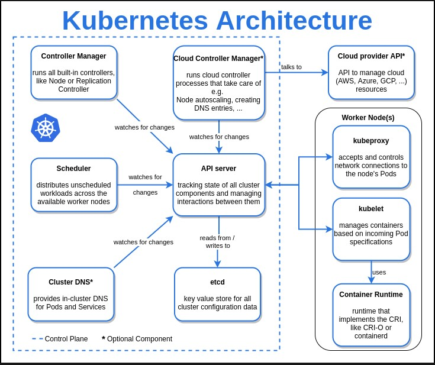
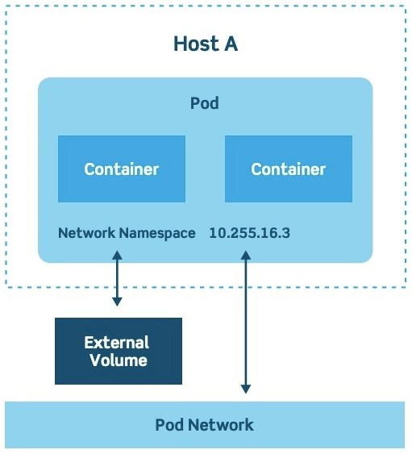
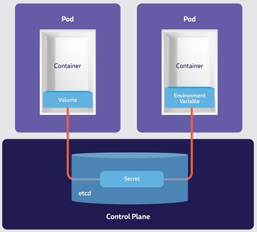

<h1><a name="readme-top"></a></h1>

[](https://github.com/marcossilvestrini/learning-kubernetes/actions/workflows/powershell.yml)[](https://github.com/marcossilvestrini/learning-kubernetes/actions/workflows/release.yml)[](https://github.com/marcossilvestrini/learning-kubernetes/actions/workflows/jekyll-gh-pages.yml)[](https://github.com/marcossilvestrini/learning-kubernetes/actions/workflows/deploy.yml)

[![MIT License][license-shield]][license-url][![Forks][forks-shield]][forks-url][![Stargazers][stars-shield]][stars-url][![Contributors][contributors-shield]][contributors-url][![Issues][issues-shield]][issues-url][![LinkedIn][linkedin-shield]][linkedin-url]

# تعلم كوبيرنتس




<p align="center">
<strong>Explore the docs »</strong></a><br />
    <a href="https://marcossilvestrini.github.io/learning-kubernetes/">Main Page</a>
    -
    <a href="https://github.com/marcossilvestrini/learning-kubernetes">Code Page</a>
    -
    <a href="https://github.com/marcossilvestrini/learning-kubernetes/issues">Report Bug</a>
    -
    <a href="https://github.com/marcossilvestrini/learning-kubernetes/issues">Request Feature</a>
</p>

## ملخص

<details>
  <summary><b>TABLE OF CONTENT</b></summary>
  <ol>
    <li>
      <a href="#about-the-project">About The Project</a>
    </li>
    <li>
      <a href="#getting-started">Getting Started</a>
      <ul>
        <li><a href="#prerequisites">Prerequisites</a></li>
        <li><a href="#installation">Installation</a></li>
      </ul>
    </li>
    <li><a href="#usage">Usage</a></li>
    <li><a href="#roadmap">Roadmap</a></li>
    <li><a href="#linux-namespaces">Linux Namespaces</a></li>
    <li><a href="#kubernetes-architecture">Kubernetes Architecture</a></li>
    <li><a href="#install-kubernetes">Install Kubernetes</a></li>
    <li><a href="#rke2">Rancher RKE2</a></li>
    <li><a href="#kubectl">Kubectl</a></li>
    <li><a href="#containers">Containers</a></li>
    <li><a href="#pods">Pods</a></li>
    <li><a href="#deployment">Deployment</a></li>
    <li><a href="#replicaset">Replicaset</a></li>
    <li><a href="#daemonset">Daemonset</a></li>
    <li><a href="#probes">Probes</a></li>
    <li><a href="#volumes">Volumes</a></li>
    <li><a href="#statefulset">Statefulset</a></li>
    <li><a href="#services">Services</a></li>
    <li><a href="#secrets">Secrets</a></li>
    <li><a href="#license">License</a></li>
    <li><a href="#contact">Contact</a></li>
    <li><a href="#acknowledgments">Acknowledgments</a></li>
  </ol>
</details><br>

<a name="about-the-project"></a>

## حول المشروع

> يهدف هذا المشروع إلى مساعدة الطلاب أو المحترفين على تعلم المفاهيم الأساسية لـ kubernetes

<p align="right">(<a href="#readme-top">back to top</a>)</p>

<a name="getting-started"></a>

## ابدء

هذا مثال على كيفية تقديم تعليمات حول إعداد مشروعك محليًا.
للحصول على نسخة محلية وتشغيلها، اتبع هذه الخطوات البسيطة.

<a name="prerequisites"></a>

### المتطلبات الأساسية

هذا مثال لكيفية إدراج الأشياء التي تحتاجها لاستخدام البرنامج
وكيفية تثبيتها.

-   شخص سخيف
-   الصندوق الافتراضي والامتداد
-   المتشرد

<a name="installation"></a>

### تثبيت

#### مستودع النسخ

```sh
git clone https://github.com/marcossilvestrini/learning-kubernetes.git
```

#### قم بتعيين مفاتيح SSH في مجلد الأمان

```sh
# generate ssh key pair for your user access hosts
ssh-keygen -q -t ecdsa -b 521 -N '' -f ~/.ssh/id_ecdsa <<<y >/dev/null 2>&1
cp ~/.ssh/id_ecdsa.pub security/

# generate ssh key pair for rancher
ssh-keygen -q -t ecdsa -b 521 -N '' -f security/kubernetes-key-ecdsa <<<y >/dev/null 2>&1
```

#### تعيين تجمع العقدة

يمكنك زيادة أو زيادة عدد طائرات التحكم والعاملين في مجموعة Vagrantfile.

مثال:

```ruby
...
 # Node|Control Plane Servers
  PLANES = ["control-plane01", "control-plane02", "control-plane03"]
  N = 2

  (0..N).each do |i|
    config.vm.define PLANES[i] do |node|
...
```

#### ضبط الشبكة

قم بتعيين تكوين الشبكة لكل جهاز افتراضي في Vagrantfile.

مثال:

```ruby
...
# NETWORK
    ol9_server01.vm.network "public_network", nic_type: "virtio", mac: "080027f3066a", ip: "192.168.0.130", netmask: "255.255.255.0", mode: "bridge",bridge: [
      "Intel(R) I211 Gigabit Network Connection",
      "MediaTek Wi-Fi 6 MT7921 Wireless LAN"
    ]
...    
```

#### قم بتعيين موارد VM

قم بتعيين تكوين الموارد كوحدة المعالجة المركزية والذاكرة وما إلى ذلك لكل جهاز افتراضي في Vagrantfile.

مثال:

```ruby
...
# PROVIDER
infra_server01.vm.provider "virtualbox" do |vb|
    vb.linked_clone = true
    vb.name =VM_INFRA_SERVER01
    vb.memory = 2048
    vb.cpus = 1
end
...  
```

#### أعلى مجموعة kubernetes

```sh
cd learning-kubernetes/vagrant/linux
vagrant up
```

<a name="usage"></a>

## الاستخدام

استخدم هذا المستودع للتعرف على اختبار kubernetes

<p align="right">(<a href="#readme-top">back to top</a>)</p>

<a name="roadmap"></a>

## خريطة الطريق

-   [x] إنشاء مستودع
-   [x] إنشاء إجراء جيثب لمهام الأتمتة
-   [x] تثبيت مجموعة kubernetes
-   [x] قم بتثبيت kubectl
-   [x] أضف أمثلة kubernetes
-   [x] إضافة نشر التطبيق
-   [x] إنشاء صورة عامل إرساء بمحتويات المشروع
-   [x] إنشاء إجراء جيثب لبناء صورة عامل الإرساء

<p align="right">(<a href="#roadmap">back to roadmap</a>)</p>
<p align="right">(<a href="#readme-top">back to top</a>)</p>

<a name="linux-namespaces"></a>

## مساحات أسماء لينكس

يعمل محرك kubernetes مع مساحات الأسماء (PID، NET، IPC، MNT، UTS) ومجموعات cgroup.


## معرف الهوية

معرف العملية هذا الملف عبارة عن مؤشر لمساحة اسم PID الخاصة بالعملية. تعمل مساحات أسماء PID على عزل مساحة رقم معرف العملية، مما يعني أن العمليات في مساحات أسماء PID المختلفة يمكن أن يكون لها نفس معرف المنتج. تسمح مساحات أسماء PID للحاويات بتوفير وظائف مثل تعليق/استئناف مجموعة العمليات في الحاوية وترحيل الحاوية إلى مضيف جديد بينما تحافظ العمليات داخل الحاوية على نفس معرفات PID

## شبكة

هذا الملف هو مؤشر لمساحة اسم الشبكة الخاصة بالعملية. وهذا يوفر عزل موارد النظام المرتبطة بالشبكات ويعزل أجهزة الشبكة. يتم استخدام IP netns - لمعالجة إدارة مساحة اسم الشبكة
mount هذا الملف هو مؤشر لمساحة اسم التحميل للعملية ويعزل نقاط التثبيت

## ipc

هذا الملف عبارة عن مقبض لمساحة اسم IPC للعملية ويعزل قوائم انتظار رسائل System Vs IPC وPOSIX

## uts

هذا الملف عبارة عن مؤشر لمساحة اسم UTS للعملية ويعزل اسم المضيف واسم مجال NIS

## مستخدم

هذا الملف هو مؤشر لمساحة اسم المستخدم للعملية

## com.cgroup

سيكون للحاوية عرض معزول للتسلسل الهرمي لمجموعة التحكم.

## cgroup مقابل مساحة الاسم

_cgroup هي وسيلة للتحكم في مرشح التحكم في حركة المرور على أساس المجموعة، على سبيل المثال_

```json
"cgroupsPath": "/myRuntime/myContainer",
    "resources": {
        "memory": {
        "limit": 100000,
        "reservation": 200000
        },
        "devices": [
            {
                "allow": false,
                "access": "rwm"
            }
        ]
   }
```

_مساحة الاسم: تحديد/تجريد ما يمكنك رؤيته في نظام التشغيل Linux_

الخط:[هتبص://ضغوف.عرج/دكس/لينوكسنمصبك.جسب](https://8gwifi.org/docs/linux-namespace.jsp)

<p align="right">(<a href="#linux-namespaces">back to linux-namespaces</a>)</p>
<p align="right">(<a href="#readme-top">back to top</a>)</p>

## العمارة كوبرنيتيس

<a name="kubernetes-architecture"></a>


### طائرة مراقبة


### العقدة


### منافذ كوبيرنيتيس


### منافذ لعقد خادم Rancher على RKE2


<p align="right">(<a href="#kubernetes-architecture">back to kubernetes-architecture</a>)</p>
<p align="right">(<a href="#readme-top">back to top</a>)</p>

## قم بتثبيت كوبيرنيت

<a name="install-kubernetes"></a>

### قبيح

```sh
# install
curl -Lo minikube https://storage.googleapis.com/minikube/releases/latest/minikube-linux-amd64
chmod +x ./minikube
sudo mv ./minikube /usr/local/bin/minikube

# get version
minikube version

# set hypervisor
minikube config set driver <YOUR_HYPERVISOR>

# up without hypervisor
minikube start --driver=hyperkit

# create cluster
minikube start --nodes 3 -p multinode-cluster

# get status of cluster
minikube status

# get ip address
minikube ip

# access minikube host
minikube ssh

# dashboard
minikube dashboard

# logs
minikube logs

# delete cluster
minikube delete
minikube delete --purge
```

### عطوف

```sh
# Install
curl -Lo ./kind https://kind.sigs.k8s.io/dl/v0.14.0/kind-linux-amd64
chmod +x ./kind
sudo mv ./kind /usr/local/bin/kind

# create cluster
kind create cluster
kind create cluster --name silvestrini

# get clusters
kind get clusters

# delete clusters
kind delete clusters $(kind get clusters)

## create yaml
cat << EOF > $HOME/kind-3nodes.yaml
kind: Cluster
apiVersion: kind.x-k8s.io/v1alpha4
nodes:
  - role: control-plane
  - role: worker
  - role: worker
EOF

# create cluster
kind create cluster --name kind-multinodes --config $HOME/kind-3nodes.yaml
```

<p align="right">(<a href="#install-kubernetes">back to install-kubernetes</a>)</p>
<p align="right">(<a href="#readme-top">back to top</a>)</p>

## رقيق

<a name="rke2"></a>

لإنشاء مجموعة kubernetes باستخدام RKE2، راجع البرامج النصية في المجلد scripts/linux/k8s/install-rke2.sh

### بعض أوامر المكدس rke2

قم بتعيين متغير PATH الخاص بك:

```sh
export PATH=$PATH:/opt/rke2/bin:/var/lib/rancher/rke2/bin
```

#### حاوية - أوامر CTR

```zhs
#list containers using ctr
ctr --address /run/k3s/containerd/containerd.sock --namespace k8s.io container ls
```

#### CONTAINERD - أوامر crictl

```zhs
#list containers using crictl

## example 1
export CRI_CONFIG_FILE=/var/lib/rancher/rke2/agent/etc/crictl.yaml
crictl ps

## example 2
crictl --config /var/lib/rancher/rke2/agent/etc/crictl.yaml ps

## example 3
crictl --runtime-endpoint unix:///run/k3s/containerd/containerd.sock ps -a


# stats containers
crictl stats
```

### تسجيل

```sh
journalctl -f -u rke2-server
/var/lib/rancher/rke2/agent/containerd/containerd.log
/var/lib/rancher/rke2/agent/logs/kubelet.log
```

مرجع:[هتبص://جيست.جذب.كوم/سوبرسب/٣بحضف٤٧٩٨٩ي٠دبس١٢٩٥٤٨٦س١٨٦يص٤٤بف](https://gist.github.com/superseb/3b78f47989e0dbc1295486c186e944bf)

<p align="right">(<a href="#rke2">back to rke2</a>)</p>
<p align="right">(<a href="#readme-top">back to top</a>)</p>

## كوبيكتل

<a name="kubectl"></a>

### ثَبَّتَ

```sh
# install
curl -LO https://storage.googleapis.com/kubernetes-release/release/`curl -s \ 
https://storage.googleapis.com/kubernetes-release/release/stable.txt`/bin/linux/amd64/kubectl
chmod +x ./kubectl
mv ./kubectl /usr/local/bin/kubectl

# get version
kubectl version  --output=yaml --client

# kubectl autocomplete
source <(kubectl completion bash)

# kubectl alias
alias k=kubectl
complete -F __start_kubectl k
```

### الأوامر - كوبيكتل

```bash

########## resources ############

# list all resources
kubectl get all

########## namespaces ###########

# get namespaces
kubectl get namespaces

# describe namespaces
kubectl describe namespaces

########## nodes ############

# list nodes
kubectl get nodes
kubectl get nodes -o wide

# delete node
kubectl drain <node_name> --ignore-daemonsets --delete-emptydir-data
kubectl delete node <node_name>

# get logs
kubectl logs my-nginx
kubectl logs -f my-nginx
kubectl logs -n kube-system --all-containers=true etcd-control-plane01
```

<p align="right">(<a href="#kubectl">back to kubectl</a>)</p>
<p align="right">(<a href="#readme-top">back to top</a>)</p>

## حاويات

<a name="containers"></a>


### الأوامر - الحاويات

```sh
# get containers in pod
kubectl -n kube-system  describe pods kube-proxy-worker01 | grep -ws -A 10  Containers

# connect in container
kubectl attach silvestrini -c infra

# connect in container
kubectl exec -it pod_name -c container_name bash
kubectl exec infra ls
kubectl exec silvestrini -c infra -- ls
kubectl exec silvestrini -c infra -it sh 

# access container in specific namespace
kubectl exec -it -n kube-system  kube-proxy-worker01 -c kube-proxy -- bash
```

<p align="right">(<a href="#containers">back to containers</a>)</p>
<p align="right">(<a href="#readme-top">back to top</a>)</p>

## القرون

<a name="pods"></a>



الكبسولة هي أصغر وحدة تنفيذ في Kubernetes. تحتوي الكبسولة على تطبيق واحد أو أكثر.\\
تعتبر البودات سريعة الزوال بطبيعتها، إذا فشلت الكبسولة (أو العقدة التي يتم تنفيذها عليها)،\\
يستطيع Kubernetes إنشاء نسخة متماثلة جديدة من تلك الحافظة تلقائيًا لمواصلة العمليات.\\
تتضمن البودات حاوية واحدة أو أكثر (مثل حاويات Docker).

توفر القرون أيضًا تبعيات بيئية، بما في ذلك التبعيات المستمرة\\
أحجام التخزين (التخزين الدائم والمتاح لجميع البودات\\
في المجموعة) وبيانات التكوين اللازمة لتشغيل الحاوية (الحاويات) داخل الحجرة.

### الأوامر - القرون

```sh
# create pods without manifest
kubectl run nginx --image nginx
kubectl run -it --rm debug --image=busybox --restart=Never -- sh

# create pod with manifest
kubectl apply -f pod-template.yaml
kubectl create -f pod.yaml

# list pods
kubectl get pods

# list all pods
kubectl get pods --all-namespaces
kubectl get pods -A
kubectl get pods -A -o wide

# list pods in specific node
kubectl get pods --all-namespaces -o wide --field-selector spec.nodeName=worker01

# list pods in  kube-system namespace
kubectl get pod -n kube-system
kubectl get pods -n kube-system -o=jsonpath='{range.items[*]}{"\n"}{.metadata.name}{range.spec.containers}'

# list pods with specif output
kubectl get pods -n kube-system -o yaml
kubectl get pods -n kube-system -o json

# list images used in pods
kubectl get pods -o=jsonpath='{range .items[*]}{"\n"}{.metadata.name}{"\t"}{range .spec.containers[*]}{.image}{"\t"}{end}{end}'

# describe details of pods
kubectl describe pod nginx
kubectl -n kube-system  describe pods kube-proxy-worker01

# delete pods
kubectl delete pod nginx
kubectl delete -f pod-template.yaml

# create Service | expose pod
kubectl expose pod my-nginx

```

### فهم موارد الكبسولة


<p align="right">(<a href="#pods">back to pods</a>)</p>
<p align="right">(<a href="#readme-top">back to top</a>)</p>

## تعيين

<a name="deployment"></a>


يوفر النشر تحديثات تعريفية لـ Pods وReplicaSets.
أنت تصف الحالة المطلوبة في النشر، ووحدة تحكم النشر\\
يغير الحالة الفعلية إلى الحالة المطلوبة بمعدل متحكم فيه.\\
يمكنك تحديد عمليات النشر لإنشاء مجموعات نسخ متماثلة جديدة، أو لإزالة\\ الموجودة
عمليات النشر واعتماد جميع مواردها من خلال عمليات النشر الجديدة.

### الأوامر - النشر

```sh
# create manifest|template
kubectl run my-nginx  --image nginx --port 80 --dry-run=client -o yaml >pod-template.yaml

# apply\update deployment
kubectl apply -f deployment.yaml

# list deployments
kubectl get deployments -A
kubectl -n kube-system get deployments.apps
kubectl get deployments -l app=nginx-deployment

# get pods management by deployment
kubectl get pods -l app=nginx-deployment

# describe deployment
kubectl describe deployment nginx-deployment

# check status of deployment
kubectl rollout status deployment nginx-deployment

# running rollback deployment
kubectl rollout undo deployment nginx-deployment
kubectl rollout undo deployment nginx-deployment --to-revision=1

# get deployment history
kubectl rollout history deployment nginx-deployment
kubectl rollout history deployment nginx-deployment --revision=2

# pause deployment(block updates)
kubectl rollout pause deployment nginx-deployment

# resume deployment(allow updates)
kubectl rollout resume deployment nginx-deployment

# restart deployment (recreate all pods in deployment)
kubectl rollout restart deployment nginx-deployment

# delete deployment
kubectl delete deployment nginx-deployment
```

<p align="right">(<a href="#deployment">back to deployment</a>)</p>
<p align="right">(<a href="#readme-top">back to top</a>)</p>

## مجموعة النسخ المتماثلة

<a name="replicaset"></a>


الغرض من مجموعة النسخ المتماثلة هو الحفاظ على تشغيل مجموعة ثابتة من العلب المتماثلة\\
في أي وقت. على هذا النحو، غالبًا ما يتم استخدامه لضمان توفر\\
عدد محدد من القرون متطابقة.

### الأوامر - مجموعة النسخ المتماثلة

````sh
# list replicaset
kubectl get replicaset -l app=nginx-deployment

# describe replicaset
kubectl describe replicaset nginx-replicaset

# create replicaset - see folder replicaset/ for examples
kubectl apply -f replicaset.yaml

# delete replicaset
kubectl delete replicas

<p align="right">(<a href="#replicaset">back to replicaset</a>)</p>
<p align="right">(<a href="#readme-top">back to top</a>)</p>

## Daemonset


A DaemonSet ensures that all (or some) Nodes run a copy of a Pod.\
As nodes are added to the cluster, Pods are added to them.\
As nodes are removed from the cluster, those Pods are garbage collected.\
Deleting a DaemonSet will clean up the Pods it created.

### Commands - Daemonset

```sh
# list daemonset
kubectl get daemonset -A

#$ describe daemonset
kubectl describe daemonset node-exporter

# create daemonset - see folder daemonset/ for examples
kubectl apply -f daemonset.yaml

# delete daemonset
kubectl delete daemonset node-exporter
````

## المجسات

<a name="probes"></a>


Kubernetes probes are health checks that are used to monitor the health of applications and services in a Kubernetes cluster.\\
Kubernetes probes are typically implemented using the Kubernetes API, which allows them to query the application or service for information.\\
This information can then be used to determine the application's or service's health.\\
Kubernetes probes can also be used to detect changes in the application or\\ service and send a notification to the Kubernetes control plane, which can\\ then take corrective action.

### أنواع المجسات

#### مجسات بدء التشغيل

يتم استخدام مسبار بدء التشغيل لتحديد ما إذا كانت الحاوية قد بدأت بنجاح.\\
يُستخدم هذا النوع من المسبار عادةً للتطبيقات التي تستغرق وقتًا أطول لبدء التشغيل،\\
أو للحاويات التي تقوم بمهام التهيئة قبل أن تصبح جاهزة لاستقبال حركة المرور.\\
يتم تشغيل مسبار بدء التشغيل مرة واحدة فقط، بعد إنشاء الحاوية، وسيؤدي ذلك إلى تأخير البدء\\
من الجاهزية والحيوية يسبر غورها حتى تنجح.\\
إذا فشل مسبار بدء التشغيل، فسيتم اعتبار الحاوية قد فشلت في بدء التشغيل\\
وسيحاول Kubernetes إعادة تشغيل الحاوية.

#### تحقيقات الاستعداد

يتم استخدام مسبار الاستعداد لتحديد ما إذا كانت الحاوية جاهزة لاستقبال حركة المرور.\\
يتم استخدام هذا النوع من المسبار للتأكد من أن الحاوية جاهزة للعمل بشكل كامل ويمكنها\\
قبول الاتصالات الواردة قبل إضافتها إلى موازن تحميل الخدمة.\\
يمكن استخدام مسبار الاستعداد للتحقق من توفر تبعيات التطبيق\\
أو لإجراء أي فحص آخر يشير إلى أن الحاوية جاهزة لخدمة حركة المرور.\\
إذا فشل مسبار الاستعداد، تتم إزالة الحاوية من موازن تحميل الخدمة حتى ينجح المسبار مرة أخرى.

#### مجسات الحياة

يتم استخدام مسبار الحيوية لتحديد ما إذا كانت الحاوية لا تزال قيد التشغيل وتعمل بشكل صحيح.\\
يتم استخدام هذا النوع من المسبار للكشف عن أعطال الحاويات أو توقفها والتعافي منها.\\
يمكن استخدام مسبار الحيوية للتحقق من استجابة التطبيق أو لتنفيذ\\
أي فحص آخر يدل على أن الحاوية لا تزال حية وبصحة جيدة.\\
إذا فشل اختبار الحيوية، فسيحاول Kubernetes إعادة تشغيل الحاوية لاستعادة وظائفها.

<p align="right">(<a href="#probes">back to probes</a>)</p>
<p align="right">(<a href="#readme-top">back to top</a>)</p>

## أحجام

<a name="volumes"></a>


### فئة التخزين


بعض موفري فئة التخزين

-   kubernetes.io/aws-ebs: AWS Elastic Block Store (EBS)
-   kubernetes.io/azure-disk: قرص أزور
-   kubernetes.io/gce-pd: القرص الثابت لمحرك Google Compute Engine (GCE)
-   kubernetes.io/cinder: OpenStack Cinder
-   kubernetes.io/vsphere-volume: vSphere
-   kubernetes.io/no-provisioner: المجلدات المحلية
-   kubernetes.io/host-path: وحدات التخزين المحلية

### PV - الحجم المستمر


بعض أنواع الطاقة الكهروضوئية

-   محلي
    -   مسار المضيف
-   شبكة
    -   NFS
    -   بروتوكول iSCSI
    -   Ceph RBD (جهاز كتلة RAdos)
    -   جلوسترفس
    -   موفرو السحابة (EBS، Google Cloud Persistent Disk، Azure Disk Storage)

#### نوع التخزين (hostPath)

-   hostPath
-   nfs
-   com.iscsi
-   منظمة التضامن المسيحي الدولية
-   محلي
-   نادي

### PVC - المطالبة بالحجم المستمر


### الأوامر - المجلدات

```bash
# list storage classes
kubectl get storageclass

# describe storage class
kubectl describe storageclass silvestrini

# get storage class provisioners
kubectl get storageclasses.storage.k8s.io  -o=jsonpath='{range.items[*]}{.provisioner}{"\n"}'

# list pv in cluster
kubectl get pv -A

# describe pv
kubectl describe pv my-pv

# list pvc
kubectl get pvc -o wide

# delete pvc 
kubectl delete pvc my-pvc

# describe pvc
kubectl describe pvc my-pvc

# get events
kubectl get events my-pvc.1772cda2d4c7069b
```

<p align="right">(<a href="#volumes">back to volumes</a>)</p>
<p align="right">(<a href="#readme-top">back to top</a>)</p>

## StatefulSet

<a name="statefulset"></a>


StatefulSet هو كائن واجهة برمجة تطبيقات عبء العمل المستخدم لإدارة التطبيقات ذات الحالة.

يدير نشر وتوسيع نطاق مجموعة من البودات، ويوفر ضمانات حول ترتيب هذه البودات وتفردها.

مثل عملية النشر، تقوم StatefulSet بإدارة البودات المستندة إلى مواصفات حاوية متطابقة.\\
على عكس عملية النشر، تحتفظ مجموعة StatefulSet بهوية ثابتة لكل حاوية من وحداتها.\\

يتم إنشاء هذه الكبسولات من نفس المواصفات، ولكنها غير قابلة للتبديل: لكل منها معرف ثابت تحتفظ به خلال أي عملية إعادة جدولة.

If you want to use storage volumes to provide persistence for your workload,\\
you can use a StatefulSet as part of the solution. Although individual Pods in\\
a StatefulSet are susceptible to failure, the persistent Pod identifiers make\\
it easier to match existing volumes to the new Pods that replace any that have failed.

### DNS للقرون في StatefulSet

```sh
<pod-name>.<service-name>.<namespace>.svc.cluster.local
# Example: nginx-0.nginx.default.svc.cluster.local 
```

### الأوامر - StatefulSet

```bash
# list statefulsets
kubectl get statefulsets

# describe statefulsets
kubectl describe  statefulsets.apps  nginx 

# delete statefulset
kubectl delete statefulset nginx

# test network service
## create container for test
kubectl run -it --rm --image=busybox --restart=Never -- sh

## test nslookup
nslookup  nginx-0.nginx.default.svc.cluster.local

## test web page
wget -O- http://nginx-0.nginx.default.svc.cluster.local
```

<p align="right">(<a href="#statefulset">back to statefulset</a>)</p>
<p align="right">(<a href="#readme-top">back to top</a>)</p>

## خدمات

<a name="services"></a>


تعد خدمة Kubernetes تجريدًا منطقيًا لمجموعة من البودات المنتشرة في المجموعة\\
(والتي تؤدي جميعها نفس الوظيفة).\\
نظرًا لأن البودات سريعة الزوال، فإن الخدمة تتيح مجموعة من البودات التي توفر\\
الوظائف (خدمات الويب، ومعالجة الصور، وما إلى ذلك) ليتم تعيين اسم وIP فريد لها.
العنوان (clusterIP).

### أنواع الخدمة في Kubernetes

#### خدمات ClusterIP

ClusterIP هو نوع الخدمة الافتراضي في Kubernetes، ويوفر اتصالاً داخليًا بين المكونات المختلفة لتطبيقنا. يقوم Kubernetes بتعيين عنوان IP افتراضي لخدمة ClusterIP التي لا يمكن الوصول إليها إلا من داخل المجموعة أثناء إنشائها. عنوان IP هذا مستقر ولا يتغير حتى إذا تمت إعادة جدولة أو استبدال البودات الموجودة خلف الخدمة.

تعد خدمات ClusterIP خيارًا ممتازًا للاتصال الداخلي بين المكونات المختلفة لتطبيقنا والتي لا تحتاج إلى التعرض للعالم الخارجي. على سبيل المثال، إذا كانت لدينا خدمة صغيرة تعالج البيانات وترسلها إلى خدمة صغيرة أخرى لمزيد من المعالجة، فيمكننا استخدام خدمة ClusterIP لتوصيلها.

لإنشاء خدمة ClusterIP في Kubernetes، نحتاج إلى تعريفها في ملف YAML وتطبيقها على المجموعة. فيما يلي مثال لتعريف خدمة ClusterIP البسيط:

```yaml
apiVersion: v1
kind: Service
metadata:
  name: backend
spec:
  selector:
    app: backend
  ports:
  - name: http
    port: 80
    targetPort: 8080
```

في هذا المثال، نحدد خدمة تسمى الواجهة الخلفية مع محدد يستهدف البودات المسمى بالتطبيق: الواجهة الخلفية. تكشف الخدمة عن المنفذ 80، وهو المنفذ الذي يستخدمه العملاء للوصول إلى الخدمة، وتقوم بإعادة توجيه حركة المرور إلى منفذ البودات 8080، حيث يتم تشغيل تطبيق الواجهة الخلفية.

#### خدمات نودبورت

تعمل خدمات NodePort على توسيع وظائف خدمات ClusterIP من خلال تمكين الاتصال الخارجي بتطبيقنا. عندما نقوم بإنشاء خدمة NodePort على أي عقدة داخل المجموعة التي تفي بالمعايير المحددة، يفتح Kubernetes منفذًا معينًا يعيد توجيه حركة المرور إلى خدمة ClusterIP المقابلة التي تعمل على العقدة.

تعتبر هذه الخدمات مثالية للتطبيقات التي تحتاج إلى إمكانية الوصول إليها من خارج المجموعة، مثل تطبيقات الويب أو واجهات برمجة التطبيقات. باستخدام خدمات NodePort، يمكننا الوصول إلى تطبيقنا باستخدام عنوان IP الخاص بالعقدة ورقم المنفذ المخصص للخدمة.

دعونا نلقي نظرة على مثال لتعريف خدمة NodePort البسيط:

```yaml
apiVersion: v1 
kind: Service 
metadata: 
  name: frontend 
spec: 
  selector: 
    app: frontend 
  type: NodePort 
  ports: 
    - name: http 
      port: 80 
      targetPort: 8080
```

نحدد خدمة تسمى الواجهة الأمامية والتي تستهدف البودات المسمى بالتطبيق: الواجهة الأمامية عن طريق تعيين محدد. تكشف الخدمة عن المنفذ 80 وتعيد توجيه حركة المرور إلى منفذ البودات 8080. قمنا بتعيين نوع الخدمة على NodePort، ويعرض Kubernetes الخدمة على منفذ معين على عقدة مؤهلة داخل المجموعة.

عندما نقوم بإنشاء خدمة NodePort، يقوم Kubernetes بتعيين رقم منفذ من نطاق محدد مسبقًا من 30000-32767. بالإضافة إلى ذلك، يمكننا تحديد رقم منفذ مخصص عن طريق إضافة حقل NodePort إلى تعريف الخدمة:

```yaml

apiVersion: v1
kind: Service
metadata:
  name: frontend
spec:
  selector:
    app: frontend
  type: NodePort
  ports:
  - name: http
    port: 80
    targetPort: 8080
    nodePort: 30080
```

تم تحديد حقلNodePort كـ 30080، والذي يخبر Kubernetes بكشف الخدمة على المنفذ 30080 على كل عقدة في المجموعة.

#### خدمات موازن التحميل

تقوم خدمات LoadBalancer بتوصيل تطبيقاتنا خارجيًا، وتستخدمها بيئات الإنتاج عندما يكون التوافر العالي وقابلية التوسع أمرًا بالغ الأهمية. عندما نقوم بإنشاء خدمة LoadBalancer، يقوم Kubernetes بتوفير موازن تحميل في بيئتنا السحابية وإعادة توجيه حركة المرور إلى العقد التي تقوم بتشغيل الخدمة.

تعتبر خدمات LoadBalancer مثالية للتطبيقات التي تحتاج إلى التعامل مع كميات كبيرة من حركة المرور، مثل تطبيقات الويب أو واجهات برمجة التطبيقات. باستخدام خدمات LoadBalancer، يمكننا الوصول إلى تطبيقنا باستخدام عنوان IP واحد مخصص لموازن التحميل.

فيما يلي مثال لتعريف خدمة LoadBalancer البسيط:

```yaml
apiVersion: v1
kind: Service
metadata:
  name: web
spec:
  selector:
    app: web
  type: LoadBalancer
  ports:
    - name: http
      port: 80
      targetPort: 8080
```

قمنا بتعيين نوع الخدمة على LoadBalancer لتوجيه Kubernetes لتوفير موازن التحميل. هنا، نحدد خدمة تسمى web ونحدد محددًا يستهدف البودات المسمى بالتطبيق: web. بالإضافة إلى ذلك، نقوم بكشف المنفذ 80 وتوجيه حركة المرور إلى منفذ البودات 8080.

بعد إنشاء خدمة LoadBalancer، يوفر Kubernetes موازن تحميل في البيئة السحابية بعنوان IP عام. يمكننا استخدام عنوان IP هذا للوصول إلى تطبيقنا من خارج المجموعة.


مرجع:[هتبص://وو.بالدنج.كوم/عبس/كوبرنتصصرفكتيبس](https://www.baeldung.com/ops/kubernetes-service-types)

### الأوامر - الخدمات

```sh
# list services
kubectl get services
kubectl get svc -o wide

# list services in system namespace
kubectl get svc -n kube-system

# details of services 
kubectl describe svc nginx
kubectl describe svc -n kube-system

# list endpoints
kubectl get endpoints

# create ClusterIP service
kubectl expose deployment app-silvestrini --port=80 --target-port=8080

# create NodePort service
kubectl expose deployment app-silvestrini --type=NodePort --port=80 --target-port=8080

# create loadbalance service
kubectl expose deployment app-silvestrini --type=LoadBalancer --port=80 --target-port=8080

#create external name service
kubectl create service externalname app-silvestrini --external-name my-db.skynet.com.br

# delete service
kubectl delete service nginx
```

<p align="right">(<a href="#services">back to services</a>)</p>
<p align="right">(<a href="#readme-top">back to top</a>)</p>

## أسرار

<a name="service"></a>



السر هو كائن يحتوي على كمية صغيرة من البيانات الحساسة مثل كلمة المرور أو الرمز المميز أو المفتاح. قد يتم وضع هذه المعلومات في مواصفات Pod أو في صورة حاوية. استخدام السر يعني أنك لا تحتاج إلى تضمين بيانات سرية في رمز التطبيق الخاص بك.

نظرًا لأنه يمكن إنشاء الأسرار بشكل مستقل عن البودات التي تستخدمها، فهناك خطر أقل في كشف السر (وبياناته) أثناء سير العمل الخاص بإنشاء البودات وعرضها وتحريرها. يمكن لـ Kubernetes والتطبيقات التي تعمل في مجموعتك أيضًا اتخاذ احتياطات إضافية فيما يتعلق بالأسرار، مثل تجنب كتابة البيانات السرية إلى وحدة تخزين غير متطايرة.

تشبه الأسرار ConfigMaps ولكنها مصممة خصيصًا للاحتفاظ بالبيانات السرية.

### أنواع الأسرار

-   الأسرار المبهمة - هذه هي الأسرار الأبسط والأكثر شيوعًا. يقومون بتخزين بيانات عشوائية مثل مفاتيح API وكلمات المرور والرموز المميزة. يتم تشفير الأسرار الغامضة في base64 عند تخزينها في Kubernetes، لكنها غير مشفرة. يمكن استخدامها لتخزين البيانات الحساسة ولكنها ليست آمنة بما يكفي للمعلومات الحساسة للغاية مثل كلمات مرور قاعدة البيانات.

-   kubernetes.io/service-account-token - يُستخدم لتخزين الرموز المميزة للوصول إلى حساب الخدمة. تُستخدم هذه الرموز المميزة لمصادقة Pods باستخدام Kubernetes API. ويتم تثبيتها تلقائيًا في البودات التي تستخدم حسابات الخدمة.

-   kubernetes.io/dockercfg و kubernetes.io/dockerconfigjson - يُستخدم لتخزين بيانات اعتماد تسجيل Docker. يتم استخدامها لمصادقة Pods باستخدام سجل Docker. يتم تركيبها في كبسولات تستخدم صور حاوية خاصة.

-   kubernetes.io/tls وkubernetes.io/ssh-auth وkubernetes.io/basic-auth - يُستخدم لتخزين شهادات TLS ومفاتيح SSH وبيانات اعتماد المصادقة الأساسية، على التوالي. يتم استخدامها لمصادقة Pods مع الخدمات الأخرى.

-   bootstrap.kubernetes.io/token - يُستخدم لتخزين الرموز المميزة للتشغيل العنقودي. يتم استخدامها لمصادقة العقد باستخدام مستوى التحكم Kubernetes.

### أوامر - أسرار

```sh
# get secrets
kubectl get secrets -A

# describe secrets
kubectl describe secret -n cert-manager cert-manager-webhook-ca

# create opaque secret
kubectl create secret generic silvestrini-secret --from-literal=username=silvestrini --from-literal=password=silvestrini

# create tls secret
# generate certs
# openssl req -x509 -nodes -days 365 -newkey rsa:2048 -keyout private-key.key -out cert.crt
kubectl create secret tls my-service-web-tls-secret --cert=cert.crt --key=private-key.key
```

<p align="right">(<a href="#secrets">back to secrets</a>)</p>
<p align="right">(<a href="#readme-top">back to top</a>)</p>

## خرائط التكوين

<a name="configmap"></a>


إن ConfigMap هو كائن API يُستخدم لتخزين البيانات غير السرية في أزواج قيمة المفتاح.\\
يمكن أن تستخدم Pods ConfigMaps كمتغيرات بيئة، أو وسيطات سطر أوامر، أو كملفات تكوين في وحدة تخزين.

يتيح لك ConfigMap فصل التكوين الخاص بالبيئة عن صور الحاوية الخاصة بك، بحيث يمكن نقل تطبيقاتك بسهولة.

### الأوامر - خرائط التكوين

```sh
# create configmap
kubectl create configmap nginx-config --from-file=kubernetes/configmaps/nginx.conf

# get configmaps
kubectl get configmaps

# describe configmaps
kubectl describe configmaps nginx-config
```

<p align="right">(<a href="#configmap">back to configmap</a>)</p>
<p align="right">(<a href="#readme-top">back to top</a>)</p>

## المساهمة

المساهمات هي ما يجعل مجتمع المصادر المفتوحة مكانًا رائعًا للتفاعل معه
التعلم والإلهام والإبداع. أي مساهمات تقدمها هي**اقدر هذا جدا**.

إذا كان لديك اقتراح من شأنه أن يجعل هذا أفضل، يرجى شوكة الريبو و
إنشاء طلب سحب. يمكنك أيضًا ببساطة فتح مشكلة بالعلامة "التحسين".
لا تنسى أن تعطي المشروع نجمة! شكرًا لك مرة أخرى!

1.  شوكة المشروع
2.  قم بإنشاء فرع الميزات الخاص بك (`git checkout -b feature/AmazingFeature`)
3.  تنفيذ التغييرات (`git commit -m 'Add some AmazingFeature'`)
4.  ادفع إلى الفرع (`git push origin feature/AmazingFeature`)
5.  افتح طلب السحب

## رخصة

-   تم ترخيص هذا المشروع بموجب ترخيص MIT \* راجع ملف LICENSE.md للحصول على التفاصيل

## اتصال

ماركوس سيلفستريني -[ماركوس.سيلفسترن@جميل.كوم](mailto:marcos.silvestrini@gmail.com)\\[](https://twitter.com/mrsilvestrini)

رابط المشروع:[هتبص://جذب.كوم/ماركسيلفصترن/ليرننجكبرنتس](https://github.com/marcossilvestrini/learning-kubernetes)

<p align="right">(<a href="#readme-top">back to top</a>)</p>

## شكر وتقدير

-   [CNCF - مؤسسة الحوسبة السحابية الأصلية](https://www.cncf.io/)
-   [OCI - مبادرة الحاوية المفتوحة](https://opencontainers.org/)
-   [بورغ](https://kubernetes.io/blog/2015/04/borg-predecessor-to-kubernetes/)
-   [موقع كوبرنيتس](https://kubernetes.io/)
-   [العمارة كوبرنيتيس](https://platform9.com/blog/kubernetes-enterprise-chapter-2-kubernetes-architecture-concepts/)
-   [جيثب](https://github.com/kubernetes/kubernetes/)
-   [مشاكل](https://github.com/kubernetes/kubernetes/issues)
-   [شهادة CKA](https://www.cncf.io/certification/cka/)
-   [شهادة سيكاد](https://www.cncf.io/certification/ckad/)
-   [شهادة سي كي اس](https://www.cncf.io/certification/cks/)
-   [عطوف](https://kind.sigs.k8s.io/docs/user/quick-start)
-   [قبيح](https://github.com/kubernetes/minikube)
-   [ك0س](https://k0sproject.io/)
-   [كعص](https://k3s.io/)
-   [رقيق](https://docs.rke2.io/architecture)
-   [حتى مجموعة RKE2 HA](https://computingforgeeks.com/deploy-kubernetes-on-rocky-using-rke2/?expand_article=1)
-   [أحمال عمل Kubernetes](https://www.suse.com/c/rancher_blog/introduction-to-kubernetes-workloads/)
-   [مزود المسار المحلي للمزرعة](https://github.com/rancher/local-path-provisioner)
-   [لوحة تحكم Kubernetes](https://upcloud.com/resources/tutorials/deploy-kubernetes-dashboard)
-   [إدارة الكتلة Openlens](https://github.com/MuhammedKalkan/OpenLens)
-   [كتاب لينكس ملاحظة](https://livro.descomplicandokubernetes.com.br/pt/)
-   [خدمات كوبرنيتيس](https://cast.ai/blog/kubernetes-load-balancer-expert-guide-with-examples/)

<p align="right">(<a href="#readme-top">back to top</a>)</p>

<!-- MARKDOWN LINKS & IMAGES-->

<!-- https://www.markdownguide.org/basic-syntax/#reference-style-links -->

[contributors-shield]: https://img.shields.io/github/contributors/marcossilvestrini/learning-kubernetes.svg?style=for-the-badge

[contributors-url]: https://github.com/marcossilvestrini/learning-kubernetes/graphs/contributors

[forks-shield]: https://img.shields.io/github/forks/marcossilvestrini/learning-kubernetes.svg?style=for-the-badge

[forks-url]: https://github.com/marcossilvestrini/learning-kubernetes/network/members

[stars-shield]: https://img.shields.io/github/stars/marcossilvestrini/learning-kubernetes.svg?style=for-the-badge

[stars-url]: https://github.com/marcossilvestrini/learning-kubernetes/stargazers

[issues-shield]: https://img.shields.io/github/issues/marcossilvestrini/learning-kubernetes.svg?style=for-the-badge

[issues-url]: https://github.com/marcossilvestrini/learning-kubernetes/issues

[license-shield]: https://img.shields.io/github/license/marcossilvestrini/learning-kubernetes.svg?style=for-the-badge

[license-url]: https://github.com/marcossilvestrini/learning-kubernetes/blob/master/LICENSE

[linkedin-shield]: https://img.shields.io/badge/-LinkedIn-black.svg?style=for-the-badge&logo=linkedin&colorB=555

[linkedin-url]: https://linkedin.com/in/marcossilvestrini
