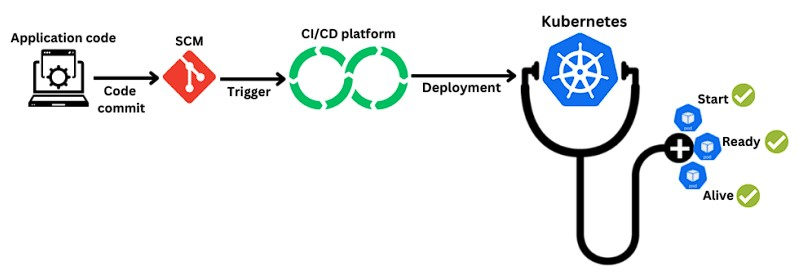

<h1><a name="readme-top"></a></h1>

[](https://github.com/marcossilvestrini/learning-kubernetes/actions/workflows/powershell.yml)[](https://github.com/marcossilvestrini/learning-kubernetes/actions/workflows/release.yml)[](https://github.com/marcossilvestrini/learning-kubernetes/actions/workflows/jekyll-gh-pages.yml)[](https://github.com/marcossilvestrini/learning-kubernetes/actions/workflows/deploy.yml)

[![MIT License][license-shield]][license-url][![Forks][forks-shield]][forks-url][![Stargazers][stars-shield]][stars-url][![Contributors][contributors-shield]][contributors-url][![Issues][issues-shield]][issues-url][![LinkedIn][linkedin-shield]][linkedin-url]

# APPRENTISSAGE DE KUBERNETES


<p align="center">
<strong>Explore the docs »</strong></a><br />
    <a href="https://marcossilvestrini.github.io/learning-kubernetes/">Main Page</a>
    -
    <a href="https://github.com/marcossilvestrini/learning-kubernetes">Code Page</a>
    -
    <a href="https://github.com/marcossilvestrini/learning-kubernetes/issues">Report Bug</a>
    -
    <a href="https://github.com/marcossilvestrini/learning-kubernetes/issues">Request Feature</a>
</p>

## Résumé

<details>
  <summary><b>TABLE OF CONTENT</b></summary>
  <ol>
    <li>
      <a href="#about-the-project">About The Project</a>
    </li>
    <li>
      <a href="#getting-started">Getting Started</a>
      <ul>
        <li><a href="#prerequisites">Prerequisites</a></li>
        <li><a href="#installation">Installation</a></li>
      </ul>
    </li>
    <li><a href="#usage">Usage</a></li>
    <li><a href="#roadmap">Roadmap</a></li>
    <li><a href="#linux-namespaces">Linux Namespaces</a></li>
    <li><a href="#kubernetes-architecture">Kubernetes Architecture</a></li>
    <li><a href="#install-kubernetes">Install Kubernetes</a></li>
    <li><a href="#rke2">Rancher RKE2</a></li>
    <li><a href="#kubectl">Kubectl</a></li>
    <li><a href="#containers">Containers</a></li>
    <li><a href="#pods">Pods</a></li>
    <li><a href="#deployment">Deployment</a></li>
    <li><a href="#replicaset">Replicaset</a></li>
    <li><a href="#daemonset">Daemonset</a></li>
    <li><a href="#probes">Probes</a></li>
    <li><a href="#volumes">Volumes</a></li>
    <li><a href="#statefulset">Statefulset</a></li>
    <li><a href="#services">Services</a></li>
    <li><a href="#secrets">Secrets</a></li>
    <li><a href="#license">License</a></li>
    <li><a href="#contact">Contact</a></li>
    <li><a href="#acknowledgments">Acknowledgments</a></li>
  </ol>
</details><br>

<a name="about-the-project"></a>

## À propos du projet

> Ce projet a pour objectif d'aider les étudiants ou professionnels à apprendre les principaux concepts de kubernetes

<p align="right">(<a href="#readme-top">back to top</a>)</p>

<a name="getting-started"></a>

## Commencer

Ceci est un exemple de la façon dont vous pouvez donner des instructions sur la mise en place de votre projet localement.
Pour obtenir une copie locale opérationnelle, suivez ces exemples d’étapes simples.

<a name="prerequisites"></a>

### Conditions préalables

Ceci est un exemple de la façon de lister les éléments dont vous avez besoin pour utiliser le logiciel.
et comment les installer.

-   git
-   Boîte virtuelle et extension
-   Vagabond

<a name="installation"></a>

### Installation

#### Cloner le référentiel

```sh
git clone https://github.com/marcossilvestrini/learning-kubernetes.git
```

#### Définir les clés ssh dans le dossier de sécurité

```sh
# generate ssh key pair for your user access hosts
ssh-keygen -q -t ecdsa -b 521 -N '' -f ~/.ssh/id_ecdsa <<<y >/dev/null 2>&1
cp ~/.ssh/id_ecdsa.pub security/

# generate ssh key pair for rancher
ssh-keygen -q -t ecdsa -b 521 -N '' -f security/kubernetes-key-ecdsa <<<y >/dev/null 2>&1
```

#### Set Node pool

Vous pouvez augmenter ou diminuer le nombre de plans de contrôle et de travailleurs dans le tableau Vagrantfile.

Exemple:

```ruby
...
 # Node|Control Plane Servers
  PLANES = ["control-plane01", "control-plane02", "control-plane03"]
  N = 2

  (0..N).each do |i|
    config.vm.define PLANES[i] do |node|
...
```

#### Définir le réseau

Définissez la configuration réseau pour chaque VM dans Vagrantfile.

Exemple:

```ruby
...
# NETWORK
    ol9_server01.vm.network "public_network", nic_type: "virtio", mac: "080027f3066a", ip: "192.168.0.130", netmask: "255.255.255.0", mode: "bridge",bridge: [
      "Intel(R) I211 Gigabit Network Connection",
      "MediaTek Wi-Fi 6 MT7921 Wireless LAN"
    ]
...    
```

#### Définir les ressources de la VM

Définissez la configuration des ressources en tant que CPU, mémoire, etc. pour chaque VM dans Vagrantfile.

Exemple:

```ruby
...
# PROVIDER
infra_server01.vm.provider "virtualbox" do |vb|
    vb.linked_clone = true
    vb.name =VM_INFRA_SERVER01
    vb.memory = 2048
    vb.cpus = 1
end
...  
```

#### Monter le cluster Kubernetes

```sh
cd learning-kubernetes/vagrant/linux
vagrant up
```

<a name="usage"></a>

## Usage

Utilisez ce référentiel pour en savoir plus sur l'examen Kubernetes

<p align="right">(<a href="#readme-top">back to top</a>)</p>

<a name="roadmap"></a>

## Feuille de route

-   [x] Créer un référentiel
-   [x] Créer une action github pour les tâches d'automatisation
-   [x] Installer le cluster Kubernetes
-   [x] Installer Kubectl
-   [x] Ajouter des exemples de Kubernetes
-   [x] Ajouter le déploiement d'applications
-   [x] Créer une image Docker avec le contenu du projet
-   [x] Créer une action github pour créer une image Docker

<p align="right">(<a href="#roadmap">back to roadmap</a>)</p>
<p align="right">(<a href="#readme-top">back to top</a>)</p>

<a name="linux-namespaces"></a>

## Espaces de noms Linux

Kubernetes Engine fonctionne avec les espaces de noms (PID, NET, IPC, MNT, UTS) et les groupes de contrôle.


## pid

L’ID du processus. Ce fichier est un handle pour l'espace de noms PID du processus. Les espaces de noms PID isolent l'espace du numéro d'identification du processus, ce qui signifie que les processus dans différents espaces de noms PID peuvent avoir le même PID. Les espaces de noms PID permettent aux conteneurs de fournir des fonctionnalités telles que la suspension/la reprise de l'ensemble des processus dans le conteneur et la migration du conteneur vers un nouvel hôte tandis que les processus à l'intérieur du conteneur conservent les mêmes PID.

## filet

Ce fichier est un handle pour l'espace de noms réseau du processus. Cela permet d'isoler les ressources système associées au réseau et d'isoler les périphériques réseau. L'ip netns - est utilisé pour traiter la gestion de l'espace de noms du réseau
mount Ce fichier est un handle pour l'espace de noms de montage du processus et isole les points de montage

## CIP

Ce fichier est un handle pour l'espace de noms IPC du processus et isole les files d'attente de messages System Vs IPC et POSIX.

## uts

Ce fichier est un handle pour l'espace de noms UTS du processus et isole le nom d'hôte et le nom de domaine NIS.

## utilisateur

Ce fichier est un handle pour l'espace de noms utilisateur du processus

## groupe de contrôle

le conteneur aura une vue isolée de la hiérarchie du groupe de contrôle.

## groupe de contrôle et espace de noms

_cgroup est un moyen de contrôler le filtre de contrôle du trafic basé sur un groupe, exemple_

```json
"cgroupsPath": "/myRuntime/myContainer",
    "resources": {
        "memory": {
        "limit": 100000,
        "reservation": 200000
        },
        "devices": [
            {
                "allow": false,
                "access": "rwm"
            }
        ]
   }
```

_espace de noms : Limiter/abstraction ce que vous pouvez voir dans le processus Linux_

Font:<https://8gwifi.org/docs/linux-namespace.jsp>

<p align="right">(<a href="#linux-namespaces">back to linux-namespaces</a>)</p>
<p align="right">(<a href="#readme-top">back to top</a>)</p>

## Architecture Kubernetes

<a name="kubernetes-architecture"></a>


### Avion de contrôle


### Nœud


### Ports Kubernetes


### Ports pour les nœuds de serveur Rancher sur RKE2


<p align="right">(<a href="#kubernetes-architecture">back to kubernetes-architecture</a>)</p>
<p align="right">(<a href="#readme-top">back to top</a>)</p>

## Installer Kubernetes

<a name="install-kubernetes"></a>

### Laid

```sh
# install
curl -Lo minikube https://storage.googleapis.com/minikube/releases/latest/minikube-linux-amd64
chmod +x ./minikube
sudo mv ./minikube /usr/local/bin/minikube

# get version
minikube version

# set hypervisor
minikube config set driver <YOUR_HYPERVISOR>

# up without hypervisor
minikube start --driver=hyperkit

# create cluster
minikube start --nodes 3 -p multinode-cluster

# get status of cluster
minikube status

# get ip address
minikube ip

# access minikube host
minikube ssh

# dashboard
minikube dashboard

# logs
minikube logs

# delete cluster
minikube delete
minikube delete --purge
```

### Gentil

```sh
# Install
curl -Lo ./kind https://kind.sigs.k8s.io/dl/v0.14.0/kind-linux-amd64
chmod +x ./kind
sudo mv ./kind /usr/local/bin/kind

# create cluster
kind create cluster
kind create cluster --name silvestrini

# get clusters
kind get clusters

# delete clusters
kind delete clusters $(kind get clusters)

## create yaml
cat << EOF > $HOME/kind-3nodes.yaml
kind: Cluster
apiVersion: kind.x-k8s.io/v1alpha4
nodes:
  - role: control-plane
  - role: worker
  - role: worker
EOF

# create cluster
kind create cluster --name kind-multinodes --config $HOME/kind-3nodes.yaml
```

<p align="right">(<a href="#install-kubernetes">back to install-kubernetes</a>)</p>
<p align="right">(<a href="#readme-top">back to top</a>)</p>

## délicat

<a name="rke2"></a>

Pour créer un cluster Kubernetes à l'aide de RKE2, consultez les scripts dans le dossier scripts/linux/k8s/install-rke2.sh

### Quelques commandes de la stack rke2

Définissez votre variable PATH :

```sh
export PATH=$PATH:/opt/rke2/bin:/var/lib/rancher/rke2/bin
```

#### CONTAINERD - Commandes ctr

```zhs
#list containers using ctr
ctr --address /run/k3s/containerd/containerd.sock --namespace k8s.io container ls
```

#### CONTAINERD - Commandes crictl

```zhs
#list containers using crictl

## example 1
export CRI_CONFIG_FILE=/var/lib/rancher/rke2/agent/etc/crictl.yaml
crictl ps

## example 2
crictl --config /var/lib/rancher/rke2/agent/etc/crictl.yaml ps

## example 3
crictl --runtime-endpoint unix:///run/k3s/containerd/containerd.sock ps -a


# stats containers
crictl stats
```

### Enregistrement

```sh
journalctl -f -u rke2-server
/var/lib/rancher/rke2/agent/containerd/containerd.log
/var/lib/rancher/rke2/agent/logs/kubelet.log
```

Référence:<https://gist.github.com/superseb/3b78f47989e0dbc1295486c186e944bf>

<p align="right">(<a href="#rke2">back to rke2</a>)</p>
<p align="right">(<a href="#readme-top">back to top</a>)</p>

## Kubectl

<a name="kubectl"></a>

### Installer

```sh
# install
curl -LO https://storage.googleapis.com/kubernetes-release/release/`curl -s \ 
https://storage.googleapis.com/kubernetes-release/release/stable.txt`/bin/linux/amd64/kubectl
chmod +x ./kubectl
mv ./kubectl /usr/local/bin/kubectl

# get version
kubectl version  --output=yaml --client

# kubectl autocomplete
source <(kubectl completion bash)

# kubectl alias
alias k=kubectl
complete -F __start_kubectl k
```

### Commandes - Kubectl

```bash

########## resources ############

# list all resources
kubectl get all

########## namespaces ###########

# get namespaces
kubectl get namespaces

# describe namespaces
kubectl describe namespaces

########## nodes ############

# list nodes
kubectl get nodes
kubectl get nodes -o wide

# delete node
kubectl drain <node_name> --ignore-daemonsets --delete-emptydir-data
kubectl delete node <node_name>

# get logs
kubectl logs my-nginx
kubectl logs -f my-nginx
kubectl logs -n kube-system --all-containers=true etcd-control-plane01
```

<p align="right">(<a href="#kubectl">back to kubectl</a>)</p>
<p align="right">(<a href="#readme-top">back to top</a>)</p>

## Conteneurs

<a name="containers"></a>


### Commandes - Conteneurs

```sh
# get containers in pod
kubectl -n kube-system  describe pods kube-proxy-worker01 | grep -ws -A 10  Containers

# connect in container
kubectl attach silvestrini -c infra

# connect in container
kubectl exec -it pod_name -c container_name bash
kubectl exec infra ls
kubectl exec silvestrini -c infra -- ls
kubectl exec silvestrini -c infra -it sh 

# access container in specific namespace
kubectl exec -it -n kube-system  kube-proxy-worker01 -c kube-proxy -- bash
```

<p align="right">(<a href="#containers">back to containers</a>)</p>
<p align="right">(<a href="#readme-top">back to top</a>)</p>

## Gousses

<a name="pods"></a>


Un pod est la plus petite unité d'exécution de Kubernetes. Un pod encapsule une ou plusieurs applications.\\
Les pods sont éphémères par nature, si un pod (ou le nœud sur lequel il s'exécute) échoue,\\
Kubernetes peut créer automatiquement une nouvelle réplique de ce pod pour poursuivre les opérations.\\
Les pods incluent un ou plusieurs conteneurs (tels que des conteneurs Docker).

Les pods fournissent également des dépendances environnementales, notamment des dépendances persistantes\\
volumes de stockage (stockage permanent et disponible pour tous les pods\\
dans le cluster) et les données de configuration nécessaires pour exécuter le(s) conteneur(s) dans le pod.

### Commandes - Pods

```sh
# create pods without manifest
kubectl run nginx --image nginx
kubectl run -it --rm debug --image=busybox --restart=Never -- sh

# create pod with manifest
kubectl apply -f pod-template.yaml
kubectl create -f pod.yaml

# list pods
kubectl get pods

# list all pods
kubectl get pods --all-namespaces
kubectl get pods -A
kubectl get pods -A -o wide

# list pods in specific node
kubectl get pods --all-namespaces -o wide --field-selector spec.nodeName=worker01

# list pods in  kube-system namespace
kubectl get pod -n kube-system
kubectl get pods -n kube-system -o=jsonpath='{range.items[*]}{"\n"}{.metadata.name}{range.spec.containers}'

# list pods with specif output
kubectl get pods -n kube-system -o yaml
kubectl get pods -n kube-system -o json

# list images used in pods
kubectl get pods -o=jsonpath='{range .items[*]}{"\n"}{.metadata.name}{"\t"}{range .spec.containers[*]}{.image}{"\t"}{end}{end}'

# describe details of pods
kubectl describe pod nginx
kubectl -n kube-system  describe pods kube-proxy-worker01

# delete pods
kubectl delete pod nginx
kubectl delete -f pod-template.yaml

# create Service | expose pod
kubectl expose pod my-nginx

```

### Comprendre les ressources des pods


<p align="right">(<a href="#pods">back to pods</a>)</p>
<p align="right">(<a href="#readme-top">back to top</a>)</p>

## Déploiement

<a name="deployment"></a>


Un déploiement fournit des mises à jour déclaratives pour les pods et les ReplicaSets.
Vous décrivez un état souhaité dans un déploiement et le contrôleur de déploiement\\
change l'état réel en l'état souhaité à un rythme contrôlé.\\
Vous pouvez définir des déploiements pour créer de nouveaux ReplicaSets ou pour supprimer des\\
Déploiements et adopter toutes leurs ressources avec de nouveaux déploiements.

### Commandes - Déploiement

```sh
# create manifest|template
kubectl run my-nginx  --image nginx --port 80 --dry-run=client -o yaml >pod-template.yaml

# apply\update deployment
kubectl apply -f deployment.yaml

# list deployments
kubectl get deployments -A
kubectl -n kube-system get deployments.apps
kubectl get deployments -l app=nginx-deployment

# get pods management by deployment
kubectl get pods -l app=nginx-deployment

# describe deployment
kubectl describe deployment nginx-deployment

# check status of deployment
kubectl rollout status deployment nginx-deployment

# running rollback deployment
kubectl rollout undo deployment nginx-deployment
kubectl rollout undo deployment nginx-deployment --to-revision=1

# get deployment history
kubectl rollout history deployment nginx-deployment
kubectl rollout history deployment nginx-deployment --revision=2

# pause deployment(block updates)
kubectl rollout pause deployment nginx-deployment

# resume deployment(allow updates)
kubectl rollout resume deployment nginx-deployment

# restart deployment (recreate all pods in deployment)
kubectl rollout restart deployment nginx-deployment

# delete deployment
kubectl delete deployment nginx-deployment
```

<p align="right">(<a href="#deployment">back to deployment</a>)</p>
<p align="right">(<a href="#readme-top">back to top</a>)</p>

## Jeu de réplicas

<a name="replicaset"></a>


Le but d'un ReplicaSet est de maintenir un ensemble stable de pods de réplique en cours d'exécution\\
n'importe quand. A ce titre, il est souvent utilisé pour garantir la disponibilité de\\
un nombre spécifié de pods identiques.

### Commandes - ReplicaSet

````sh
# list replicaset
kubectl get replicaset -l app=nginx-deployment

# describe replicaset
kubectl describe replicaset nginx-replicaset

# create replicaset - see folder replicaset/ for examples
kubectl apply -f replicaset.yaml

# delete replicaset
kubectl delete replicas

<p align="right">(<a href="#replicaset">back to replicaset</a>)</p>
<p align="right">(<a href="#readme-top">back to top</a>)</p>

## Daemonset


A DaemonSet ensures that all (or some) Nodes run a copy of a Pod.\
As nodes are added to the cluster, Pods are added to them.\
As nodes are removed from the cluster, those Pods are garbage collected.\
Deleting a DaemonSet will clean up the Pods it created.

### Commands - Daemonset

```sh
# list daemonset
kubectl get daemonset -A

#$ describe daemonset
kubectl describe daemonset node-exporter

# create daemonset - see folder daemonset/ for examples
kubectl apply -f daemonset.yaml

# delete daemonset
kubectl delete daemonset node-exporter
````

## Sondes

<a name="probes"></a>



Les sondes Kubernetes sont des vérifications de l'état utilisées pour surveiller l'état des applications et des services dans un cluster Kubernetes.\\
Les sondes Kubernetes sont généralement implémentées à l'aide de l'API Kubernetes, qui leur permet d'interroger l'application ou le service pour obtenir des informations.\\
Ces informations peuvent ensuite être utilisées pour déterminer l'état de santé de l'application ou du service.\\
Les sondes Kubernetes peuvent également être utilisées pour détecter les modifications apportées à l'application ou au service et envoyer une notification au plan de contrôle Kubernetes, qui peut ensuite prendre des mesures correctives.

### Types de sondes

#### Sondes de démarrage

Une sonde de démarrage est utilisée pour déterminer si un conteneur a démarré avec succès.\\
Ce type de sonde est généralement utilisé pour les applications dont le démarrage prend plus de temps,\\
ou pour les conteneurs qui effectuent des tâches d'initialisation avant d'être prêts à recevoir du trafic.\\
La sonde de démarrage n'est exécutée qu'une seule fois, après la création du conteneur, et elle retardera le démarrage\\
des sondes de préparation et de vivacité jusqu'à ce qu'elles réussissent.
Si la sonde de démarrage échoue, le conteneur est considéré comme n'ayant pas pu démarrer\\
et Kubernetes tentera de redémarrer le conteneur.

#### Sondes de préparation

Une sonde de préparation est utilisée pour déterminer si un conteneur est prêt à recevoir du trafic.\\
Ce type de sonde est utilisé pour garantir qu'un conteneur est entièrement opérationnel et peut\\
accepter les connexions entrantes avant de les ajouter à l'équilibreur de charge du service.\\
Une sonde de préparation peut être utilisée pour vérifier la disponibilité des dépendances d'une application\\
ou pour effectuer toute autre vérification indiquant que le conteneur est prêt à desservir le trafic.\\
Si la sonde de préparation échoue, le conteneur est supprimé de l'équilibreur de charge de service jusqu'à ce que la sonde réussisse à nouveau.

#### Sondes de vivacité

Une sonde d'activité est utilisée pour déterminer si un conteneur est toujours en cours d'exécution et fonctionne correctement.\\
Ce type de sonde est utilisé pour détecter et récupérer des pannes ou des blocages de conteneur.\\
Une sonde d'activité peut être utilisée pour vérifier la réactivité d'une application ou pour effectuer\\
toute autre vérification indiquant que le conteneur est toujours vivant et sain.\\
Si la sonde d'activité échoue, Kubernetes tentera de redémarrer le conteneur pour restaurer ses fonctionnalités.

<p align="right">(<a href="#probes">back to probes</a>)</p>
<p align="right">(<a href="#readme-top">back to top</a>)</p>

## Volumes

<a name="volumes"></a>


### Classe de stockage


Certains fournisseurs de classes de stockage

-   kubernetes.io/aws-ebs : AWS Elastic Block Store (EBS)
-   kubernetes.io/azure-disk : disque Azure
-   kubernetes.io/gce-pd : disque persistant de Google Compute Engine (GCE)
-   kubernetes.io/cinder : OpenStack Cinder
-   kubernetes.io/vsphere-volume : vSphere
-   kubernetes.io/no-provisioner: Volumes locais
-   kubernetes.io/host-path : volumes locaux

### PV - Volume persistant


Certains types de PV

-   Locale
    -   Chemin d'hôte
-   Réseau
    -   NFS
    -   iSCSI
    -   Ceph RBD (dispositif de blocage RAdos)
    -   GlusterFS
    -   Fournisseurs de cloud (EBS, disque persistant Google Cloud, stockage sur disque Azure)

#### Type de stockage (hostPath)

-   cheminhôte
-   nfs
-   iscsi
-   CSI
-   locale
-   fc

### PVC – Réclamation de volume persistante


### Commandes - Volumes

```bash
# list storage classes
kubectl get storageclass

# describe storage class
kubectl describe storageclass silvestrini

# get storage class provisioners
kubectl get storageclasses.storage.k8s.io  -o=jsonpath='{range.items[*]}{.provisioner}{"\n"}'

# list pv in cluster
kubectl get pv -A

# describe pv
kubectl describe pv my-pv

# list pvc
kubectl get pvc -o wide

# delete pvc 
kubectl delete pvc my-pvc

# describe pvc
kubectl describe pvc my-pvc

# get events
kubectl get events my-pvc.1772cda2d4c7069b
```

<p align="right">(<a href="#volumes">back to volumes</a>)</p>
<p align="right">(<a href="#readme-top">back to top</a>)</p>

## Ensemble avec état

<a name="statefulset"></a>


StatefulSet est l'objet API de charge de travail utilisé pour gérer les applications avec état.

Gère le déploiement et la mise à l'échelle d'un ensemble de pods, et fournit des garanties sur l'ordre et l'unicité de ces pods.

Comme un déploiement, un StatefulSet gère les pods basés sur une spécification de conteneur identique.\\
Contrairement à un déploiement, un StatefulSet conserve une identité persistante pour chacun de ses pods.\\

Ces pods sont créés à partir de la même spécification, mais ne sont pas interchangeables : chacun possède un identifiant persistant qu'il conserve lors de toute replanification.

Si vous souhaitez utiliser des volumes de stockage pour assurer la persistance de votre charge de travail,\\
vous pouvez utiliser un StatefulSet dans le cadre de la solution. Bien que les pods individuels dans\\
un StatefulSet est susceptible d'échouer, les identifiants de Pod persistants font\\
il est plus facile de faire correspondre les volumes existants aux nouveaux pods qui remplacent ceux qui sont en panne.

### DNS pour les pods dans StatefulSet

```sh
<pod-name>.<service-name>.<namespace>.svc.cluster.local
# Example: nginx-0.nginx.default.svc.cluster.local 
```

### Commandes - StatefulSet

```bash
# list statefulsets
kubectl get statefulsets

# describe statefulsets
kubectl describe  statefulsets.apps  nginx 

# delete statefulset
kubectl delete statefulset nginx

# test network service
## create container for test
kubectl run -it --rm --image=busybox --restart=Never -- sh

## test nslookup
nslookup  nginx-0.nginx.default.svc.cluster.local

## test web page
wget -O- http://nginx-0.nginx.default.svc.cluster.local
```

<p align="right">(<a href="#statefulset">back to statefulset</a>)</p>
<p align="right">(<a href="#readme-top">back to top</a>)</p>

## Prestations de service

<a name="services"></a>


Un service Kubernetes est une abstraction logique pour un groupe de pods déployés dans un cluster\\
(qui remplissent tous la même fonction).\\
Les pods étant éphémères, un service active un groupe de pods, qui fournissent des informations spécifiques\\
fonctions (web services, traitement d'images, etc.) à attribuer un nom et une IP unique\\
adresse (clusterIP).

### Types de services dans Kubernetes

#### Services ClusterIP

ClusterIP est le type de service par défaut dans Kubernetes et fournit une connectivité interne entre les différents composants de notre application. Kubernetes attribue une adresse IP virtuelle à un service ClusterIP accessible uniquement depuis l'intérieur du cluster lors de sa création. Cette adresse IP est stable et ne change pas même si les pods derrière le service sont reprogrammés ou remplacés.

Les services ClusterIP sont un excellent choix pour la communication interne entre les différents composants de notre application qui n'ont pas besoin d'être exposés au monde extérieur. Par exemple, si nous disposons d'un microservice qui traite les données et les envoie à un autre microservice pour un traitement ultérieur, nous pouvons utiliser un service ClusterIP pour les connecter.

Pour créer un service ClusterIP dans Kubernetes, nous devons le définir dans un fichier YAML et l'appliquer au cluster. Voici un exemple de définition simple de service ClusterIP :

```yaml
apiVersion: v1
kind: Service
metadata:
  name: backend
spec:
  selector:
    app: backend
  ports:
  - name: http
    port: 80
    targetPort: 8080
```

Dans cet exemple, nous définissons un service nommé backend avec un sélecteur qui cible les pods étiquetés avec app: backend. Le service expose le port 80, qui est le port utilisé par les clients pour accéder au service, et transfère le trafic vers le port 8080 des pods, où l'application backend est exécutée.

#### Services NodePort

Les services NodePort étendent les fonctionnalités des services ClusterIP en permettant une connectivité externe à notre application. Lorsque nous créons un service NodePort sur n'importe quel nœud du cluster qui répond aux critères définis, Kubernetes ouvre un port désigné qui transfère le trafic vers le service ClusterIP correspondant exécuté sur le nœud.

Ces services sont idéaux pour les applications qui doivent être accessibles depuis l'extérieur du cluster, telles que les applications Web ou les API. Avec les services NodePort, nous pouvons accéder à notre application en utilisant l'adresse IP du nœud et le numéro de port attribué au service.

Examinons un exemple de définition simple d'un service NodePort :

```yaml
apiVersion: v1 
kind: Service 
metadata: 
  name: frontend 
spec: 
  selector: 
    app: frontend 
  type: NodePort 
  ports: 
    - name: http 
      port: 80 
      targetPort: 8080
```

Nous définissons un service nommé frontend qui cible les pods étiquetés avec app: frontend en définissant un sélecteur. Le service expose le port 80 et transfère le trafic vers le port 8080 des pods. Nous définissons le type de service sur NodePort et Kubernetes expose le service sur un port spécifique sur un nœud qualifié au sein du cluster.

Lorsque nous créons un service NodePort, Kubernetes attribue un numéro de port parmi une plage prédéfinie de 30000 à 32767. De plus, nous pouvons spécifier un numéro de port personnalisé en ajoutant le champ nodePort à la définition du service :

```yaml

apiVersion: v1
kind: Service
metadata:
  name: frontend
spec:
  selector:
    app: frontend
  type: NodePort
  ports:
  - name: http
    port: 80
    targetPort: 8080
    nodePort: 30080
```

Le champ nodePort est spécifié comme 30080, ce qui indique à Kubernetes d'exposer le service sur le port 30080 sur chaque nœud du cluster.

#### Services d'équilibrage de charge

Les services LoadBalancer connectent nos applications en externe et les environnements de production les utilisent là où la haute disponibilité et l'évolutivité sont essentielles. Lorsque nous créons un service LoadBalancer, Kubernetes provisionne un équilibreur de charge dans notre environnement cloud et transfère le trafic vers les nœuds exécutant le service.

Les services LoadBalancer sont idéaux pour les applications qui doivent gérer des volumes de trafic élevés, telles que les applications Web ou les API. Avec les services LoadBalancer, nous pouvons accéder à notre application en utilisant une seule adresse IP attribuée à l'équilibreur de charge.

Voici un exemple de définition simple du service LoadBalancer :

```yaml
apiVersion: v1
kind: Service
metadata:
  name: web
spec:
  selector:
    app: web
  type: LoadBalancer
  ports:
    - name: http
      port: 80
      targetPort: 8080
```

Nous définissons le type de service sur LoadBalancer pour demander à Kubernetes de provisionner un équilibreur de charge. Ici, nous définissons un service nommé web et spécifions un sélecteur qui cible les pods étiquetés avec app: web. De plus, nous exposons le port 80 et transmettons le trafic vers le port 8080 des pods.

Après avoir créé le service LoadBalancer, Kubernetes provisionne un équilibreur de charge dans l'environnement cloud avec une adresse IP publique. Nous pouvons utiliser cette adresse IP pour accéder à notre application depuis l'extérieur du cluster.


Référence:<https://www.baeldung.com/ops/kubernetes-service-types>

### Commandes - Services

```sh
# list services
kubectl get services
kubectl get svc -o wide

# list services in system namespace
kubectl get svc -n kube-system

# details of services 
kubectl describe svc nginx
kubectl describe svc -n kube-system

# list endpoints
kubectl get endpoints

# create ClusterIP service
kubectl expose deployment app-silvestrini --port=80 --target-port=8080

# create NodePort service
kubectl expose deployment app-silvestrini --type=NodePort --port=80 --target-port=8080

# create loadbalance service
kubectl expose deployment app-silvestrini --type=LoadBalancer --port=80 --target-port=8080

#create external name service
kubectl create service externalname app-silvestrini --external-name my-db.skynet.com.br

# delete service
kubectl delete service nginx
```

<p align="right">(<a href="#services">back to services</a>)</p>
<p align="right">(<a href="#readme-top">back to top</a>)</p>

## Secrets

<a name="service"></a>


Un secret est un objet qui contient une petite quantité de données sensibles telles qu'un mot de passe, un jeton ou une clé. Ces informations pourraient autrement être placées dans une spécification de pod ou dans une image de conteneur. L'utilisation d'un secret signifie que vous n'avez pas besoin d'inclure de données confidentielles dans le code de votre application.

Étant donné que les secrets peuvent être créés indépendamment des pods qui les utilisent, il y a moins de risque que le secret (et ses données) soient exposés pendant le flux de travail de création, d'affichage et de modification des pods. Kubernetes et les applications qui s'exécutent dans votre cluster peuvent également prendre des précautions supplémentaires avec les secrets, par exemple en évitant d'écrire des données secrètes sur un stockage non volatile.

Les secrets sont similaires aux ConfigMaps mais sont spécifiquement destinés à contenir des données confidentielles.

### Types de secrets

-   Secrets opaques – ce sont les secrets les plus simples et les plus courants. Ils stockent des données arbitraires telles que des clés API, des mots de passe et des jetons. Les secrets opaques sont codés en base64 lorsqu'ils sont stockés dans Kubernetes, mais ils ne sont pas chiffrés. Ils peuvent être utilisés pour stocker des données sensibles, mais ne sont pas suffisamment sécurisés pour les informations hautement sensibles telles que les mots de passe des bases de données.

-   kubernetes.io/service-account-token - utilisé pour stocker les jetons d'accès au compte de service. Ces jetons sont utilisés pour authentifier les pods avec l'API Kubernetes. Ils sont automatiquement montés dans les pods qui utilisent des comptes de service.

-   kubernetes.io/dockercfg et kubernetes.io/dockerconfigjson - utilisés pour stocker les informations d'identification du registre Docker. Ils sont utilisés pour authentifier les Pods auprès d’un registre Docker. Ils sont montés dans des pods qui utilisent des images de conteneurs privés.

-   kubernetes.io/tls, kubernetes.io/ssh-auth, and kubernetes.io/basic-auth - used to store TLS certificates, SSH keys, and basic authentication credentials, respectively. They are used to authenticate Pods with other services.

-   bootstrap.kubernetes.io/token - utilisé pour stocker les jetons d'amorçage du cluster. Ils sont utilisés pour authentifier les nœuds auprès du plan de contrôle Kubernetes.

### Commandes - Secrets

```sh
# get secrets
kubectl get secrets -A

# describe secrets
kubectl describe secret -n cert-manager cert-manager-webhook-ca

# create opaque secret
kubectl create secret generic silvestrini-secret --from-literal=username=silvestrini --from-literal=password=silvestrini

# create tls secret
# generate certs
# openssl req -x509 -nodes -days 365 -newkey rsa:2048 -keyout private-key.key -out cert.crt
kubectl create secret tls my-service-web-tls-secret --cert=cert.crt --key=private-key.key
```

<p align="right">(<a href="#secrets">back to secrets</a>)</p>
<p align="right">(<a href="#readme-top">back to top</a>)</p>

## Cartes de configuration

<a name="configmap"></a>


Un ConfigMap est un objet API utilisé pour stocker des données non confidentielles dans des paires clé-valeur.\\
Les pods peuvent utiliser des ConfigMaps en tant que variables d'environnement, arguments de ligne de commande ou en tant que fichiers de configuration dans un volume.

Un ConfigMap vous permet de découpler la configuration spécifique à l'environnement de vos images de conteneur, afin que vos applications soient facilement portables.

### Commandes - ConfigMaps

```sh
# create configmap
kubectl create configmap nginx-config --from-file=kubernetes/configmaps/nginx.conf

# get configmaps
kubectl get configmaps

# describe configmaps
kubectl describe configmaps nginx-config
```

<p align="right">(<a href="#configmap">back to configmap</a>)</p>
<p align="right">(<a href="#readme-top">back to top</a>)</p>

## Contribuant

Les contributions sont ce qui fait de la communauté open source un endroit si formidable pour
apprendre, inspirer et créer. Toutes les contributions que vous apportez sont**très appréciée**.

Si vous avez une suggestion pour améliorer les choses, veuillez créer le dépôt et
créer une pull request. Vous pouvez aussi simplement ouvrir un ticket avec la balise « amélioration ».
N'oubliez pas de donner une étoile au projet ! Merci encore!

1.  Forkez le projet
2.  Créez votre branche de fonctionnalités (`git checkout -b feature/AmazingFeature`)
3.  Validez vos modifications (`git commit -m 'Add some AmazingFeature'`)
4.  Pousser vers la succursale (`git push origin feature/AmazingFeature`)
5.  Ouvrir une demande de tirage

## Licence

-   Ce projet est sous licence MIT \* voir le fichier LICENSE.md pour plus de détails

## Contact

Marcos Sylvestrini -[marcos.silvestrini@gmail.com](mailto:marcos.silvestrini@gmail.com)\\[](https://twitter.com/mrsilvestrini)

Lien du projet :<https://github.com/marcossilvestrini/learning-kubernetes>

<p align="right">(<a href="#readme-top">back to top</a>)</p>

## Remerciements

-   [CNCF - Fondation Cloud Native Computing](https://www.cncf.io/)
-   [OCI - Initiative de conteneurs ouverts](https://opencontainers.org/)
-   [Borg](https://kubernetes.io/blog/2015/04/borg-predecessor-to-kubernetes/)
-   [Site Web Kubernetes](https://kubernetes.io/)
-   [Architecture Kubernetes](https://platform9.com/blog/kubernetes-enterprise-chapter-2-kubernetes-architecture-concepts/)
-   [GitHub](https://github.com/kubernetes/kubernetes/)
-   [Problèmes](https://github.com/kubernetes/kubernetes/issues)
-   [Certification de l'ACK](https://www.cncf.io/certification/cka/)
-   [Certification CKAD](https://www.cncf.io/certification/ckad/)
-   [Certification CKS](https://www.cncf.io/certification/cks/)
-   [Gentil](https://kind.sigs.k8s.io/docs/user/quick-start)
-   [Laid](https://github.com/kubernetes/minikube)
-   [k0s](https://k0sproject.io/)
-   [Comme un bâton](https://k3s.io/)
-   [délicat](https://docs.rke2.io/architecture)
-   [Jusqu'à la haute disponibilité du cluster RKE2](https://computingforgeeks.com/deploy-kubernetes-on-rocky-using-rke2/?expand_article=1)
-   [Charges de travail Kubernetes](https://www.suse.com/c/rancher_blog/introduction-to-kubernetes-workloads/)
-   [Fournisseur de chemins locaux pour éleveurs](https://github.com/rancher/local-path-provisioner)
-   [Tableau de bord Kubernetes](https://upcloud.com/resources/tutorials/deploy-kubernetes-dashboard)
-   [Gestion des clusters Openlens](https://github.com/MuhammedKalkan/OpenLens)
-   [Réserver Linux Ps](https://livro.descomplicandokubernetes.com.br/pt/)
-   [Services Kubernetes](https://cast.ai/blog/kubernetes-load-balancer-expert-guide-with-examples/)

<p align="right">(<a href="#readme-top">back to top</a>)</p>

<!-- MARKDOWN LINKS & IMAGES-->

<!-- https://www.markdownguide.org/basic-syntax/#reference-style-links -->

[contributors-shield]: https://img.shields.io/github/contributors/marcossilvestrini/learning-kubernetes.svg?style=for-the-badge

[contributors-url]: https://github.com/marcossilvestrini/learning-kubernetes/graphs/contributors

[forks-shield]: https://img.shields.io/github/forks/marcossilvestrini/learning-kubernetes.svg?style=for-the-badge

[forks-url]: https://github.com/marcossilvestrini/learning-kubernetes/network/members

[stars-shield]: https://img.shields.io/github/stars/marcossilvestrini/learning-kubernetes.svg?style=for-the-badge

[stars-url]: https://github.com/marcossilvestrini/learning-kubernetes/stargazers

[issues-shield]: https://img.shields.io/github/issues/marcossilvestrini/learning-kubernetes.svg?style=for-the-badge

[issues-url]: https://github.com/marcossilvestrini/learning-kubernetes/issues

[license-shield]: https://img.shields.io/github/license/marcossilvestrini/learning-kubernetes.svg?style=for-the-badge

[license-url]: https://github.com/marcossilvestrini/learning-kubernetes/blob/master/LICENSE

[linkedin-shield]: https://img.shields.io/badge/-LinkedIn-black.svg?style=for-the-badge&logo=linkedin&colorB=555

[linkedin-url]: https://linkedin.com/in/marcossilvestrini
