<h1><a name="readme-top"></a></h1>

[](https://github.com/marcossilvestrini/learning-kubernetes/actions/workflows/powershell.yml)
[](https://github.com/marcossilvestrini/learning-kubernetes/actions/workflows/release.yml)
[](https://github.com/marcossilvestrini/learning-kubernetes/actions/workflows/check-kubernetes-app.yml)

[![MIT License][license-shield]][license-url]
[![Forks][forks-shield]][forks-url]
[![Stargazers][stars-shield]][stars-url]
[![Contributors][contributors-shield]][contributors-url]
[![Issues][issues-shield]][issues-url]
[![LinkedIn][linkedin-shield]][linkedin-url]

# LEARNING KUBERNETES

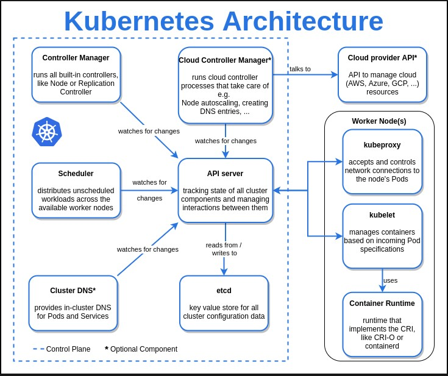

<p align="center">
<strong>Explore the docs »</strong></a><br />
    <a href="https://marcossilvestrini.github.io/learning-kubernetes/">Main Page</a>
    -
    <a href="https://github.com/marcossilvestrini/learning-kubernetes">Code Page</a>
    -
    <a href="https://github.com/marcossilvestrini/learning-kubernetes/issues">Report Bug</a>
    -
    <a href="https://github.com/marcossilvestrini/learning-kubernetes/issues">Request Feature</a>
</p>

## Summary

<details>
  <summary><b>TABLE OF CONTENT</b></summary>
  <ol>
    <li>
      <a href="#about-the-project">About The Project</a>
    </li>
    <li>
      <a href="#getting-started">Getting Started</a>
      <ul>
        <li><a href="#prerequisites">Prerequisites</a></li>
        <li><a href="#installation">Installation</a></li>
      </ul>
    </li>
    <li><a href="#usage">Usage</a></li>
    <li><a href="#roadmap">Roadmap</a></li>
    <li><a href="#kubernetes-architecture">Kubernetes Architecture</a></li>
    <li><a href="#install-kubernetes">Install Kubernetes</a></li>
    <li><a href="#rke2">Rancher RKE2</a></li>
    <li><a href="#kubectl">Kubectl</a></li>
    <li><a href="#containers">Containers</a></li>
    <li><a href="#pods">Pods</a></li>
    <li><a href="#deployment">Deployment</a></li>
    <li><a href="#services">Services</a></li>
    <li><a href="#license">License</a></li>
    <li><a href="#contact">Contact</a></li>
    <li><a href="#acknowledgments">Acknowledgments</a></li>
  </ol>
</details><br>

<a name="about-the-project"></a>

## About Project

>This project aims to help students or professionals to learn the main concepts of kubernetes

<p align="right">(<a href="#readme-top">back to top</a>)</p>

<a name="getting-started"></a>

## Getting Started

This is an example of how you may give instructions on setting up your project locally.
To get a local copy up and running follow these simple example steps.

<a name="prerequisites"></a>

### Prerequisites

This is an example of how to list things you need to use the software
and how to install them.

* git
* Virtual Box and extension
* Vagrant

<a name="installation"></a>

### Installation

#### Clone repository

```sh
git clone https://github.com/marcossilvestrini/learning-kubernetes.git
```

#### Set ssh keys in security folder

```sh
# generate ssh key pair for your user access hosts
ssh-keygen -q -t ecdsa -b 521 -N '' -f ~/.ssh/id_ecdsa <<<y >/dev/null 2>&1
cp ~/.ssh/id_ecdsa.pub security/

# generate ssh key pair for rancher
ssh-keygen -q -t ecdsa -b 521 -N '' -f security/rancher-key-ecdsa <<<y >/dev/null 2>&1
cat security/rancher-key-ecdsa.pub >security/authorized_keys
```

#### Set network

Set network configuration for each VM in Vagrantfile.
Example:

```ruby
# NETWORK
    ol9_server01.vm.network "public_network", nic_type: "virtio", mac: "080027f3066a", ip: "192.168.0.130", netmask: "255.255.255.0", mode: "bridge",bridge: [
      "Intel(R) I211 Gigabit Network Connection",
      "MediaTek Wi-Fi 6 MT7921 Wireless LAN"
    ]    
```

#### Set VM's resources

Set resource configuration as CPU, Memory,etc for each VM in Vagrantfile.
Example:

```ruby
# PROVIDER
infra_server01.vm.provider "virtualbox" do |vb|
    vb.linked_clone = true
    vb.name =VM_INFRA_SERVER01
    vb.memory = 2048
    vb.cpus = 1
end  
```

#### Up kubernetes cluster

```sh
cd learning-kubernetes/vagrant/linux
vagrant up
```

<a name="usage"></a>

## Usage

Use this repository for get learning about kubernetes exam

<p align="right">(<a href="#readme-top">back to top</a>)</p>

<a name="roadmap"></a>

## Roadmap

* [x] Create repository
* [x] Create github action for automation tasks
* [x] Install kubernetes cluster
* [x] Install kubectl
* [x] Add Examples kubernetes pods
* [x] Add Examples kubernetes deployment
* [x] Add app deployment
* [x] Create docker image with project contents
* [ ] Create github action for build docker image

<p align="right">(<a href="#roadmap">back to roadmap</a>)</p>
<p align="right">(<a href="#readme-top">back to top</a>)</p>

>kubernetes Engine work with namespaces(PID,NET,IPC,MNT,UTS) and cgroups.

## Kubernetes Architecture

<a name="kubernetes-architecture"></a>

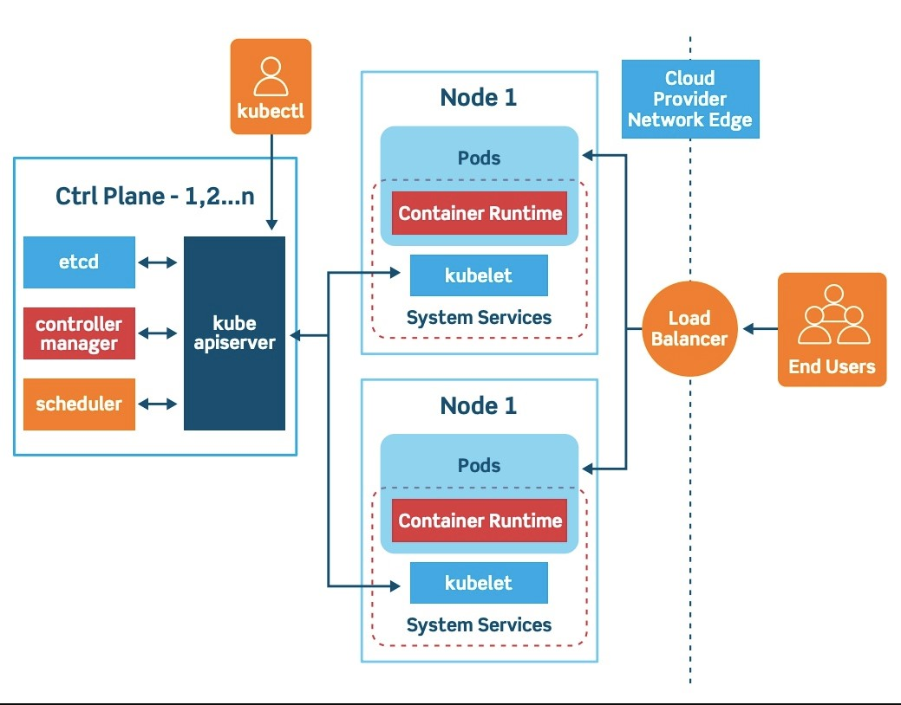

### Control Plane

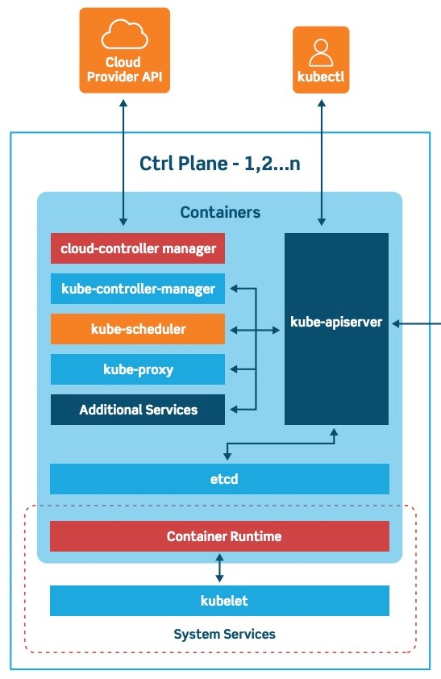

### Node

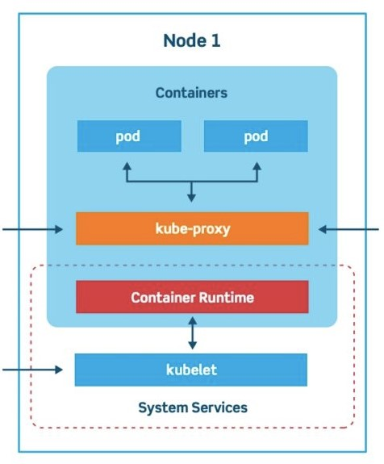

Reference: <https://platform9.com/blog/kubernetes-enterprise-chapter-2-kubernetes-architecture-concepts/>

### Kubernetes ports

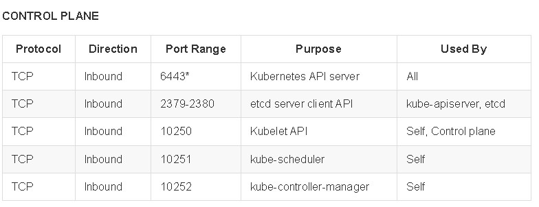

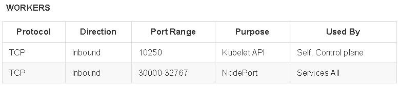

Font: <https://livro.descomplicandokubernetes.com.br/pt/day_one/>

## Install kubernetes

<a name="install-kubernetes"></a>

### Minikube

```sh
# install
curl -Lo minikube https://storage.googleapis.com/minikube/releases/latest/minikube-linux-amd64
chmod +x ./minikube
sudo mv ./minikube /usr/local/bin/minikube

# get version
minikube version

# set hypervisor
minikube config set driver <YOUR_HYPERVISOR>

# up without hypervisor
minikube start --driver=hyperkit

# create cluster
minikube start --nodes 3 -p multinode-cluster

# get status of cluster
minikube status

# get ip address
minikube ip

# access minikube host
minikube ssh

# dashboard
minikube dashboard

# logs
minikube logs

# delete cluster
minikube delete
minikube delete --purge
```

### Kind

```sh
# Install
curl -Lo ./kind https://kind.sigs.k8s.io/dl/v0.14.0/kind-linux-amd64
chmod +x ./kind
sudo mv ./kind /usr/local/bin/kind

# create cluster
kind create cluster
kind create cluster --name silvestrini

# get clusters
kind get clusters

# delete clusters
kind delete clusters $(kind get clusters)

## create yaml
cat << EOF > $HOME/kind-3nodes.yaml
kind: Cluster
apiVersion: kind.x-k8s.io/v1alpha4
nodes:
  - role: control-plane
  - role: worker
  - role: worker
EOF

# create cluster
kind create cluster --name kind-multinodes --config $HOME/kind-3nodes.yaml
```

## RKE2

<a name="rke2"></a>

For create kubernetes cluster using RKE2, see scripts in folder scripts/rke2

### Some commands of stack rke2

Set your PATH variable:

```sh
export PATH=$PATH:/opt/rke2/bin:/var/lib/rancher/rke2/bin
```

#### CONTAINERD - ctr Commands

```zhs
#list containers using ctr
ctr --address /run/k3s/containerd/containerd.sock --namespace k8s.io container ls
```

#### CONTAINERD - crictl Commands

```zhs
#list containers using crictl

## example 1
export CRI_CONFIG_FILE=/var/lib/rancher/rke2/agent/etc/crictl.yaml
crictl ps

## example 2
crictl --config /var/lib/rancher/rke2/agent/etc/crictl.yaml ps

## example 3
crictl --runtime-endpoint unix:///run/k3s/containerd/containerd.sock ps -a


# stats containers
crictl stats
```

### Logging

```sh
journalctl -f -u rke2-server
/var/lib/rancher/rke2/agent/containerd/containerd.log
/var/lib/rancher/rke2/agent/logs/kubelet.log
```

Reference: <https://gist.github.com/superseb/3b78f47989e0dbc1295486c186e944bf>

## Kubectl

<a name="kubectl"></a>

### Install

```sh
# install
curl -LO https://storage.googleapis.com/kubernetes-release/release/`curl -s \ 
https://storage.googleapis.com/kubernetes-release/release/stable.txt`/bin/linux/amd64/kubectl
chmod +x ./kubectl
mv ./kubectl /usr/local/bin/kubectl

# get version
kubectl version  --output=yaml --client

# kubectl autocomplete
source <(kubectl completion bash)

# kubectl alias
alias k=kubectl
complete -F __start_kubectl k
```

### Commands - Kubectl

```bash

########## resources ############

# list all resources
kubectl get all

########## namespaces ###########

# get namespaces
kubectl get namespaces

# describe namespaces
kubectl describe namespaces

########## nodes ############

# list nodes
kubectl get nodes
kubectl get nodes -o wide

# delete node
kubectl drain <node_name> --ignore-daemonsets --delete-emptydir-data
kubectl delete node <node_name>

# get logs
kubectl logs my-nginx
kubectl logs -f my-nginx
```

## Containers

<a name="containers"></a>

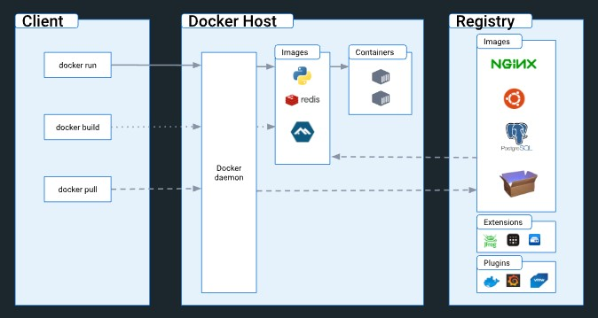


### Commands - Containers

```sh
# get containers in pod
kubectl -n kube-system  describe pods kube-proxy-worker01 | grep -ws -A 10  Containers

# connect in container
kubectl attach silvestrini -c infra

# connect in container
kubectl exec -it pod_name -c container_name bash
kubectl exec infra ls
kubectl exec silvestrini -c infra -- ls
kubectl exec silvestrini -c infra -it sh 

# access container in specific namespace
kubectl exec -it -n kube-system  kube-proxy-worker01 -c kube-proxy -- bash
```

## Pods

<a name="pods"></a>

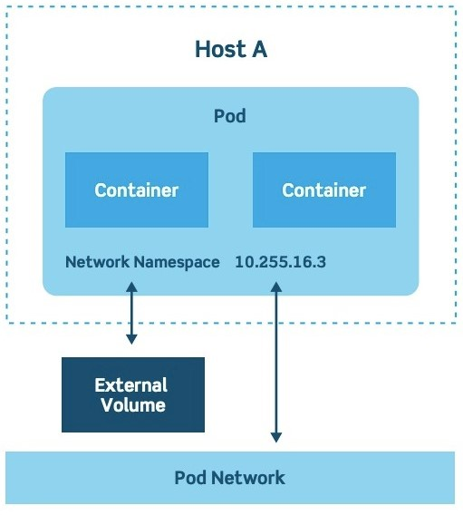

A pod is the smallest execution unit in Kubernetes. A pod encapsulates one or more applications.\
Pods are ephemeral by nature, if a pod (or the node it executes on) fails,\
Kubernetes can automatically create a new replica of that pod to continue operations.\
Pods include one or more containers (such as Docker containers).

Pods also provide environmental dependencies, including persistent\
storage volumes (storage that is permanent and available to all pods\
in the cluster) and configuration data needed to run the container(s) within the pod.

### Commands - Pods

```sh
# list pods
kubectl get pods

# list all pods
kubectl get pods --all-namespaces
kubectl get pods -A
kubectl get pods -A -o wide

# list pods in inspec node

kubectl get pods --all-namespaces -o wide --field-selector spec.nodeName=worker01

# list pods in  kube-system namespace
kubectl get pod -n kube-system
kubectl get pods -n kube-system -o=jsonpath='{range.items[*]}{"\n"}{.metadata.name}{range.spec.containers}'

# list pods with specif output
kubectl get pods -n kube-system -o yaml
kubectl get pods -n kube-system -o json

# list images used in pods
kubectl get pods -o=jsonpath='{range .items[*]}{"\n"}{.metadata.name}{"\t"}{range .spec.containers[*]}{.image}{"\t"}{end}{end}'

# describe details of pods
kubectl describe pod nginx
kubectl -n kube-system  describe pods kube-proxy-worker01

# create pod with manifest
kubectl apply -f pod-template.yaml
kubectl create -f pod.yaml

# execute pods
kubectl run nginx --image nginx

# delete pods
kubectl delete pod nginx
kubectl delete -f pod-template.yaml

# create Service | expose pod
kubectl expose pod my-nginx

```

### Understanding Pod Resources

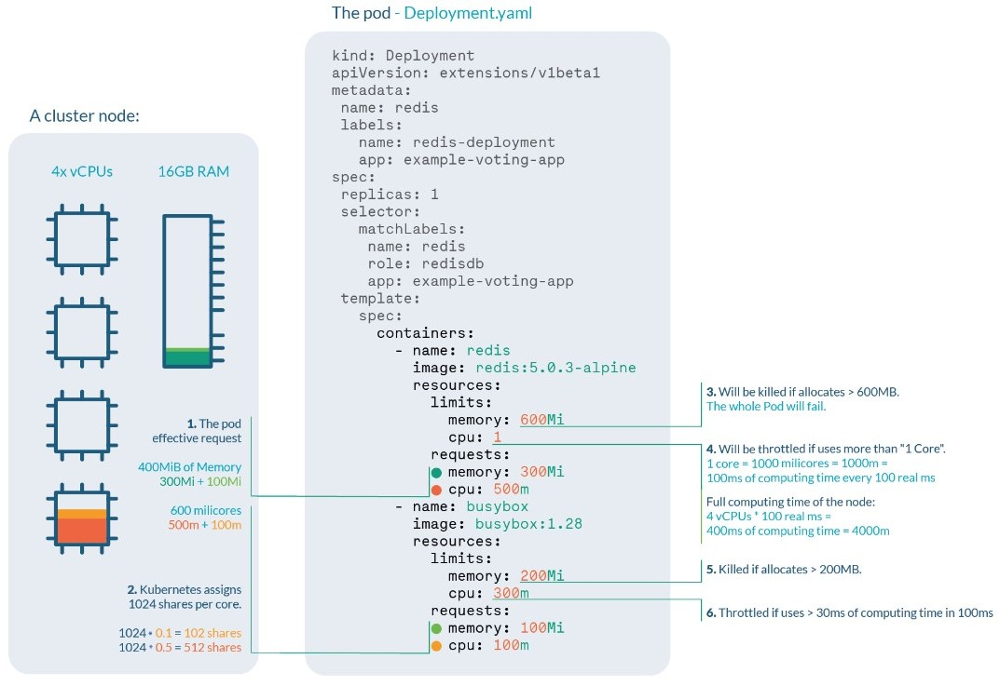

## Deployment

<a name="deployment"></a>

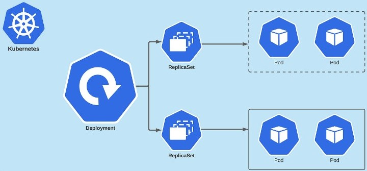

A Deployment provides declarative updates for Pods and ReplicaSets.
You describe a desired state in a Deployment,and the Deployment Controller\
changes the actual state to the desired state at a controlled rate.\
You can define Deployments to create new ReplicaSets, or to remove existing\
Deployments and adopt all their resources with new Deployments.

### Commands - Deployment

```sh
# create manifest|template
kubectl run my-nginx  --image nginx --port 80 --dry-run=client -o yaml >pod-template.yaml

# apply\update deployment
kubectl apply -f deployment.yaml

# list deployments
kubectl get deployments -A
kubectl -n kube-system get deployments.apps
kubectl get deployments -l app=nginx-deployment

# get pods management by deployment
kubectl get pods -l app=nginx-deployment

# describe deployment
kubectl describe deployment nginx-deployment

# check status of deployment
kubectl rollout status deployment nginx-deployment

# running rollback deployment
kubectl rollout undo deployment nginx-deployment
kubectl rollout undo deployment nginx-deployment --to-revision=1

# get deployment history
kubectl rollout history deployment nginx-deployment
kubectl rollout history deployment nginx-deployment --revision=2

# pause deployment(block updates)
kubectl rollout pause deployment nginx-deployment

# resume deployment(allow updates)
kubectl rollout resume deployment nginx-deployment

# restart deployment (recreate all pods in deployment)
kubectl rollout restart deployment nginx-deployment

# delete deployment
kubectl delete deployment nginx-deployment

```

## ReplicaSet

A ReplicaSet's purpose is to maintain a stable set of replica Pods running\
at any given time. As such, it is often used to guarantee the availability of\
a specified number of identical Pods.

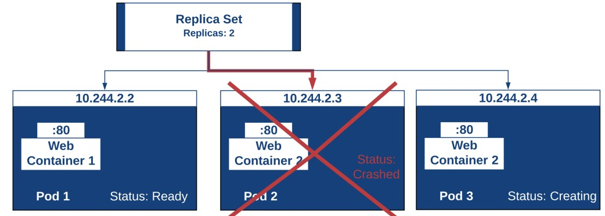

### Commands - ReplicaSet

```sh
# list replicaset
kubectl get replicaset -l app=nginx-deployment

# describe replicaset
kubectl describe replicaset nginx-replicaset

# create replicaset - see folder replicaset/ for examples
kubectl apply -f replicaset.yaml

# delete replicaset
kubectl delete replicaset nginx-deployment
```

## Daemonset

A DaemonSet ensures that all (or some) Nodes run a copy of a Pod.\
As nodes are added to the cluster, Pods are added to them.\
As nodes are removed from the cluster, those Pods are garbage collected.\
Deleting a DaemonSet will clean up the Pods it created.

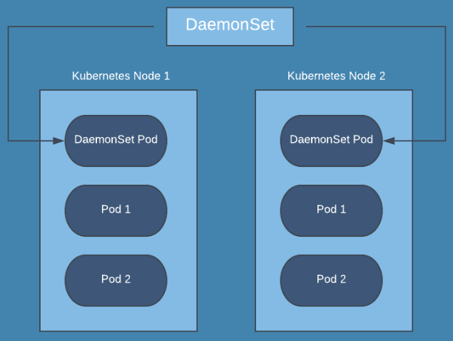

### Commands - Daemonset

```sh
# list daemonset
kubectl get daemonset -A

#$ describe daemonset
kubectl describe daemonset node-exporter

# create daemonset - see folder daemonset/ for examples
kubectl apply -f daemonset.yaml

# delete daemonset
kubectl delete daemonset node-exporter
```

## Probes

Kubernetes probes are health checks that are used to monitor the health of applications and services in a Kubernetes cluster.\
Kubernetes probes are typically implemented using the Kubernetes API, which allows them to query the application or service for information.\
This information can then be used to determine the application's or service's health.\
Kubernetes probes can also be used to detect changes in the application or\ service and send a notification to the Kubernetes control plane, which can\ then take corrective action.


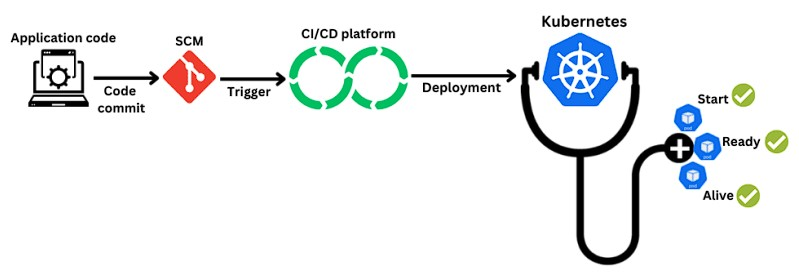

### Types of Probes

#### Startup Probes

A startup probe is used to determine if a container has started successfully.\
This type of probe is typically used for applications that take longer to start up,\
or for containers that perform initialization tasks before they become ready to receive traffic.\
The startup probe is run only once, after the container has been created, and it will delay the start\
of the readiness and liveness probes until it succeeds.\
If the startup probe fails, the container is considered to have failed to start\
and Kubernetes will attempt to restart the container.

#### Readiness Probes

A readiness probe is used to determine if a container is ready to receive traffic.\
This type of probe is used to ensure that a container is fully up and running and can\
accept incoming connections before it is added to the service load balancer.\
A readiness probe can be used to check the availability of an application's dependencies\
or to perform any other check that indicates the container is ready to serve traffic.\
If the readiness probe fails, the container is removed from the service load balancer until the probe succeeds again.

#### Liveness Probes

A liveness probe is used to determine if a container is still running and functioning properly.\
This type of probe is used to detect and recover from container crashes or hang-ups.\
A liveness probe can be used to check the responsiveness of an application or to perform\
any other check that indicates the container is still alive and healthy.\
If the liveness probe fails, Kubernetes will attempt to restart the container to restore its functionality.

## Services

<a name="services"></a>

### Commands - Services

```sh
# list services
kubectl get services
kubectl get svc -o wide

# list services in system namespace
kubectl get svc -n kube-system

# delete service
kubectl delete service nginx
```

<p align="right">(<a href="#kubernetes-secrets">back to install kubernetes</a>)</p>
<p align="right">(<a href="#readme-top">back to top</a>)</p>

## Contributing

Contributions are what make the open source community such an amazing place to
learn, inspire, and create. Any contributions you make are **greatly appreciated**.

If you have a suggestion that would make this better, please fork the repo and
create a pull request. You can also simply open an issue with the tag "enhancement".
Don't forget to give the project a star! Thanks again!

1. Fork the Project
2. Create your Feature Branch (`git checkout -b feature/AmazingFeature`)
3. Commit your Changes (`git commit -m 'Add some AmazingFeature'`)
4. Push to the Branch (`git push origin feature/AmazingFeature`)
5. Open a Pull Request

## License

* This project is licensed under the MIT License * see the LICENSE.md file for details

## Contact

Marcos Silvestrini - marcos.silvestrini@gmail.com \
[](https://twitter.com/mrsilvestrini)

Project Link: [https://github.com/marcossilvestrini/learning-kubernetes](https://github.com/marcossilvestrini/learning-kubernetes)

<p align="right">(<a href="#readme-top">back to top</a>)</p>

## Acknowledgments

* [CNCF - Cloud Native Computing Foundation](https://www.cncf.io/)
* [OCI - Open Container Initiative](https://opencontainers.org/)
* [Borg](https://kubernetes.io/blog/2015/04/borg-predecessor-to-kubernetes/)
* [kubernetes Website](https://kubernetes.io/)
* [Github](https://github.com/kubernetes/kubernetes/)
* [Issues](https://github.com/kubernetes/kubernetes/issues)
* [CKA Certification](https://www.cncf.io/certification/cka/)
* [CKAD Certification](https://www.cncf.io/certification/ckad/)
* [CKS Certification](https://www.cncf.io/certification/cks/)
* [Book Linuxips](https://livro.descomplicandokubernetes.com.br/pt/)
* [Kind](https://kind.sigs.k8s.io/docs/user/quick-start)
* [Minikube](https://github.com/kubernetes/minikube)
* [k0s](https://k0sproject.io/)
* [k3s](https://k3s.io/)
* [RKE2](https://docs.rke2.io/architecture)
* [Up RKE2 Cluster HA](https://computingforgeeks.com/deploy-kubernetes-on-rocky-using-rke2/?expand_article=1)

<p align="right">(<a href="#readme-top">back to top</a>)</p>

<!-- MARKDOWN LINKS & IMAGES-->
<!-- https://www.markdownguide.org/basic-syntax/#reference-style-links -->
[contributors-shield]: https://img.shields.io/github/contributors/marcossilvestrini/learning-kubernetes.svg?style=for-the-badge
[contributors-url]: https://github.com/marcossilvestrini/learning-kubernetes/graphs/contributors
[forks-shield]: https://img.shields.io/github/forks/marcossilvestrini/learning-kubernetes.svg?style=for-the-badge
[forks-url]: https://github.com/marcossilvestrini/learning-kubernetes/network/members
[stars-shield]: https://img.shields.io/github/stars/marcossilvestrini/learning-kubernetes.svg?style=for-the-badge
[stars-url]: https://github.com/marcossilvestrini/learning-kubernetes/stargazers
[issues-shield]: https://img.shields.io/github/issues/marcossilvestrini/learning-kubernetes.svg?style=for-the-badge
[issues-url]: https://github.com/marcossilvestrini/learning-kubernetes/issues
[license-shield]: https://img.shields.io/github/license/marcossilvestrini/learning-kubernetes.svg?style=for-the-badge
[license-url]: https://github.com/marcossilvestrini/learning-kubernetes/blob/master/LICENSE
[linkedin-shield]: https://img.shields.io/badge/-LinkedIn-black.svg?style=for-the-badge&logo=linkedin&colorB=555
[linkedin-url]: https://linkedin.com/in/marcossilvestrini
