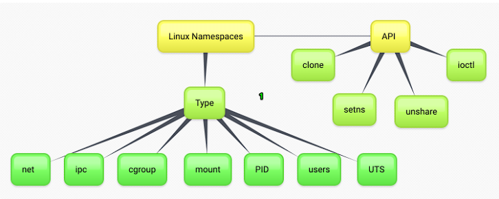
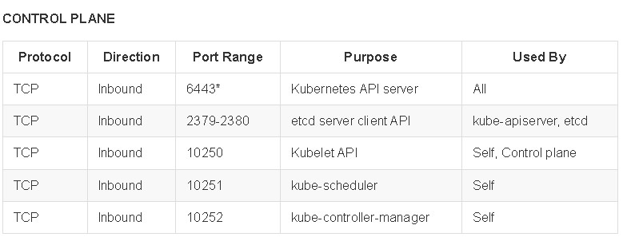
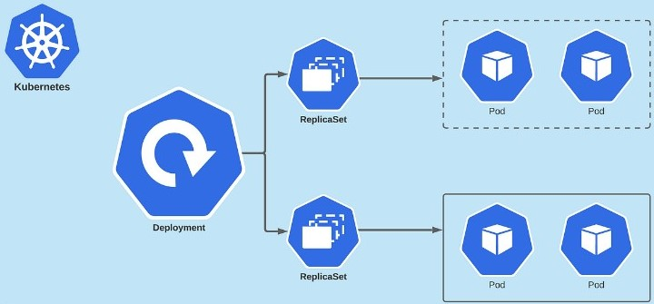
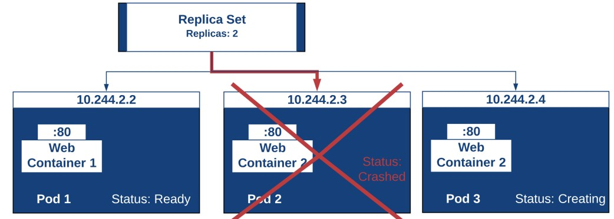
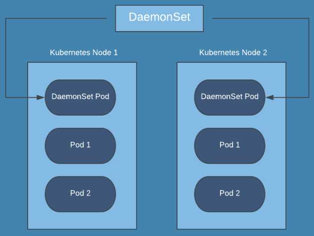
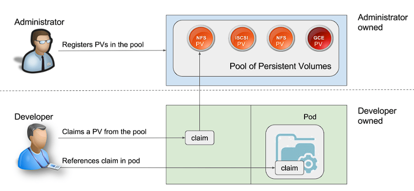

<h1><a name="readme-top"></a></h1>

[](https://github.com/marcossilvestrini/learning-kubernetes/actions/workflows/powershell.yml)
[](https://github.com/marcossilvestrini/learning-kubernetes/actions/workflows/release.yml)
[](https://github.com/marcossilvestrini/learning-kubernetes/actions/workflows/jekyll-gh-pages.yml)
[](https://github.com/marcossilvestrini/learning-kubernetes/actions/workflows/deploy.yml)

[![MIT License][license-shield]][license-url]
[![Forks][forks-shield]][forks-url]
[![Stargazers][stars-shield]][stars-url]
[![Contributors][contributors-shield]][contributors-url]
[![Issues][issues-shield]][issues-url]
[![LinkedIn][linkedin-shield]][linkedin-url]

# LEARNING KUBERNETES


<p align="center">
<strong>Explore the docs »</strong></a><br />
    <a href="https://marcossilvestrini.github.io/learning-kubernetes/">Main Page</a>
    -
    <a href="https://github.com/marcossilvestrini/learning-kubernetes">Code Page</a>
    -
    <a href="https://github.com/marcossilvestrini/learning-kubernetes/issues">Report Bug</a>
    -
    <a href="https://github.com/marcossilvestrini/learning-kubernetes/issues">Request Feature</a>
</p>

## Summary

<details>
  <summary><b>TABLE OF CONTENT</b></summary>
  <ol>
    <li>
      <a href="#about-the-project">About The Project</a>
    </li>
    <li>
      <a href="#getting-started">Getting Started</a>
      <ul>
        <li><a href="#prerequisites">Prerequisites</a></li>
        <li><a href="#installation">Installation</a></li>
      </ul>
    </li>
    <li><a href="#usage">Usage</a></li>
    <li><a href="#roadmap">Roadmap</a></li>
    <li><a href="#linux-namespaces">Linux Namespaces</a></li>
    <li><a href="#kubernetes-architecture">Kubernetes Architecture</a></li>
    <li><a href="#install-kubernetes">Install Kubernetes</a></li>
    <li><a href="#rke2">Rancher RKE2</a></li>
    <li><a href="#kubectl">Kubectl</a></li>
    <li><a href="#containers">Containers</a></li>
    <li><a href="#pods">Pods</a></li>
    <li><a href="#deployment">Deployment</a></li>
    <li><a href="#replicaset">Replicaset</a></li>
    <li><a href="#daemonset">Daemonset</a></li>
    <li><a href="#probes">Probes</a></li>
    <li><a href="#volumes">Volumes</a></li>
    <li><a href="#statefulset">Statefulset</a></li>
    <li><a href="#services">Services</a></li>
    <li><a href="#secrets">Secrets</a></li>
    <li><a href="#license">License</a></li>
    <li><a href="#contact">Contact</a></li>
    <li><a href="#acknowledgments">Acknowledgments</a></li>
  </ol>
</details><br>

<a name="about-the-project"></a>

## About Project

>This project aims to help students or professionals to learn the main concepts of kubernetes

<p align="right">(<a href="#readme-top">back to top</a>)</p>

<a name="getting-started"></a>

## Getting Started

To get a local copy up and running follow these simple example steps.

<a name="prerequisites"></a>

### Prerequisites

List things you need to use the software and how to install them.

```sh
git
Virtual Box and extension
Vagrant
```

<a name="installation"></a>

### Installation

#### Clone repository

```sh
git clone https://github.com/marcossilvestrini/learning-kubernetes.git
```

#### Set ssh keys in security folder

```sh
# generate ssh key pair for your user access hosts
ssh-keygen -q -t ecdsa -b 521 -N '' -f ~/.ssh/id_ecdsa <<<y >/dev/null 2>&1
cp ~/.ssh/id_ecdsa.pub security/

# generate ssh key pair for rancher
ssh-keygen -q -t ecdsa -b 521 -N '' -f security/kubernetes-key-ecdsa <<<y >/dev/null 2>&1
```

#### Set Node pool

You can scale dow or up number of control planes and workers in Vagrantfile array.

Example:

```ruby
...
 # Node|Control Plane Servers
  PLANES = ["control-plane01", "control-plane02", "control-plane03"]
  N = 2

  (0..N).each do |i|
    config.vm.define PLANES[i] do |node|
...
```

#### Set network

Set network configuration for each VM in Vagrantfile.

Example:

```ruby
...
# NETWORK
    ol9_server01.vm.network "public_network", nic_type: "virtio", mac: "080027f3066a", ip: "192.168.0.130", netmask: "255.255.255.0", mode: "bridge",bridge: [
      "Intel(R) I211 Gigabit Network Connection",
      "MediaTek Wi-Fi 6 MT7921 Wireless LAN"
    ]
...    
```

#### Set VM's resources

Set resource configuration as CPU, Memory,etc for each VM in Vagrantfile.

Example:

```ruby
...
# PROVIDER
infra_server01.vm.provider "virtualbox" do |vb|
    vb.linked_clone = true
    vb.name =VM_INFRA_SERVER01
    vb.memory = 2048
    vb.cpus = 1
end
...  
```

#### Up kubernetes cluster

```sh
cd learning-kubernetes/vagrant/linux
vagrant up
```

<a name="usage"></a>

## Usage

Use this repository for get learning about kubernetes

<p align="right">(<a href="#readme-top">back to top</a>)</p>

<a name="roadmap"></a>

## Roadmap

* [x] Create repository
* [x] Create github action for automation tasks
* [x] Install kubernetes cluster
* [x] Install kubectl
* [x] Add kubernetes examples
* [x] Add app deployment
* [x] Create docker image with project contents
* [x] Create github action for build docker image

<p align="right">(<a href="#roadmap">back to roadmap</a>)</p>
<p align="right">(<a href="#readme-top">back to top</a>)</p>

<a name="linux-namespaces"></a>

## Linux Namespaces

kubernetes Engine work with namespaces(PID,NET,IPC,MNT,UTS) and cgroups.



## pid

The Process ID. This file is a handle for the PID namespace of the process.PID namespaces isolate the process ID number space, meaning that processes in different PID namespaces can have the same PID. PID namespaces allow containers to provide functionality such as suspending/resuming the set of processes in the container and migrating the container to a new host while the processes inside the container maintain the same PIDs

## net

This file is a handle for the network namespace of the process. This provides the isolation of the system resources associated with networking and isolates Network devices. The ip netns - is used to process network namespace management
mount This file is a handle for the mount namespace of the process and isolates Mount points

## ipc

This file is a handle for the IPC namespace of the process and isolates System Vs IPC and POSIX message queues

## uts

This file is a handle for the UTS namespace of the process and isolates Hostname and NIS domain name

## user

This file is a handle for the user namespace of the process

## cgroup

the container will have an isolated view of the cgroup hierarchy.

## cgroup vs namespace

*cgroup is a way to control group based traffic control filter, example*

```json
"cgroupsPath": "/myRuntime/myContainer",
    "resources": {
        "memory": {
        "limit": 100000,
        "reservation": 200000
        },
        "devices": [
            {
                "allow": false,
                "access": "rwm"
            }
        ]
   }
```

*namespace: Limit/abstraction what you can see in linux proc*

Font: <https://8gwifi.org/docs/linux-namespace.jsp>

<p align="right">(<a href="#linux-namespaces">back to linux-namespaces</a>)</p>
<p align="right">(<a href="#readme-top">back to top</a>)</p>

## Kubernetes Architecture

<a name="kubernetes-architecture"></a>


### Control Plane


### Node


### Kubernetes ports




### Ports for Rancher Server Nodes on RKE2


<p align="right">(<a href="#kubernetes-architecture">back to kubernetes-architecture</a>)</p>
<p align="right">(<a href="#readme-top">back to top</a>)</p>

## Install kubernetes

<a name="install-kubernetes"></a>

### Minikube

```sh
# install
curl -Lo minikube https://storage.googleapis.com/minikube/releases/latest/minikube-linux-amd64
chmod +x ./minikube
sudo mv ./minikube /usr/local/bin/minikube

# get version
minikube version

# set hypervisor
minikube config set driver <YOUR_HYPERVISOR>

# up without hypervisor
minikube start --driver=hyperkit

# create cluster
minikube start --nodes 3 -p multinode-cluster

# get status of cluster
minikube status

# get ip address
minikube ip

# access minikube host
minikube ssh

# dashboard
minikube dashboard

# logs
minikube logs

# delete cluster
minikube delete
minikube delete --purge
```

### Kind

```sh
# Install
curl -Lo ./kind https://kind.sigs.k8s.io/dl/v0.14.0/kind-linux-amd64
chmod +x ./kind
sudo mv ./kind /usr/local/bin/kind

# create cluster
kind create cluster
kind create cluster --name silvestrini

# get clusters
kind get clusters

# delete clusters
kind delete clusters $(kind get clusters)

## create yaml
cat << EOF > $HOME/kind-3nodes.yaml
kind: Cluster
apiVersion: kind.x-k8s.io/v1alpha4
nodes:
  - role: control-plane
  - role: worker
  - role: worker
EOF

# create cluster
kind create cluster --name kind-multinodes --config $HOME/kind-3nodes.yaml
```

<p align="right">(<a href="#install-kubernetes">back to install-kubernetes</a>)</p>
<p align="right">(<a href="#readme-top">back to top</a>)</p>

## RKE2

<a name="rke2"></a>

For create kubernetes cluster using RKE2, see scripts in folder scripts/linux/k8s/install-rke2.sh

### Some commands of stack rke2

Set your PATH variable:

```sh
export PATH=$PATH:/opt/rke2/bin:/var/lib/rancher/rke2/bin
```

#### CONTAINERD - ctr Commands

```zhs
#list containers using ctr
ctr --address /run/k3s/containerd/containerd.sock --namespace k8s.io container ls
```

#### CONTAINERD - crictl Commands

```zhs
#list containers using crictl

## example 1
export CRI_CONFIG_FILE=/var/lib/rancher/rke2/agent/etc/crictl.yaml
crictl ps

## example 2
crictl --config /var/lib/rancher/rke2/agent/etc/crictl.yaml ps

## example 3
crictl --runtime-endpoint unix:///run/k3s/containerd/containerd.sock ps -a


# stats containers
crictl stats
```

### Logging

```sh
journalctl -f -u rke2-server
/var/lib/rancher/rke2/agent/containerd/containerd.log
/var/lib/rancher/rke2/agent/logs/kubelet.log
```

Reference: <https://gist.github.com/superseb/3b78f47989e0dbc1295486c186e944bf>

<p align="right">(<a href="#rke2">back to rke2</a>)</p>
<p align="right">(<a href="#readme-top">back to top</a>)</p>

## Kubectl

<a name="kubectl"></a>

### Install

```sh
# install
curl -LO https://storage.googleapis.com/kubernetes-release/release/`curl -s \ 
https://storage.googleapis.com/kubernetes-release/release/stable.txt`/bin/linux/amd64/kubectl
chmod +x ./kubectl
mv ./kubectl /usr/local/bin/kubectl

# get version
kubectl version  --output=yaml --client

# kubectl autocomplete
source <(kubectl completion bash)

# kubectl alias
alias k=kubectl
complete -F __start_kubectl k
```

### Commands - Kubectl

```bash

########## resources ############

# list all resources
kubectl get all

########## namespaces ###########

# get namespaces
kubectl get namespaces

# describe namespaces
kubectl describe namespaces

########## nodes ############

# list nodes
kubectl get nodes
kubectl get nodes -o wide

# delete node
kubectl drain <node_name> --ignore-daemonsets --delete-emptydir-data
kubectl delete node <node_name>

# get logs
kubectl logs my-nginx
kubectl logs -f my-nginx
kubectl logs -n kube-system --all-containers=true etcd-control-plane01
```

<p align="right">(<a href="#kubectl">back to kubectl</a>)</p>
<p align="right">(<a href="#readme-top">back to top</a>)</p>

## Containers

<a name="containers"></a>


### Commands - Containers

```sh
# get containers in pod
kubectl -n kube-system  describe pods kube-proxy-worker01 | grep -ws -A 10  Containers

# connect in container
kubectl attach silvestrini -c infra

# connect in container
kubectl exec -it pod_name -c container_name bash
kubectl exec infra ls
kubectl exec silvestrini -c infra -- ls
kubectl exec silvestrini -c infra -it sh 

# access container in specific namespace
kubectl exec -it -n kube-system  kube-proxy-worker01 -c kube-proxy -- bash
```

<p align="right">(<a href="#containers">back to containers</a>)</p>
<p align="right">(<a href="#readme-top">back to top</a>)</p>

## Pods

<a name="pods"></a>


A pod is the smallest execution unit in Kubernetes. A pod encapsulates one or more applications.\
Pods are ephemeral by nature, if a pod (or the node it executes on) fails,\
Kubernetes can automatically create a new replica of that pod to continue operations.\
Pods include one or more containers (such as Docker containers).

Pods also provide environmental dependencies, including persistent\
storage volumes (storage that is permanent and available to all pods\
in the cluster) and configuration data needed to run the container(s) within the pod.

### Commands - Pods

```sh
# create pods without manifest
kubectl run nginx --image nginx
kubectl run -it --rm debug --image=busybox --restart=Never -- sh

# create pod with manifest
kubectl apply -f pod-template.yaml
kubectl create -f pod.yaml

# list pods
kubectl get pods

# list all pods
kubectl get pods --all-namespaces
kubectl get pods -A
kubectl get pods -A -o wide

# list pods in specific node
kubectl get pods --all-namespaces -o wide --field-selector spec.nodeName=worker01

# list pods in  kube-system namespace
kubectl get pod -n kube-system
kubectl get pods -n kube-system -o=jsonpath='{range.items[*]}{"\n"}{.metadata.name}{range.spec.containers}'

# list pods with specif output
kubectl get pods -n kube-system -o yaml
kubectl get pods -n kube-system -o json

# list images used in pods
kubectl get pods -o=jsonpath='{range .items[*]}{"\n"}{.metadata.name}{"\t"}{range .spec.containers[*]}{.image}{"\t"}{end}{end}'

# describe details of pods
kubectl describe pod nginx
kubectl -n kube-system  describe pods kube-proxy-worker01

# delete pods
kubectl delete pod nginx
kubectl delete -f pod-template.yaml

# create Service | expose pod
kubectl expose pod my-nginx

```

### Understanding Pod Resources


<p align="right">(<a href="#pods">back to pods</a>)</p>
<p align="right">(<a href="#readme-top">back to top</a>)</p>

## Deployment

<a name="deployment"></a>



A Deployment provides declarative updates for Pods and ReplicaSets.
You describe a desired state in a Deployment,and the Deployment Controller\
changes the actual state to the desired state at a controlled rate.\
You can define Deployments to create new ReplicaSets, or to remove existing\
Deployments and adopt all their resources with new Deployments.

### Commands - Deployment

```sh
# create manifest|template
kubectl run my-nginx  --image nginx --port 80 --dry-run=client -o yaml >pod-template.yaml

# apply\update deployment
kubectl apply -f deployment.yaml

# list deployments
kubectl get deployments -A
kubectl -n kube-system get deployments.apps
kubectl get deployments -l app=nginx-deployment

# get pods management by deployment
kubectl get pods -l app=nginx-deployment

# describe deployment
kubectl describe deployment nginx-deployment

# check status of deployment
kubectl rollout status deployment nginx-deployment

# running rollback deployment
kubectl rollout undo deployment nginx-deployment
kubectl rollout undo deployment nginx-deployment --to-revision=1

# get deployment history
kubectl rollout history deployment nginx-deployment
kubectl rollout history deployment nginx-deployment --revision=2

# pause deployment(block updates)
kubectl rollout pause deployment nginx-deployment

# resume deployment(allow updates)
kubectl rollout resume deployment nginx-deployment

# restart deployment (recreate all pods in deployment)
kubectl rollout restart deployment nginx-deployment

# delete deployment
kubectl delete deployment nginx-deployment
```

<p align="right">(<a href="#deployment">back to deployment</a>)</p>
<p align="right">(<a href="#readme-top">back to top</a>)</p>

## ReplicaSet

<a name="replicaset"></a>



A ReplicaSet's purpose is to maintain a stable set of replica Pods running\
at any given time. As such, it is often used to guarantee the availability of\
a specified number of identical Pods.

### Commands - ReplicaSet

```sh
# list replicaset
kubectl get replicaset -l app=nginx-deployment

# describe replicaset
kubectl describe replicaset nginx-replicaset

# create replicaset - see folder replicaset/ for examples
kubectl apply -f replicaset.yaml

# delete replicaset
kubectl delete replicas

<p align="right">(<a href="#replicaset">back to replicaset</a>)</p>
<p align="right">(<a href="#readme-top">back to top</a>)</p>

## Daemonset



A DaemonSet ensures that all (or some) Nodes run a copy of a Pod.\
As nodes are added to the cluster, Pods are added to them.\
As nodes are removed from the cluster, those Pods are garbage collected.\
Deleting a DaemonSet will clean up the Pods it created.

### Commands - Daemonset

```sh
# list daemonset
kubectl get daemonset -A

#$ describe daemonset
kubectl describe daemonset node-exporter

# create daemonset - see folder daemonset/ for examples
kubectl apply -f daemonset.yaml

# delete daemonset
kubectl delete daemonset node-exporter
```

## Probes

<a name="probes"></a>


Kubernetes probes are health checks that are used to monitor the health of applications and services in a Kubernetes cluster.\
Kubernetes probes are typically implemented using the Kubernetes API, which allows them to query the application or service for information.\
This information can then be used to determine the application's or service's health.\
Kubernetes probes can also be used to detect changes in the application or\ service and send a notification to the Kubernetes control plane, which can\ then take corrective action.

### Types of Probes

#### Startup Probes

A startup probe is used to determine if a container has started successfully.\
This type of probe is typically used for applications that take longer to start up,\
or for containers that perform initialization tasks before they become ready to receive traffic.\
The startup probe is run only once, after the container has been created, and it will delay the start\
of the readiness and liveness probes until it succeeds.\
If the startup probe fails, the container is considered to have failed to start\
and Kubernetes will attempt to restart the container.

#### Readiness Probes

A readiness probe is used to determine if a container is ready to receive traffic.\
This type of probe is used to ensure that a container is fully up and running and can\
accept incoming connections before it is added to the service load balancer.\
A readiness probe can be used to check the availability of an application's dependencies\
or to perform any other check that indicates the container is ready to serve traffic.\
If the readiness probe fails, the container is removed from the service load balancer until the probe succeeds again.

#### Liveness Probes

A liveness probe is used to determine if a container is still running and functioning properly.\
This type of probe is used to detect and recover from container crashes or hang-ups.\
A liveness probe can be used to check the responsiveness of an application or to perform\
any other check that indicates the container is still alive and healthy.\
If the liveness probe fails, Kubernetes will attempt to restart the container to restore its functionality.

<p align="right">(<a href="#probes">back to probes</a>)</p>
<p align="right">(<a href="#readme-top">back to top</a>)</p>

## Volumes

<a name="volumes"></a>


### Storage Class


Some Storage Class providers

* kubernetes.io/aws-ebs: AWS Elastic Block Store (EBS)
* kubernetes.io/azure-disk: Azure Disk
* kubernetes.io/gce-pd: Google Compute Engine (GCE) Persistent Disk
* kubernetes.io/cinder: OpenStack Cinder
* kubernetes.io/vsphere-volume: vSphere
* kubernetes.io/no-provisioner: Volumes locais
* kubernetes.io/host-path: Volumes locais

### PV - Persistent volume



Some Types of PV

* Local
  * HostPath
* Network
  * NFS
  * iSCSI
  * Ceph RBD(RAdos Block Device)
  * GlusterFS
  * Cloud Providers(EBS,Google Cloud Persistent Disk,Azure Disk Storage)

#### Type of Storage(hostPath)

* hostPath
* nfs
* iscsi
* csi
* local
* fc

### PVC - Persistent Volume Claim


### Commands - Volumes

```bash
# list storage classes
kubectl get storageclass

# describe storage class
kubectl describe storageclass silvestrini

# get storage class provisioners
kubectl get storageclasses.storage.k8s.io  -o=jsonpath='{range.items[*]}{.provisioner}{"\n"}'

# list pv in cluster
kubectl get pv -A

# describe pv
kubectl describe pv my-pv

# list pvc
kubectl get pvc -o wide

# delete pvc 
kubectl delete pvc my-pvc

# describe pvc
kubectl describe pvc my-pvc

# get events
kubectl get events my-pvc.1772cda2d4c7069b
```

<p align="right">(<a href="#volumes">back to volumes</a>)</p>
<p align="right">(<a href="#readme-top">back to top</a>)</p>

## StatefulSet

<a name="statefulset"></a>


StatefulSet is the workload API object used to manage stateful applications.

Manages the deployment and scaling of a set of Pods, and provides guarantees about the ordering and uniqueness of these Pods.

Like a Deployment, a StatefulSet manages Pods that are based on an identical container spec.\
Unlike a Deployment, a StatefulSet maintains a sticky identity for each of its Pods.\

These pods are created from the same spec, but are not interchangeable: each has a persistent identifier that it maintains across any rescheduling.

If you want to use storage volumes to provide persistence for your workload,\
you can use a StatefulSet as part of the solution. Although individual Pods in\
a StatefulSet are susceptible to failure, the persistent Pod identifiers make\
it easier to match existing volumes to the new Pods that replace any that have failed.

### DNS for pods in StatefulSet

```sh
<pod-name>.<service-name>.<namespace>.svc.cluster.local
# Example: nginx-0.nginx.default.svc.cluster.local 
```

### Commands - StatefulSet

```bash
# list statefulsets
kubectl get statefulsets

# describe statefulsets
kubectl describe  statefulsets.apps  nginx 

# delete statefulset
kubectl delete statefulset nginx

# test network service
## create container for test
kubectl run -it --rm --image=busybox --restart=Never -- sh

## test nslookup
nslookup  nginx-0.nginx.default.svc.cluster.local

## test web page
wget -O- http://nginx-0.nginx.default.svc.cluster.local
```

<p align="right">(<a href="#statefulset">back to statefulset</a>)</p>
<p align="right">(<a href="#readme-top">back to top</a>)</p>

## Services

<a name="services"></a>


A Kubernetes service is a logical abstraction for a deployed group of pods in a cluster\
(which all perform the same function).\
Since pods are ephemeral, a service enables a group of pods, which provide specific\
functions (web services, image processing, etc.) to be assigned a name and unique IP\
address (clusterIP).

### Service Types in Kubernetes

#### ClusterIP Services

ClusterIP is the default service type in Kubernetes, and it provides internal connectivity between different components of our application. Kubernetes assigns a virtual IP address to a ClusterIP service that can solely be accessed from within the cluster during its creation. This IP address is stable and doesn’t change even if the pods behind the service are rescheduled or replaced.

ClusterIP services are an excellent choice for internal communication between different components of our application that don’t need to be exposed to the outside world. For example, if we have a microservice that processes data and sends it to another microservice for further processing, we can use a ClusterIP service to connect them.

To create a ClusterIP service in Kubernetes, we need to define it in a YAML file and apply it to the cluster. Here's an example of a simple ClusterIP service definition:

```yaml
apiVersion: v1
kind: Service
metadata:
  name: backend
spec:
  selector:
    app: backend
  ports:
  - name: http
    port: 80
    targetPort: 8080
```

In this example, we define a service named backend with a selector that targets pods labeled with app: backend. The service exposes port 80, which is the port used by clients to access the service, and forwards the traffic to the pods’ port 8080, which is where the backend application is running.

#### NodePort Services

NodePort services extend the functionality of ClusterIP services by enabling external connectivity to our application. When we create a NodePort service on any node within the cluster that meets the defined criteria, Kubernetes opens up a designated port that forwards traffic to the corresponding ClusterIP service running on the node.

These services are ideal for applications that need to be accessible from outside the cluster, such as web applications or APIs. With NodePort services, we can access our application using the node’s IP address and the port number assigned to the service.

Let's look at an example of a simple NodePort service definition:

```yaml
apiVersion: v1 
kind: Service 
metadata: 
  name: frontend 
spec: 
  selector: 
    app: frontend 
  type: NodePort 
  ports: 
    - name: http 
      port: 80 
      targetPort: 8080
```

We define a service named frontend that targets pods labeled with app: frontend by setting a selector. The service exposes port 80 and forwards the traffic to the pods’ port 8080. We set the service type to NodePort, and Kubernetes exposes the service on a specific port on a qualifying node within the cluster.

When we create a NodePort service, Kubernetes assigns a port number from a predefined range of 30000-32767. Additionally, we can specify a custom port number by adding the nodePort field to the service definition:

```yaml

apiVersion: v1
kind: Service
metadata:
  name: frontend
spec:
  selector:
    app: frontend
  type: NodePort
  ports:
  - name: http
    port: 80
    targetPort: 8080
    nodePort: 30080
```

The nodePort field is specified as 30080, which tells Kubernetes to expose the service on port 30080 on every node in the cluster.

#### LoadBalancer Services

LoadBalancer services connect our applications externally, and production environments use them where high availability and scalability are critical. When we create a LoadBalancer service, Kubernetes provisions a load balancer in our cloud environment and forwards the traffic to the nodes running the service.

LoadBalancer services are ideal for applications that need to handle high traffic volumes, such as web applications or APIs. With LoadBalancer services, we can access our application using a single IP address assigned to the load balancer.

Here's an example of a simple LoadBalancer service definition:

```yaml
apiVersion: v1
kind: Service
metadata:
  name: web
spec:
  selector:
    app: web
  type: LoadBalancer
  ports:
    - name: http
      port: 80
      targetPort: 8080
```

We set the service type to LoadBalancer to instruct Kubernetes to provision a load balancer. Here, we define a service named web and specify a selector that targets pods labeled with app: web. Additionally, we expose port 80 and forward traffic to the pods’ port 8080.

After creating the LoadBalancer service, Kubernetes provisions a load balancer in the cloud environment with a public IP address. We can use this IP address to access our application from outside the cluster.


Reference: <https://www.baeldung.com/ops/kubernetes-service-types>

### Commands - Services

```sh
# list services
kubectl get services
kubectl get svc -o wide

# list services in system namespace
kubectl get svc -n kube-system

# details of services 
kubectl describe svc nginx
kubectl describe svc -n kube-system

# list endpoints
kubectl get endpoints

# create ClusterIP service
kubectl expose deployment app-silvestrini --port=80 --target-port=8080

# create NodePort service
kubectl expose deployment app-silvestrini --type=NodePort --port=80 --target-port=8080

# create loadbalance service
kubectl expose deployment app-silvestrini --type=LoadBalancer --port=80 --target-port=8080

#create external name service
kubectl create service externalname app-silvestrini --external-name my-db.skynet.com.br

# delete service
kubectl delete service nginx
```

<p align="right">(<a href="#services">back to services</a>)</p>
<p align="right">(<a href="#readme-top">back to top</a>)</p>

## Secrets

<a name="service"></a>


A Secret is an object that contains a small amount of sensitive data such as a password, a token, or a key. Such information might otherwise be put in a Pod specification or in a container image. Using a Secret means that you don't need to include confidential data in your application code.

Because Secrets can be created independently of the Pods that use them, there is less risk of the Secret (and its data) being exposed during the workflow of creating, viewing, and editing Pods. Kubernetes, and applications that run in your cluster, can also take additional precautions with Secrets, such as avoiding writing secret data to nonvolatile storage.

Secrets are similar to ConfigMaps but are specifically intended to hold confidential data.

### Types of Secrets

* Opaque Secrets - these are the simplest and most common secrets. They store arbitrary data such as API keys, passwords, and tokens. Opaque Secrets are encoded in base64 when stored in Kubernetes, but they are not encrypted. They can be used to store sensitive data but are not secure enough for highly sensitive information like database passwords.

* kubernetes.io/service-account-token - used to store service account access tokens. These tokens are used to authenticate Pods with the Kubernetes API. They are automatically mounted in Pods that use service accounts.

* kubernetes.io/dockercfg and kubernetes.io/dockerconfigjson - used to store Docker registry credentials. They are used to authenticate Pods with a Docker registry. They are mounted in Pods that use private container images.

* kubernetes.io/tls, kubernetes.io/ssh-auth, and kubernetes.io/basic-auth - used to store TLS certificates, SSH keys, and basic authentication credentials, respectively. They are used to authenticate Pods with other services.

* bootstrap.kubernetes.io/token - used to store cluster bootstrapping tokens. They are used to authenticate nodes with the Kubernetes control plane.

### Commands - Secrets

```sh
# get secrets
kubectl get secrets -A

# describe secrets
kubectl describe secret -n cert-manager cert-manager-webhook-ca

# create opaque secret
kubectl create secret generic silvestrini-secret --from-literal=username=silvestrini --from-literal=password=silvestrini

# create tls secret
# generate certs
# openssl req -x509 -nodes -days 365 -newkey rsa:2048 -keyout private-key.key -out cert.crt
kubectl create secret tls my-service-web-tls-secret --cert=cert.crt --key=private-key.key
```

<p align="right">(<a href="#secrets">back to secrets</a>)</p>
<p align="right">(<a href="#readme-top">back to top</a>)</p>


## ConfigMaps

<a name="configmap"></a>


A ConfigMap is an API object used to store non-confidential data in key-value pairs.\
Pods can consume ConfigMaps as environment variables, command-line arguments, or as configuration files in a volume.

A ConfigMap allows you to decouple environment-specific configuration from your container images, so that your applications are easily portable.

### Commands - ConfigMaps

```sh
# create configmap
kubectl create configmap nginx-config --from-file=kubernetes/configmaps/nginx.conf

# get configmaps
kubectl get configmaps

# describe configmaps
kubectl describe configmaps nginx-config
```

<p align="right">(<a href="#configmap">back to configmap</a>)</p>
<p align="right">(<a href="#readme-top">back to top</a>)</p>

## Contributing

Contributions are what make the open source community such an amazing place to
learn, inspire, and create. Any contributions you make are **greatly appreciated**.

If you have a suggestion that would make this better, please fork the repo and
create a pull request. You can also simply open an issue with the tag "enhancement".
Don't forget to give the project a star! Thanks again!

1. Fork the Project
2. Create your Feature Branch (`git checkout -b feature/AmazingFeature`)
3. Commit your Changes (`git commit -m 'Add some AmazingFeature'`)
4. Push to the Branch (`git push origin feature/AmazingFeature`)
5. Open a Pull Request

## License

* This project is licensed under the MIT License * see the LICENSE.md file for details

## Contact

Marcos Silvestrini - marcos.silvestrini@gmail.com \
[](https://twitter.com/mrsilvestrini)

Project Link: [https://github.com/marcossilvestrini/learning-kubernetes](https://github.com/marcossilvestrini/learning-kubernetes)

<p align="right">(<a href="#readme-top">back to top</a>)</p>

## Acknowledgments

* [CNCF - Cloud Native Computing Foundation](https://www.cncf.io/)
* [OCI - Open Container Initiative](https://opencontainers.org/)
* [Borg](https://kubernetes.io/blog/2015/04/borg-predecessor-to-kubernetes/)
* [kubernetes Website](https://kubernetes.io/)
* [Kubernetes Architecture](https://platform9.com/blog/kubernetes-enterprise-chapter-2-kubernetes-architecture-concepts/)
* [Github](https://github.com/kubernetes/kubernetes/)
* [Issues](https://github.com/kubernetes/kubernetes/issues)
* [CKA Certification](https://www.cncf.io/certification/cka/)
* [CKAD Certification](https://www.cncf.io/certification/ckad/)
* [CKS Certification](https://www.cncf.io/certification/cks/)
* [Kind](https://kind.sigs.k8s.io/docs/user/quick-start)
* [Minikube](https://github.com/kubernetes/minikube)
* [k0s](https://k0sproject.io/)
* [k3s](https://k3s.io/)
* [RKE2](https://docs.rke2.io/architecture)
* [Up RKE2 Cluster HA](https://computingforgeeks.com/deploy-kubernetes-on-rocky-using-rke2/?expand_article=1)
* [Kubernetes Workloads](https://www.suse.com/c/rancher_blog/introduction-to-kubernetes-workloads/)
* [Rancher Local Path Provisioner](https://github.com/rancher/local-path-provisioner)
* [Kubernetes Dashboard](https://upcloud.com/resources/tutorials/deploy-kubernetes-dashboard)
* [Openlens Cluster Managment](https://github.com/MuhammedKalkan/OpenLens)
* [Book Linuxips](https://livro.descomplicandokubernetes.com.br/pt/)
* [Kubernetes Services](https://cast.ai/blog/kubernetes-load-balancer-expert-guide-with-examples/)

<p align="right">(<a href="#readme-top">back to top</a>)</p>

<!-- MARKDOWN LINKS & IMAGES-->
<!-- https://www.markdownguide.org/basic-syntax/#reference-style-links -->
[contributors-shield]: https://img.shields.io/github/contributors/marcossilvestrini/learning-kubernetes.svg?style=for-the-badge
[contributors-url]: https://github.com/marcossilvestrini/learning-kubernetes/graphs/contributors
[forks-shield]: https://img.shields.io/github/forks/marcossilvestrini/learning-kubernetes.svg?style=for-the-badge
[forks-url]: https://github.com/marcossilvestrini/learning-kubernetes/network/members
[stars-shield]: https://img.shields.io/github/stars/marcossilvestrini/learning-kubernetes.svg?style=for-the-badge
[stars-url]: https://github.com/marcossilvestrini/learning-kubernetes/stargazers
[issues-shield]: https://img.shields.io/github/issues/marcossilvestrini/learning-kubernetes.svg?style=for-the-badge
[issues-url]: https://github.com/marcossilvestrini/learning-kubernetes/issues
[license-shield]: https://img.shields.io/github/license/marcossilvestrini/learning-kubernetes.svg?style=for-the-badge
[license-url]: https://github.com/marcossilvestrini/learning-kubernetes/blob/master/LICENSE
[linkedin-shield]: https://img.shields.io/badge/-LinkedIn-black.svg?style=for-the-badge&logo=linkedin&colorB=555
[linkedin-url]: https://linkedin.com/in/marcossilvestrini
