<h1><a name="readme-top"></a></h1>

[](https://github.com/marcossilvestrini/learning-kubernetes/actions/workflows/powershell.yml)[](https://github.com/marcossilvestrini/learning-kubernetes/actions/workflows/release.yml)[](https://github.com/marcossilvestrini/learning-kubernetes/actions/workflows/jekyll-gh-pages.yml)[](https://github.com/marcossilvestrini/learning-kubernetes/actions/workflows/deploy.yml)

[![MIT License][license-shield]][license-url][![Forks][forks-shield]][forks-url][![Stargazers][stars-shield]][stars-url][![Contributors][contributors-shield]][contributors-url][![Issues][issues-shield]][issues-url][![LinkedIn][linkedin-shield]][linkedin-url]

# APRENDENDO KUBERNETES

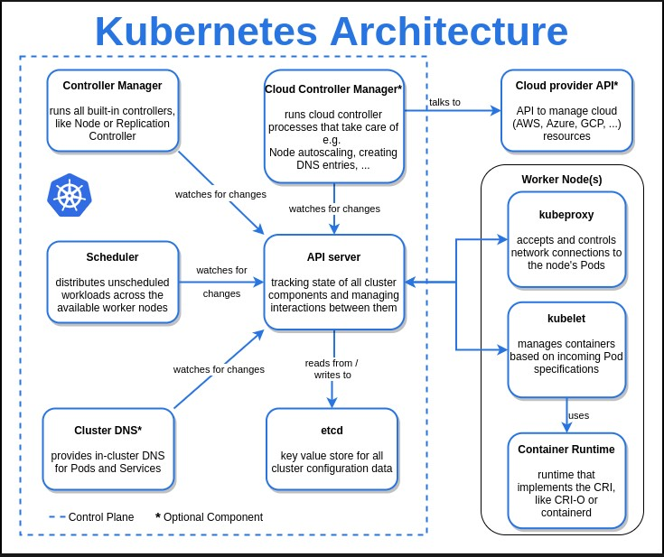


<p align="center">
<strong>Explore the docs »</strong></a><br />
    <a href="https://marcossilvestrini.github.io/learning-kubernetes/">Main Page</a>
    -
    <a href="https://github.com/marcossilvestrini/learning-kubernetes">Code Page</a>
    -
    <a href="https://github.com/marcossilvestrini/learning-kubernetes/issues">Report Bug</a>
    -
    <a href="https://github.com/marcossilvestrini/learning-kubernetes/issues">Request Feature</a>
</p>

## Resumo

<details>
  <summary><b>TABLE OF CONTENT</b></summary>
  <ol>
    <li>
      <a href="#about-the-project">About The Project</a>
    </li>
    <li>
      <a href="#getting-started">Getting Started</a>
      <ul>
        <li><a href="#prerequisites">Prerequisites</a></li>
        <li><a href="#installation">Installation</a></li>
      </ul>
    </li>
    <li><a href="#usage">Usage</a></li>
    <li><a href="#roadmap">Roadmap</a></li>
    <li><a href="#linux-namespaces">Linux Namespaces</a></li>
    <li><a href="#kubernetes-architecture">Kubernetes Architecture</a></li>
    <li><a href="#install-kubernetes">Install Kubernetes</a></li>
    <li><a href="#rke2">Rancher RKE2</a></li>
    <li><a href="#kubectl">Kubectl</a></li>
    <li><a href="#containers">Containers</a></li>
    <li><a href="#pods">Pods</a></li>
    <li><a href="#deployment">Deployment</a></li>
    <li><a href="#replicaset">Replicaset</a></li>
    <li><a href="#daemonset">Daemonset</a></li>
    <li><a href="#probes">Probes</a></li>
    <li><a href="#volumes">Volumes</a></li>
    <li><a href="#statefulset">Statefulset</a></li>
    <li><a href="#services">Services</a></li>
    <li><a href="#secrets">Secrets</a></li>
    <li><a href="#license">License</a></li>
    <li><a href="#contact">Contact</a></li>
    <li><a href="#acknowledgments">Acknowledgments</a></li>
  </ol>
</details><br>

<a name="about-the-project"></a>

## Sobre o projeto

> Este projeto visa ajudar estudantes ou profissionais a aprender os principais conceitos do kubernetes

<p align="right">(<a href="#readme-top">back to top</a>)</p>

<a name="getting-started"></a>

## Começando

Para obter uma cópia local instalada e funcionando, siga estas etapas simples de exemplo.

<a name="prerequisites"></a>

### Pré-requisitos

Liste o que você precisa para usar o software e como instalá-lo.

```sh
git
Virtual Box and extension
Vagrant
```

<a name="installation"></a>

### Instalação

#### Clonar repositório

```sh
git clone https://github.com/marcossilvestrini/learning-kubernetes.git
```

#### Defina chaves ssh na pasta de segurança

```sh
# generate ssh key pair for your user access hosts
ssh-keygen -q -t ecdsa -b 521 -N '' -f ~/.ssh/id_ecdsa <<<y >/dev/null 2>&1
cp ~/.ssh/id_ecdsa.pub security/

# generate ssh key pair for rancher
ssh-keygen -q -t ecdsa -b 521 -N '' -f security/kubernetes-key-ecdsa <<<y >/dev/null 2>&1
```

#### Definir pool de nós

Você pode diminuir ou aumentar o número de planos de controle e trabalhadores na matriz Vagrantfile.

Exemplo:

```ruby
...
 # Node|Control Plane Servers
  PLANES = ["control-plane01", "control-plane02", "control-plane03"]
  N = 2

  (0..N).each do |i|
    config.vm.define PLANES[i] do |node|
...
```

#### Definir rede

Defina a configuração de rede para cada VM no Vagrantfile.

Exemplo:

```ruby
...
# NETWORK
    ol9_server01.vm.network "public_network", nic_type: "virtio", mac: "080027f3066a", ip: "192.168.0.130", netmask: "255.255.255.0", mode: "bridge",bridge: [
      "Intel(R) I211 Gigabit Network Connection",
      "MediaTek Wi-Fi 6 MT7921 Wireless LAN"
    ]
...    
```

#### Definir recursos da VM

Defina a configuração de recursos como CPU, memória, etc. para cada VM no Vagrantfile.

Exemplo:

```ruby
...
# PROVIDER
infra_server01.vm.provider "virtualbox" do |vb|
    vb.linked_clone = true
    vb.name =VM_INFRA_SERVER01
    vb.memory = 2048
    vb.cpus = 1
end
...  
```

#### Acima do cluster Kubernetes

```sh
cd learning-kubernetes/vagrant/linux
vagrant up
```

<a name="usage"></a>

## Uso

Use este repositório para aprender sobre kubernetes

<p align="right">(<a href="#readme-top">back to top</a>)</p>

<a name="roadmap"></a>

## Roteiro

-   [x] Criar repositório
-   [x] Crie ação no GitHub para tarefas de automação
-   [x] Instale o cluster Kubernetes
-   [x] Instalar o kubectl
-   [x] Adicionar exemplos de Kubernetes
-   [x] Adicionar implantação de aplicativo
-   [x] Crie uma imagem docker com o conteúdo do projeto
-   [x] Criar ação no github para construir imagem docker

<p align="right">(<a href="#roadmap">back to roadmap</a>)</p>
<p align="right">(<a href="#readme-top">back to top</a>)</p>

<a name="linux-namespaces"></a>

## Namespaces Linux

O Kubernetes Engine funciona com namespaces (PID,NET,IPC,MNT,UTS) e cgroups.

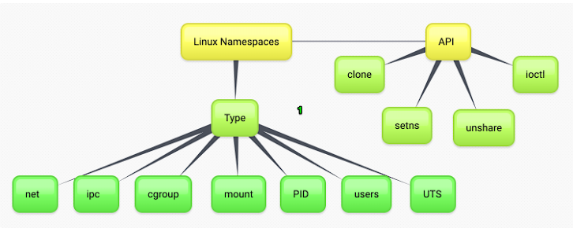

## pid

O ID do processo. Este arquivo é um identificador para o namespace PID do processo. Os namespaces PID isolam o espaço do número de ID do processo, o que significa que processos em diferentes namespaces PID podem ter o mesmo PID. Os namespaces PID permitem que os contêineres forneçam funcionalidades como suspender/retomar o conjunto de processos no contêiner e migrar o contêiner para um novo host enquanto os processos dentro do contêiner mantêm os mesmos PIDs

## líquido

Este arquivo é um identificador para o namespace de rede do processo. Isso fornece o isolamento dos recursos do sistema associados à rede e isola os dispositivos de rede. O ip netns - é usado para processar o gerenciamento de namespace de rede
mount Este arquivo é um identificador para o namespace de montagem do processo e isola os pontos de montagem

## ipc

Este arquivo é um identificador para o namespace IPC do processo e isola filas de mensagens System Vs IPC e POSIX

## uts

Este arquivo é um identificador para o namespace UTS do processo e isola o nome do host e o nome de domínio NIS

## do utilizador

Este arquivo é um identificador para o namespace do usuário do processo

## cgrupo

o contêiner terá uma visão isolada da hierarquia do cgroup.

## cgroup vs namespace

_cgroup é uma forma de controlar filtro de controle de tráfego baseado em grupo, exemplo_

```json
"cgroupsPath": "/myRuntime/myContainer",
    "resources": {
        "memory": {
        "limit": 100000,
        "reservation": 200000
        },
        "devices": [
            {
                "allow": false,
                "access": "rwm"
            }
        ]
   }
```

_namespace: Limite/abstração do que você pode ver no linux proc_

Fonte:<https://8gwifi.org/docs/linux-namespace.jsp>

<p align="right">(<a href="#linux-namespaces">back to linux-namespaces</a>)</p>
<p align="right">(<a href="#readme-top">back to top</a>)</p>

## Arquitetura Kubernetes

<a name="kubernetes-architecture"></a>

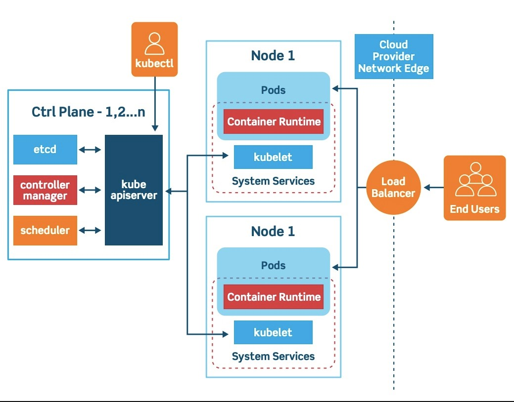

### Plano de controle

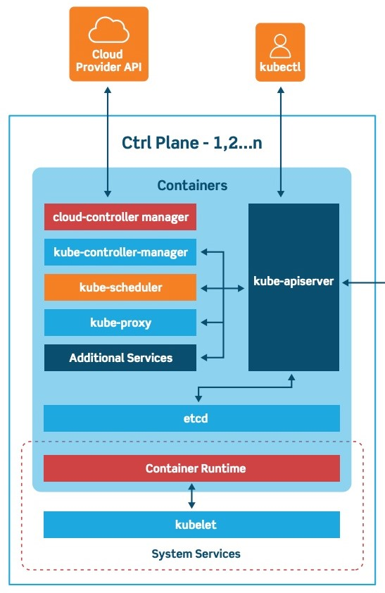

### Nó

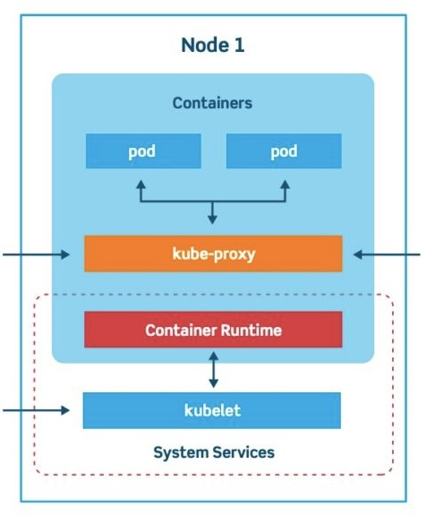

### Portas Kubernetes

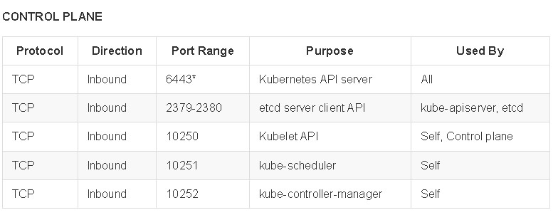

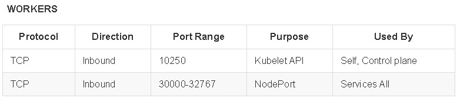

### Portas para nós do servidor Rancher em RKE2

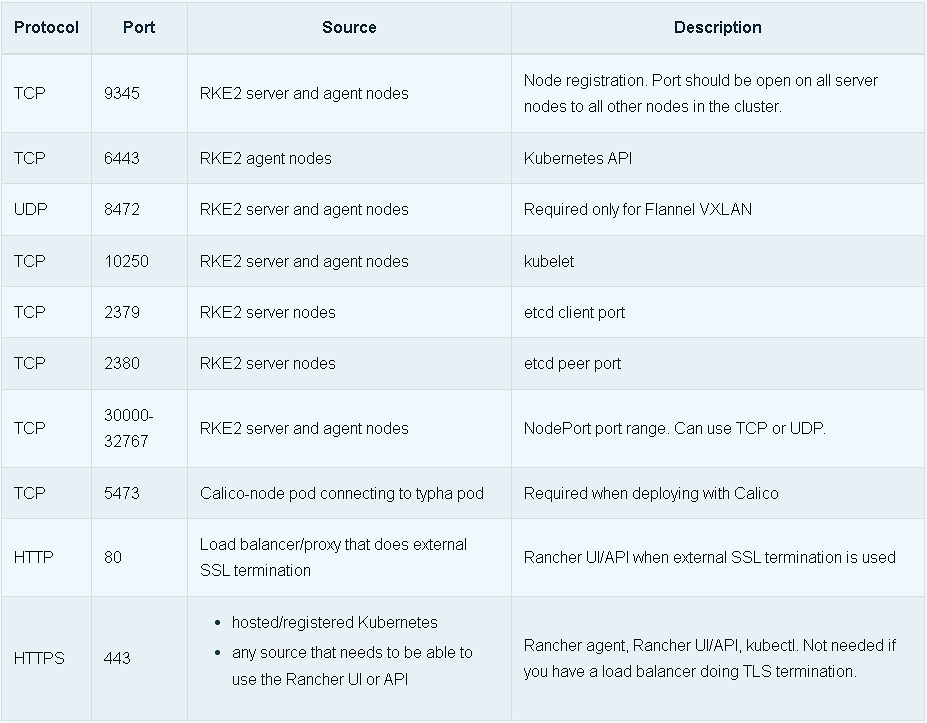

<p align="right">(<a href="#kubernetes-architecture">back to kubernetes-architecture</a>)</p>
<p align="right">(<a href="#readme-top">back to top</a>)</p>

## Instale Kubernetes

<a name="install-kubernetes"></a>

### Feio

```sh
# install
curl -Lo minikube https://storage.googleapis.com/minikube/releases/latest/minikube-linux-amd64
chmod +x ./minikube
sudo mv ./minikube /usr/local/bin/minikube

# get version
minikube version

# set hypervisor
minikube config set driver <YOUR_HYPERVISOR>

# up without hypervisor
minikube start --driver=hyperkit

# create cluster
minikube start --nodes 3 -p multinode-cluster

# get status of cluster
minikube status

# get ip address
minikube ip

# access minikube host
minikube ssh

# dashboard
minikube dashboard

# logs
minikube logs

# delete cluster
minikube delete
minikube delete --purge
```

### Tipo

```sh
# Install
curl -Lo ./kind https://kind.sigs.k8s.io/dl/v0.14.0/kind-linux-amd64
chmod +x ./kind
sudo mv ./kind /usr/local/bin/kind

# create cluster
kind create cluster
kind create cluster --name silvestrini

# get clusters
kind get clusters

# delete clusters
kind delete clusters $(kind get clusters)

## create yaml
cat << EOF > $HOME/kind-3nodes.yaml
kind: Cluster
apiVersion: kind.x-k8s.io/v1alpha4
nodes:
  - role: control-plane
  - role: worker
  - role: worker
EOF

# create cluster
kind create cluster --name kind-multinodes --config $HOME/kind-3nodes.yaml
```

<p align="right">(<a href="#install-kubernetes">back to install-kubernetes</a>)</p>
<p align="right">(<a href="#readme-top">back to top</a>)</p>

## delicado

<a name="rke2"></a>

Para criar cluster kubernetes usando RKE2, consulte scripts na pasta scripts/linux/k8s/install-rke2.sh

### Alguns comandos da pilha rke2

Defina sua variável PATH:

```sh
export PATH=$PATH:/opt/rke2/bin:/var/lib/rancher/rke2/bin
```

#### CONTAINERD - Comandos ctr

```zhs
#list containers using ctr
ctr --address /run/k3s/containerd/containerd.sock --namespace k8s.io container ls
```

#### CONTAINERD - Comandos crictl

```zhs
#list containers using crictl

## example 1
export CRI_CONFIG_FILE=/var/lib/rancher/rke2/agent/etc/crictl.yaml
crictl ps

## example 2
crictl --config /var/lib/rancher/rke2/agent/etc/crictl.yaml ps

## example 3
crictl --runtime-endpoint unix:///run/k3s/containerd/containerd.sock ps -a


# stats containers
crictl stats
```

### Exploração madeireira

```sh
journalctl -f -u rke2-server
/var/lib/rancher/rke2/agent/containerd/containerd.log
/var/lib/rancher/rke2/agent/logs/kubelet.log
```

Referência:<https://gist.github.com/superseb/3b78f47989e0dbc1295486c186e944bf>

<p align="right">(<a href="#rke2">back to rke2</a>)</p>
<p align="right">(<a href="#readme-top">back to top</a>)</p>

## Kubectl

<a name="kubectl"></a>

### Instalar

```sh
# install
curl -LO https://storage.googleapis.com/kubernetes-release/release/`curl -s \ 
https://storage.googleapis.com/kubernetes-release/release/stable.txt`/bin/linux/amd64/kubectl
chmod +x ./kubectl
mv ./kubectl /usr/local/bin/kubectl

# get version
kubectl version  --output=yaml --client

# kubectl autocomplete
source <(kubectl completion bash)

# kubectl alias
alias k=kubectl
complete -F __start_kubectl k
```

### Comandos - Kubectl

```bash

########## resources ############

# list all resources
kubectl get all

########## namespaces ###########

# get namespaces
kubectl get namespaces

# describe namespaces
kubectl describe namespaces

########## nodes ############

# list nodes
kubectl get nodes
kubectl get nodes -o wide

# delete node
kubectl drain <node_name> --ignore-daemonsets --delete-emptydir-data
kubectl delete node <node_name>

# get logs
kubectl logs my-nginx
kubectl logs -f my-nginx
kubectl logs -n kube-system --all-containers=true etcd-control-plane01
```

<p align="right">(<a href="#kubectl">back to kubectl</a>)</p>
<p align="right">(<a href="#readme-top">back to top</a>)</p>

## Containers

<a name="containers"></a>

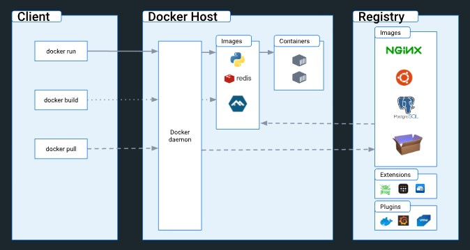

### Comandos - Contêineres

```sh
# get containers in pod
kubectl -n kube-system  describe pods kube-proxy-worker01 | grep -ws -A 10  Containers

# connect in container
kubectl attach silvestrini -c infra

# connect in container
kubectl exec -it pod_name -c container_name bash
kubectl exec infra ls
kubectl exec silvestrini -c infra -- ls
kubectl exec silvestrini -c infra -it sh 

# access container in specific namespace
kubectl exec -it -n kube-system  kube-proxy-worker01 -c kube-proxy -- bash
```

<p align="right">(<a href="#containers">back to containers</a>)</p>
<p align="right">(<a href="#readme-top">back to top</a>)</p>

## Vagens

<a name="pods"></a>

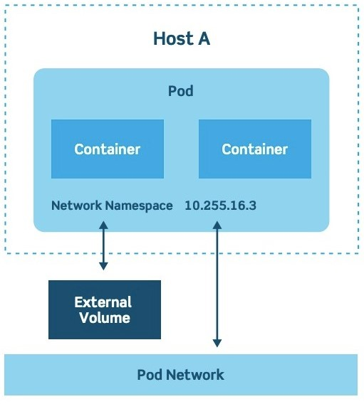

Um pod é a menor unidade de execução do Kubernetes. Um pod encapsula um ou mais aplicativos.\\
Os pods são efêmeros por natureza. Se um pod (ou o nó em que ele é executado) falhar,\\
O Kubernetes pode criar automaticamente uma nova réplica desse pod para continuar as operações.\\
Os pods incluem um ou mais contêineres (como contêineres Docker).

Os pods também fornecem dependências ambientais, incluindo dependências persistentes\\
volumes de armazenamento (armazenamento permanente e disponível para todos os pods\\
no cluster) e dados de configuração necessários para executar os contêineres dentro do pod.

### Comandos - Pods

```sh
# create pods without manifest
kubectl run nginx --image nginx
kubectl run -it --rm debug --image=busybox --restart=Never -- sh

# create pod with manifest
kubectl apply -f pod-template.yaml
kubectl create -f pod.yaml

# list pods
kubectl get pods

# list all pods
kubectl get pods --all-namespaces
kubectl get pods -A
kubectl get pods -A -o wide

# list pods in specific node
kubectl get pods --all-namespaces -o wide --field-selector spec.nodeName=worker01

# list pods in  kube-system namespace
kubectl get pod -n kube-system
kubectl get pods -n kube-system -o=jsonpath='{range.items[*]}{"\n"}{.metadata.name}{range.spec.containers}'

# list pods with specif output
kubectl get pods -n kube-system -o yaml
kubectl get pods -n kube-system -o json

# list images used in pods
kubectl get pods -o=jsonpath='{range .items[*]}{"\n"}{.metadata.name}{"\t"}{range .spec.containers[*]}{.image}{"\t"}{end}{end}'

# describe details of pods
kubectl describe pod nginx
kubectl -n kube-system  describe pods kube-proxy-worker01

# delete pods
kubectl delete pod nginx
kubectl delete -f pod-template.yaml

# create Service | expose pod
kubectl expose pod my-nginx

```

### Compreendendo os recursos do pod

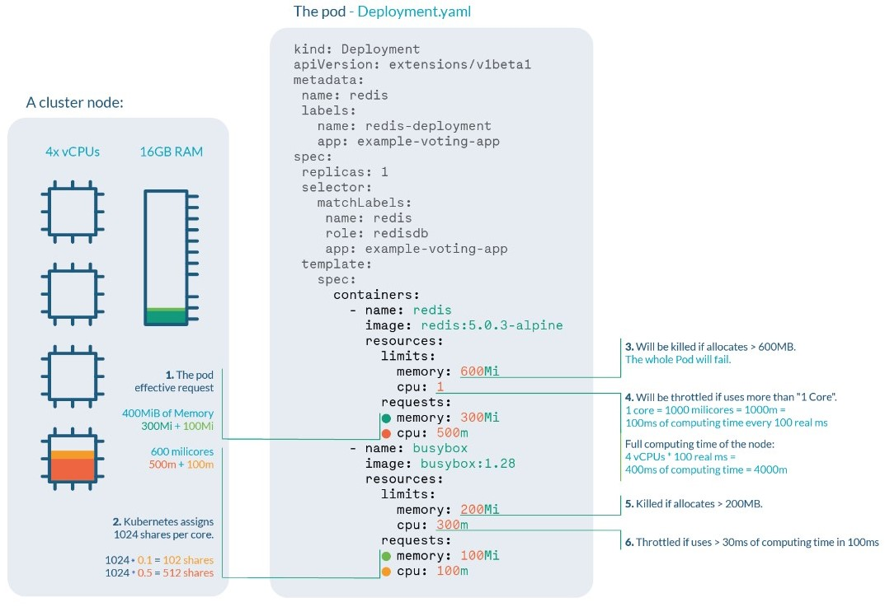

<p align="right">(<a href="#pods">back to pods</a>)</p>
<p align="right">(<a href="#readme-top">back to top</a>)</p>

## Implantação

<a name="deployment"></a>

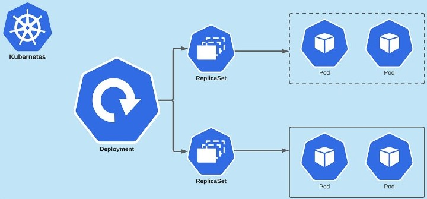

Uma implantação fornece atualizações declarativas para pods e ReplicaSets.
Você descreve um estado desejado em uma implantação e o controlador de implantação\\
altera o estado real para o estado desejado a uma taxa controlada.\\
Você pode definir implantações para criar novos ReplicaSets ou para remover os existentes\\
Implantações e adote todos os seus recursos com novas implantações.

### Comandos - Implantação

```sh
# create manifest|template
kubectl run my-nginx  --image nginx --port 80 --dry-run=client -o yaml >pod-template.yaml

# apply\update deployment
kubectl apply -f deployment.yaml

# list deployments
kubectl get deployments -A
kubectl -n kube-system get deployments.apps
kubectl get deployments -l app=nginx-deployment

# get pods management by deployment
kubectl get pods -l app=nginx-deployment

# describe deployment
kubectl describe deployment nginx-deployment

# check status of deployment
kubectl rollout status deployment nginx-deployment

# running rollback deployment
kubectl rollout undo deployment nginx-deployment
kubectl rollout undo deployment nginx-deployment --to-revision=1

# get deployment history
kubectl rollout history deployment nginx-deployment
kubectl rollout history deployment nginx-deployment --revision=2

# pause deployment(block updates)
kubectl rollout pause deployment nginx-deployment

# resume deployment(allow updates)
kubectl rollout resume deployment nginx-deployment

# restart deployment (recreate all pods in deployment)
kubectl rollout restart deployment nginx-deployment

# delete deployment
kubectl delete deployment nginx-deployment
```

<p align="right">(<a href="#deployment">back to deployment</a>)</p>
<p align="right">(<a href="#readme-top">back to top</a>)</p>

## Conjunto de réplicas

<a name="replicaset"></a>

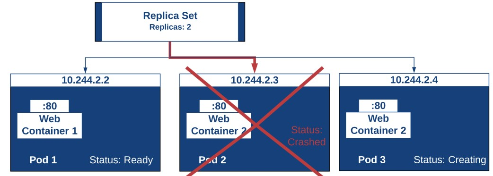

O objetivo de um ReplicaSet é manter um conjunto estável de pods de réplica em execução\\
a qualquer momento. Como tal, é frequentemente usado para garantir a disponibilidade de\\
um número especificado de pods idênticos.

### Comandos - ReplicaSet

````sh
# list replicaset
kubectl get replicaset -l app=nginx-deployment

# describe replicaset
kubectl describe replicaset nginx-replicaset

# create replicaset - see folder replicaset/ for examples
kubectl apply -f replicaset.yaml

# delete replicaset
kubectl delete replicas

<p align="right">(<a href="#replicaset">back to replicaset</a>)</p>
<p align="right">(<a href="#readme-top">back to top</a>)</p>

## Daemonset

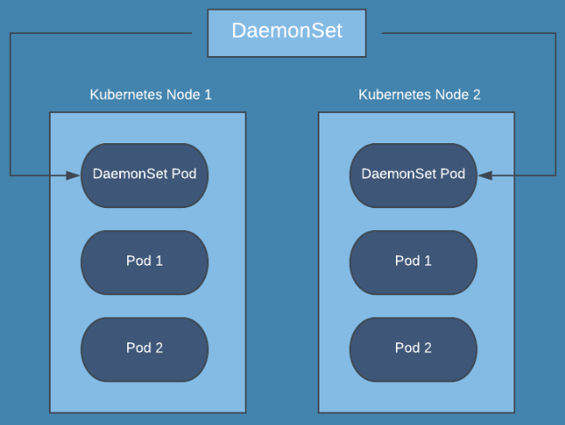

A DaemonSet ensures that all (or some) Nodes run a copy of a Pod.\
As nodes are added to the cluster, Pods are added to them.\
As nodes are removed from the cluster, those Pods are garbage collected.\
Deleting a DaemonSet will clean up the Pods it created.

### Commands - Daemonset

```sh
# list daemonset
kubectl get daemonset -A

#$ describe daemonset
kubectl describe daemonset node-exporter

# create daemonset - see folder daemonset/ for examples
kubectl apply -f daemonset.yaml

# delete daemonset
kubectl delete daemonset node-exporter
````

## Sondas

<a name="probes"></a>

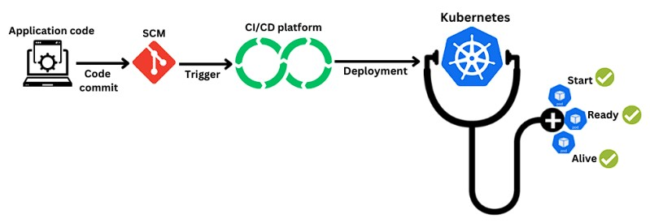

As sondagens do Kubernetes são verificações de integridade usadas para monitorar a integridade de aplicativos e serviços em um cluster do Kubernetes.\\
Os probes do Kubernetes normalmente são implementados usando a API do Kubernetes, que permite consultar informações no aplicativo ou serviço.\\
Essas informações podem então ser usadas para determinar a integridade do aplicativo ou serviço.\\
Os testes do Kubernetes também podem ser usados ​​para detectar alterações no aplicativo ou serviço e enviar uma notificação ao plano de controle do Kubernetes, que pode então tomar medidas corretivas.

### Tipos de sondas

#### Sondas de inicialização

Uma investigação de inicialização é usada para determinar se um contêiner foi iniciado com êxito.\\
Esse tipo de investigação normalmente é usado para aplicativos que demoram mais para inicializar,\\
ou para contêineres que executam tarefas de inicialização antes de ficarem prontos para receber tráfego.\\
A investigação de inicialização é executada apenas uma vez, após a criação do contêiner, e atrasará o início\\
das sondagens de prontidão e vivacidade até que seja bem-sucedido.\\
Se a investigação de inicialização falhar, considera-se que o contêiner falhou ao iniciar\\
e o Kubernetes tentará reiniciar o contêiner.

#### Sondas de prontidão

Uma investigação de prontidão é usada para determinar se um contêiner está pronto para receber tráfego.\\
Este tipo de investigação é usado para garantir que um contêiner esteja totalmente instalado e funcionando e possa\\
aceita conexões de entrada antes de serem adicionadas ao balanceador de carga de serviço.\\
Uma sondagem de prontidão pode ser usada para verificar a disponibilidade das dependências de um aplicativo\\
ou para realizar qualquer outra verificação que indique que o contêiner está pronto para atender o tráfego.\\
Se a investigação de prontidão falhar, o contêiner será removido do balanceador de carga de serviço até que a investigação seja bem-sucedida novamente.

#### Sondas de vivacidade

Uma investigação de atividade é usada para determinar se um contêiner ainda está em execução e funcionando corretamente.\\
Esse tipo de investigação é usado para detectar e recuperar falhas ou travamentos de contêineres.\\
Uma sonda de atividade pode ser usada para verificar a capacidade de resposta de um aplicativo ou para executar\\
qualquer outra verificação que indique que o contêiner ainda está ativo e íntegro.\\
Se a investigação de atividade falhar, o Kubernetes tentará reiniciar o contêiner para restaurar sua funcionalidade.

<p align="right">(<a href="#probes">back to probes</a>)</p>
<p align="right">(<a href="#readme-top">back to top</a>)</p>

## Volumes

<a name="volumes"></a>

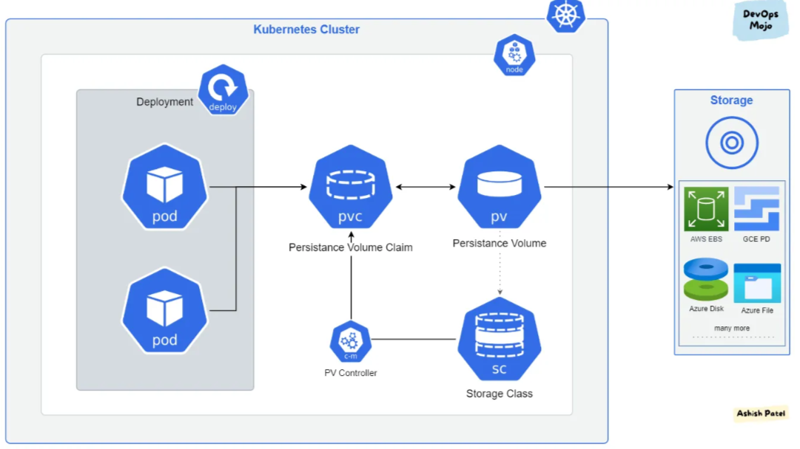

### Classe de armazenamento


Alguns provedores de classe de armazenamento

-   kubernetes.io/aws-ebs: AWS Elastic Block Store (EBS)
-   kubernetes.io/azure-disk: Disco Azure
-   kubernetes.io/gce-pd: disco permanente do Google Compute Engine (GCE)
-   kubernetes.io/cinder: OpenStack Cinder
-   kubernetes.io/vsphere-volume: vSphere
-   kubernetes.io/no-provisioner: Volumes locais
-   kubernetes.io/host-path: Volumes locais

### PV - Volume persistente

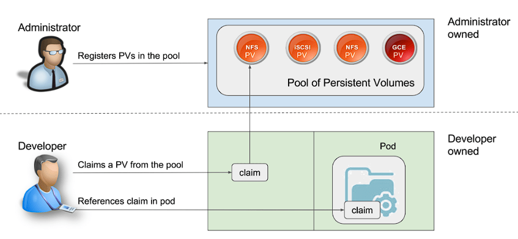

Alguns tipos de PV

-   Local
    -   HostPath
-   Rede
    -   NFS
    -   iSCSI
    -   Ceph RBD (dispositivo de bloco Rados)
    -   GlusterFS
    -   Provedores de nuvem (EBS, disco permanente do Google Cloud, armazenamento em disco do Azure)

#### Tipo de armazenamento (hostPath)

-   hostPath
-   nfs
-   iscsi
-   csi
-   local
-   FC

### PVC - Reivindicação de Volume Persistente


### Comandos - Volumes

```bash
# list storage classes
kubectl get storageclass

# describe storage class
kubectl describe storageclass silvestrini

# get storage class provisioners
kubectl get storageclasses.storage.k8s.io  -o=jsonpath='{range.items[*]}{.provisioner}{"\n"}'

# list pv in cluster
kubectl get pv -A

# describe pv
kubectl describe pv my-pv

# list pvc
kubectl get pvc -o wide

# delete pvc 
kubectl delete pvc my-pvc

# describe pvc
kubectl describe pvc my-pvc

# get events
kubectl get events my-pvc.1772cda2d4c7069b
```

<p align="right">(<a href="#volumes">back to volumes</a>)</p>
<p align="right">(<a href="#readme-top">back to top</a>)</p>

## StatefulSet

<a name="statefulset"></a>

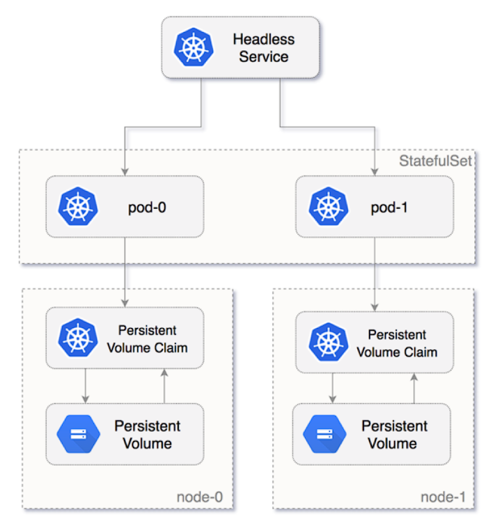

StatefulSet é o objeto da API de carga de trabalho usado para gerenciar aplicativos com estado.

Gerencia a implantação e o escalonamento de um conjunto de pods e fornece garantias sobre a ordem e a exclusividade desses pods.

Assim como uma implantação, um StatefulSet gerencia pods baseados em especificações de contêiner idênticas.\\
Ao contrário de uma implantação, um StatefulSet mantém uma identidade fixa para cada um de seus pods.\\

Esses pods são criados a partir da mesma especificação, mas não são intercambiáveis: cada um possui um identificador persistente que mantém durante qualquer reagendamento.

Se você quiser usar volumes de armazenamento para fornecer persistência para sua carga de trabalho,\\
você pode usar um StatefulSet como parte da solução. Embora pods individuais em\\
um StatefulSet são suscetíveis a falhas, os identificadores de pod persistentes fazem\\
é mais fácil combinar os volumes existentes com os novos pods que substituem aqueles que falharam.

### DNS para pods em StatefulSet

```sh
<pod-name>.<service-name>.<namespace>.svc.cluster.local
# Example: nginx-0.nginx.default.svc.cluster.local 
```

### Comandos - StatefulSet

```bash
# list statefulsets
kubectl get statefulsets

# describe statefulsets
kubectl describe  statefulsets.apps  nginx 

# delete statefulset
kubectl delete statefulset nginx

# test network service
## create container for test
kubectl run -it --rm --image=busybox --restart=Never -- sh

## test nslookup
nslookup  nginx-0.nginx.default.svc.cluster.local

## test web page
wget -O- http://nginx-0.nginx.default.svc.cluster.local
```

<p align="right">(<a href="#statefulset">back to statefulset</a>)</p>
<p align="right">(<a href="#readme-top">back to top</a>)</p>

## Serviços

<a name="services"></a>

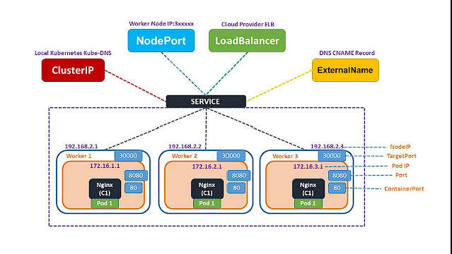

Um serviço Kubernetes é uma abstração lógica para um grupo implantado de pods em um cluster\\
(todos desempenham a mesma função).\\
Como os pods são efêmeros, um serviço habilita um grupo de pods, que fornecem informações\\
funções (serviços web, processamento de imagens, etc.) receberão um nome e IP exclusivo\\
endereço (clusterIP).

### Tipos de serviço no Kubernetes

#### Serviços ClusterIP

ClusterIP é o tipo de serviço padrão no Kubernetes e fornece conectividade interna entre diferentes componentes de nosso aplicativo. Kubernetes atribui um endereço IP virtual a um serviço ClusterIP que só pode ser acessado de dentro do cluster durante sua criação. Este endereço IP é estável e não muda mesmo se os pods por trás do serviço forem reprogramados ou substituídos.

Os serviços ClusterIP são uma excelente escolha para comunicação interna entre diferentes componentes da nossa aplicação que não precisam de ser expostos ao mundo exterior. Por exemplo, se tivermos um microsserviço que processa dados e os envia para outro microsserviço para processamento posterior, podemos usar um serviço ClusterIP para conectá-los.

Para criar um serviço ClusterIP no Kubernetes, precisamos defini-lo em um arquivo YAML e aplicá-lo ao cluster. Aqui está um exemplo de uma definição simples de serviço ClusterIP:

```yaml
apiVersion: v1
kind: Service
metadata:
  name: backend
spec:
  selector:
    app: backend
  ports:
  - name: http
    port: 80
    targetPort: 8080
```

Neste exemplo, definimos um serviço denominado backend com um seletor direcionado a pods rotulados com app: backend. O serviço expõe a porta 80, que é a porta usada pelos clientes para acessar o serviço, e encaminha o tráfego para a porta 8080 dos pods, que é onde o aplicativo backend está sendo executado.

#### Serviços NodePort

Os serviços NodePort estendem a funcionalidade dos serviços ClusterIP, permitindo conectividade externa ao nosso aplicativo. Quando criamos um serviço NodePort em qualquer nó do cluster que atenda aos critérios definidos, o Kubernetes abre uma porta designada que encaminha o tráfego para o serviço ClusterIP correspondente em execução no nó.

Esses serviços são ideais para aplicações que precisam ser acessíveis de fora do cluster, como aplicações web ou APIs. Com os serviços NodePort, podemos acessar nossa aplicação usando o endereço IP do nó e o número da porta atribuído ao serviço.

Vejamos um exemplo de definição simples de serviço NodePort:

```yaml
apiVersion: v1 
kind: Service 
metadata: 
  name: frontend 
spec: 
  selector: 
    app: frontend 
  type: NodePort 
  ports: 
    - name: http 
      port: 80 
      targetPort: 8080
```

Definimos um serviço chamado frontend que tem como alvo pods rotulados com app: frontend definindo um seletor. O serviço expõe a porta 80 e encaminha o tráfego para a porta 8080 dos pods. Definimos o tipo de serviço como NodePort e o Kubernetes expõe o serviço em uma porta específica em um nó qualificado dentro do cluster.

Quando criamos um serviço NodePort, o Kubernetes atribui um número de porta de um intervalo predefinido de 30000-32767. Além disso, podemos especificar um número de porta personalizado adicionando o campo nodePort à definição de serviço:

```yaml

apiVersion: v1
kind: Service
metadata:
  name: frontend
spec:
  selector:
    app: frontend
  type: NodePort
  ports:
  - name: http
    port: 80
    targetPort: 8080
    nodePort: 30080
```

O campo nodePort é especificado como 30080, que informa ao Kubernetes para expor o serviço na porta 30080 em cada nó do cluster.

#### Serviços LoadBalancer

Os serviços LoadBalancer conectam nossos aplicativos externamente e os ambientes de produção os utilizam onde alta disponibilidade e escalabilidade são essenciais. Quando criamos um serviço LoadBalancer, o Kubernetes provisiona um balanceador de carga em nosso ambiente de nuvem e encaminha o tráfego para os nós que executam o serviço.

Os serviços LoadBalancer são ideais para aplicações que precisam lidar com altos volumes de tráfego, como aplicações web ou APIs. Com os serviços LoadBalancer, podemos acessar nosso aplicativo usando um único endereço IP atribuído ao balanceador de carga.

Aqui está um exemplo de uma definição simples de serviço LoadBalancer:

```yaml
apiVersion: v1
kind: Service
metadata:
  name: web
spec:
  selector:
    app: web
  type: LoadBalancer
  ports:
    - name: http
      port: 80
      targetPort: 8080
```

Definimos o tipo de serviço como LoadBalancer para instruir o Kubernetes a provisionar um balanceador de carga. Aqui, definimos um serviço chamado web e especificamos um seletor direcionado a pods rotulados com app: web. Além disso, expomos a porta 80 e encaminhamos o tráfego para a porta 8080 dos pods.

Depois de criar o serviço LoadBalancer, o Kubernetes provisiona um balanceador de carga no ambiente de nuvem com um endereço IP público. Podemos usar este endereço IP para acessar nosso aplicativo de fora do cluster.


Referência:<https://www.baeldung.com/ops/kubernetes-service-types>

### Comandos - Serviços

```sh
# list services
kubectl get services
kubectl get svc -o wide

# list services in system namespace
kubectl get svc -n kube-system

# details of services 
kubectl describe svc nginx
kubectl describe svc -n kube-system

# list endpoints
kubectl get endpoints

# create ClusterIP service
kubectl expose deployment app-silvestrini --port=80 --target-port=8080

# create NodePort service
kubectl expose deployment app-silvestrini --type=NodePort --port=80 --target-port=8080

# create loadbalance service
kubectl expose deployment app-silvestrini --type=LoadBalancer --port=80 --target-port=8080

#create external name service
kubectl create service externalname app-silvestrini --external-name my-db.skynet.com.br

# delete service
kubectl delete service nginx
```

<p align="right">(<a href="#services">back to services</a>)</p>
<p align="right">(<a href="#readme-top">back to top</a>)</p>

## Segredos

<a name="service"></a>

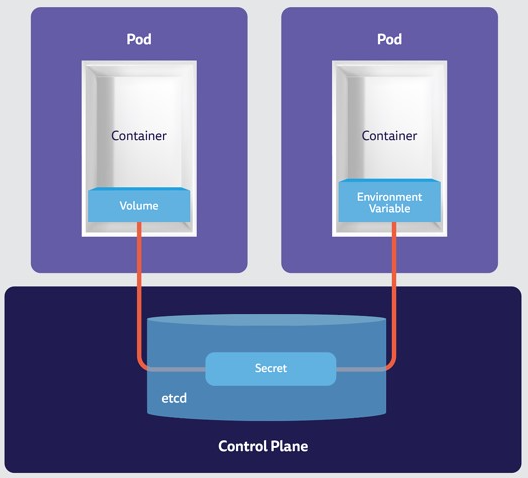

Um segredo é um objeto que contém uma pequena quantidade de dados confidenciais, como uma senha, um token ou uma chave. Caso contrário, essas informações poderiam ser colocadas em uma especificação de pod ou em uma imagem de contêiner. Usar um segredo significa que você não precisa incluir dados confidenciais no código do seu aplicativo.

Como os segredos podem ser criados independentemente dos pods que os utilizam, há menos risco de o segredo (e seus dados) serem expostos durante o fluxo de trabalho de criação, visualização e edição de pods. Kubernetes e aplicativos executados em seu cluster também podem tomar precauções adicionais com segredos, como evitar gravar dados secretos em armazenamento não volátil.

Os segredos são semelhantes aos ConfigMaps, mas destinam-se especificamente a armazenar dados confidenciais.

### Tipos de segredos

-   Segredos opacos - estes são os segredos mais simples e comuns. Eles armazenam dados arbitrários, como chaves de API, senhas e tokens. Os segredos opacos são codificados em base64 quando armazenados no Kubernetes, mas não são criptografados. Eles podem ser usados ​​para armazenar dados confidenciais, mas não são seguros o suficiente para informações altamente confidenciais, como senhas de bancos de dados.

-   kubernetes.io/service-account-token - usado para armazenar tokens de acesso à conta de serviço. Esses tokens são usados ​​para autenticar pods com a API Kubernetes. Eles são montados automaticamente em pods que usam contas de serviço.

-   kubernetes.io/dockercfg e kubernetes.io/dockerconfigjson - usados ​​para armazenar credenciais de registro do Docker. Eles são usados ​​para autenticar pods com um registro Docker. Eles são montados em pods que usam imagens de contêiner privadas.

-   kubernetes.io/tls, kubernetes.io/ssh-auth e kubernetes.io/basic-auth – usados ​​para armazenar certificados TLS, chaves SSH e credenciais básicas de autenticação, respectivamente. Eles são usados ​​para autenticar pods com outros serviços.

-   bootstrap.kubernetes.io/token - usado para armazenar tokens de inicialização de cluster. Eles são usados ​​para autenticar nós com o plano de controle do Kubernetes.

### Comandos - Segredos

```sh
# get secrets
kubectl get secrets -A

# describe secrets
kubectl describe secret -n cert-manager cert-manager-webhook-ca

# create opaque secret
kubectl create secret generic silvestrini-secret --from-literal=username=silvestrini --from-literal=password=silvestrini

# create tls secret
# generate certs
# openssl req -x509 -nodes -days 365 -newkey rsa:2048 -keyout private-key.key -out cert.crt
kubectl create secret tls my-service-web-tls-secret --cert=cert.crt --key=private-key.key
```

<p align="right">(<a href="#secrets">back to secrets</a>)</p>
<p align="right">(<a href="#readme-top">back to top</a>)</p>

## ConfigMaps

<a name="configmap"></a>


Um ConfigMap é um objeto API usado para armazenar dados não confidenciais em pares chave-valor.\\
Os pods podem consumir ConfigMaps como variáveis ​​de ambiente, argumentos de linha de comando ou como arquivos de configuração em um volume.

Um ConfigMap permite dissociar a configuração específica do ambiente das imagens do contêiner, para que seus aplicativos sejam facilmente portáveis.

### Comandos - ConfigMaps

```sh
# create configmap
kubectl create configmap nginx-config --from-file=kubernetes/configmaps/nginx.conf

# get configmaps
kubectl get configmaps

# describe configmaps
kubectl describe configmaps nginx-config
```

<p align="right">(<a href="#configmap">back to configmap</a>)</p>
<p align="right">(<a href="#readme-top">back to top</a>)</p>

## Contribuindo

As contribuições são o que tornam a comunidade de código aberto um lugar incrível para
aprender, inspirar e criar. Qualquer contribuição que você fizer será**muito apreciado**.

Se você tiver uma sugestão que possa melhorar isso, bifurque o repositório e
crie uma solicitação pull. Você também pode simplesmente abrir um problema com a tag “aprimoramento”.
Não se esqueça de dar uma estrela ao projeto! Obrigado novamente!

1.  Bifurque o projeto
2.  Crie sua ramificação de recursos (`git checkout -b feature/AmazingFeature`)
3.  Confirme suas alterações (`git commit -m 'Add some AmazingFeature'`)
4.  Empurre para a filial (`git push origin feature/AmazingFeature`)
5.  Abra uma solicitação pull

## Licença

-   Este projeto está licenciado sob a licença MIT \* consulte o arquivo LICENSE.md para obter detalhes

## Contato

Marcos Silvestrini -[marcos.silvestrini@gmail.com](mailto:marcos.silvestrini@gmail.com)\\[](https://twitter.com/mrsilvestrini)

Link do projeto:<https://github.com/marcossilvestrini/learning-kubernetes>

<p align="right">(<a href="#readme-top">back to top</a>)</p>

## Agradecimentos

-   [CNCF - Fundação de Computação Nativa em Nuvem](https://www.cncf.io/)
-   [OCI - Iniciativa de Contêineres Abertos](https://opencontainers.org/)
-   [Borg](https://kubernetes.io/blog/2015/04/borg-predecessor-to-kubernetes/)
-   [Site Kubernetes](https://kubernetes.io/)
-   [Arquitetura Kubernetes](https://platform9.com/blog/kubernetes-enterprise-chapter-2-kubernetes-architecture-concepts/)
-   [GitHub](https://github.com/kubernetes/kubernetes/)
-   [Problemas](https://github.com/kubernetes/kubernetes/issues)
-   [Certificação CKA](https://www.cncf.io/certification/cka/)
-   [Certificação CKAD](https://www.cncf.io/certification/ckad/)
-   [Certificação CKS](https://www.cncf.io/certification/cks/)
-   [Tipo](https://kind.sigs.k8s.io/docs/user/quick-start)
-   [Feio](https://github.com/kubernetes/minikube)
-   [k0s](https://k0sproject.io/)
-   [Como um bastão](https://k3s.io/)
-   [delicado](https://docs.rke2.io/architecture)
-   [Acima do cluster RKE2 HA](https://computingforgeeks.com/deploy-kubernetes-on-rocky-using-rke2/?expand_article=1)
-   [Cargas de trabalho do Kubernetes](https://www.suse.com/c/rancher_blog/introduction-to-kubernetes-workloads/)
-   [Provisionador de caminho local rancheiro](https://github.com/rancher/local-path-provisioner)
-   [Painel do Kubernetes](https://upcloud.com/resources/tutorials/deploy-kubernetes-dashboard)
-   [Gerenciamento de cluster Openlens](https://github.com/MuhammedKalkan/OpenLens)
-   [Reserve Linux Ps](https://livro.descomplicandokubernetes.com.br/pt/)
-   [Serviços Kubernetes](https://cast.ai/blog/kubernetes-load-balancer-expert-guide-with-examples/)

<p align="right">(<a href="#readme-top">back to top</a>)</p>

<!-- MARKDOWN LINKS & IMAGES-->

<!-- https://www.markdownguide.org/basic-syntax/#reference-style-links -->

[contributors-shield]: https://img.shields.io/github/contributors/marcossilvestrini/learning-kubernetes.svg?style=for-the-badge

[contributors-url]: https://github.com/marcossilvestrini/learning-kubernetes/graphs/contributors

[forks-shield]: https://img.shields.io/github/forks/marcossilvestrini/learning-kubernetes.svg?style=for-the-badge

[forks-url]: https://github.com/marcossilvestrini/learning-kubernetes/network/members

[stars-shield]: https://img.shields.io/github/stars/marcossilvestrini/learning-kubernetes.svg?style=for-the-badge

[stars-url]: https://github.com/marcossilvestrini/learning-kubernetes/stargazers

[issues-shield]: https://img.shields.io/github/issues/marcossilvestrini/learning-kubernetes.svg?style=for-the-badge

[issues-url]: https://github.com/marcossilvestrini/learning-kubernetes/issues

[license-shield]: https://img.shields.io/github/license/marcossilvestrini/learning-kubernetes.svg?style=for-the-badge

[license-url]: https://github.com/marcossilvestrini/learning-kubernetes/blob/master/LICENSE

[linkedin-shield]: https://img.shields.io/badge/-LinkedIn-black.svg?style=for-the-badge&logo=linkedin&colorB=555

[linkedin-url]: https://linkedin.com/in/marcossilvestrini
