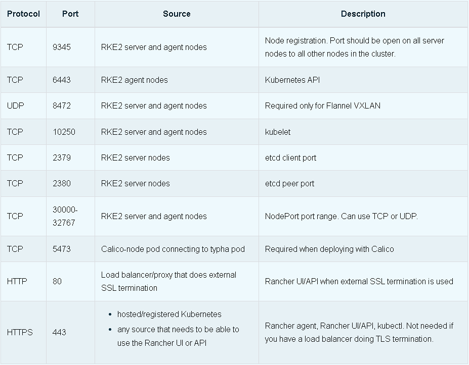
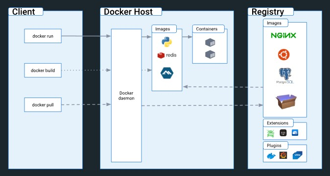
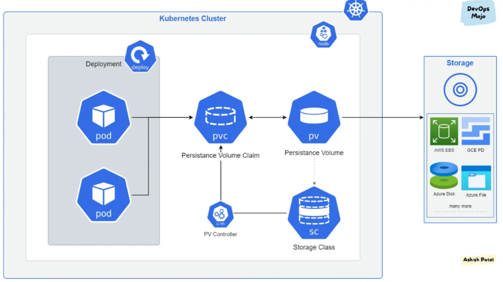
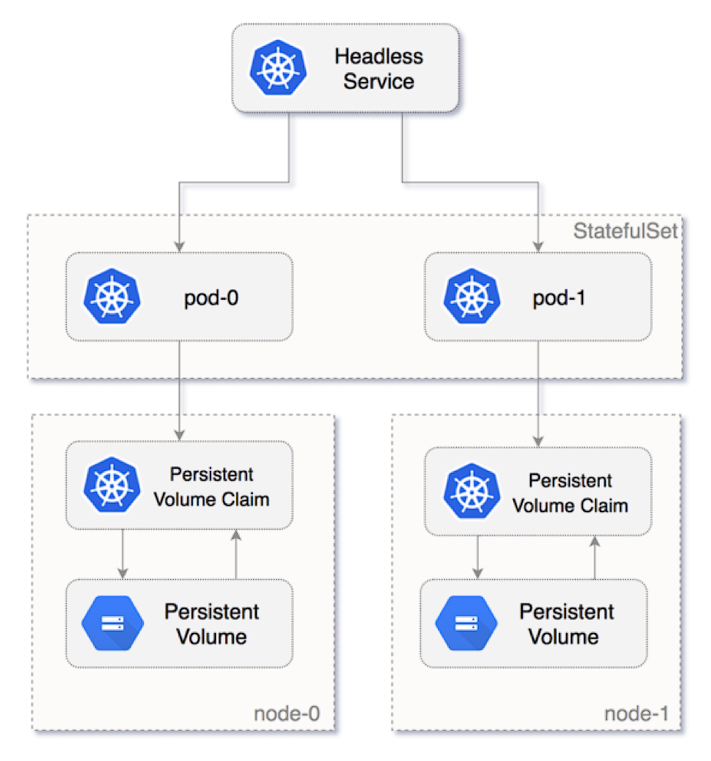

<h1><a name="readme-top"></a></h1>

[](https://github.com/marcossilvestrini/learning-kubernetes/actions/workflows/powershell.yml)[](https://github.com/marcossilvestrini/learning-kubernetes/actions/workflows/release.yml)[](https://github.com/marcossilvestrini/learning-kubernetes/actions/workflows/jekyll-gh-pages.yml)[](https://github.com/marcossilvestrini/learning-kubernetes/actions/workflows/deploy.yml)

[![MIT License][license-shield]][license-url][![Forks][forks-shield]][forks-url][![Stargazers][stars-shield]][stars-url][![Contributors][contributors-shield]][contributors-url][![Issues][issues-shield]][issues-url][![LinkedIn][linkedin-shield]][linkedin-url]

# 學習線上課程，掌握職場技能


<p align="center">
<strong>Explore the docs »</strong></a><br />
    <a href="https://marcossilvestrini.github.io/learning-kubernetes/">Main Page</a>
    -
    <a href="https://github.com/marcossilvestrini/learning-kubernetes">Code Page</a>
    -
    <a href="https://github.com/marcossilvestrini/learning-kubernetes/issues">Report Bug</a>
    -
    <a href="https://github.com/marcossilvestrini/learning-kubernetes/issues">Request Feature</a>
</p>

## 概括

<details>
  <summary><b>TABLE OF CONTENT</b></summary>
  <ol>
    <li>
      <a href="#about-the-project">About The Project</a>
    </li>
    <li>
      <a href="#getting-started">Getting Started</a>
      <ul>
        <li><a href="#prerequisites">Prerequisites</a></li>
        <li><a href="#installation">Installation</a></li>
      </ul>
    </li>
    <li><a href="#usage">Usage</a></li>
    <li><a href="#roadmap">Roadmap</a></li>
    <li><a href="#linux-namespaces">Linux Namespaces</a></li>
    <li><a href="#kubernetes-architecture">Kubernetes Architecture</a></li>
    <li><a href="#install-kubernetes">Install Kubernetes</a></li>
    <li><a href="#rke2">Rancher RKE2</a></li>
    <li><a href="#kubectl">Kubectl</a></li>
    <li><a href="#containers">Containers</a></li>
    <li><a href="#pods">Pods</a></li>
    <li><a href="#deployment">Deployment</a></li>
    <li><a href="#replicaset">Replicaset</a></li>
    <li><a href="#daemonset">Daemonset</a></li>
    <li><a href="#probes">Probes</a></li>
    <li><a href="#volumes">Volumes</a></li>
    <li><a href="#statefulset">Statefulset</a></li>
    <li><a href="#services">Services</a></li>
    <li><a href="#secrets">Secrets</a></li>
    <li><a href="#license">License</a></li>
    <li><a href="#contact">Contact</a></li>
    <li><a href="#acknowledgments">Acknowledgments</a></li>
  </ol>
</details><br>

<a name="about-the-project"></a>

## 關於項目

> 該計畫旨在幫助學生或專業人士學習 kubernetes 的主要概念

<p align="right">(<a href="#readme-top">back to top</a>)</p>

<a name="getting-started"></a>

## 入門

這是一個範例，說明如何在本地設定項目。
若要啟動並執行本機副本，請按照以下簡單的範例步驟操作。

<a name="prerequisites"></a>

### 先決條件

這是如何列出使用該軟體所需的物品的範例
以及如何安裝它們。

-   git
-   虛擬盒和擴展
-   流浪漢

<a name="installation"></a>

### 安裝

#### 克隆儲存庫

```sh
git clone https://github.com/marcossilvestrini/learning-kubernetes.git
```

#### 在安全資料夾中設定 ssh 金鑰

```sh
# generate ssh key pair for your user access hosts
ssh-keygen -q -t ecdsa -b 521 -N '' -f ~/.ssh/id_ecdsa <<<y >/dev/null 2>&1
cp ~/.ssh/id_ecdsa.pub security/

# generate ssh key pair for rancher
ssh-keygen -q -t ecdsa -b 521 -N '' -f security/kubernetes-key-ecdsa <<<y >/dev/null 2>&1
```

#### 設定節點池

您可以減少或增加 Vagrantfile 陣列中控制平面和工作執行緒的數量。

例子：

```ruby
...
 # Node|Control Plane Servers
  PLANES = ["control-plane01", "control-plane02", "control-plane03"]
  N = 2

  (0..N).each do |i|
    config.vm.define PLANES[i] do |node|
...
```

#### 設定網路

在 Vagrantfile 中為每個虛擬機器設定網路配置。

例子：

```ruby
...
# NETWORK
    ol9_server01.vm.network "public_network", nic_type: "virtio", mac: "080027f3066a", ip: "192.168.0.130", netmask: "255.255.255.0", mode: "bridge",bridge: [
      "Intel(R) I211 Gigabit Network Connection",
      "MediaTek Wi-Fi 6 MT7921 Wireless LAN"
    ]
...    
```

#### 設定VM的資源

在 Vagrantfile 中為每個虛擬機器設定 CPU、記憶體等資源配置。

例子：

```ruby
...
# PROVIDER
infra_server01.vm.provider "virtualbox" do |vb|
    vb.linked_clone = true
    vb.name =VM_INFRA_SERVER01
    vb.memory = 2048
    vb.cpus = 1
end
...  
```

#### 啟動kubernetes集群

```sh
cd learning-kubernetes/vagrant/linux
vagrant up
```

<a name="usage"></a>

## 用法

使用此存儲庫來了解 kubernetes 考試

<p align="right">(<a href="#readme-top">back to top</a>)</p>

<a name="roadmap"></a>

## 路線圖

-   [x] 建立儲存庫
-   [x] 為自動化任務建立 github 操作
-   [x] 安裝kubernetes集群
-   [x] 安裝 kubectl
-   [x] 新增 kubernetes 範例
-   [x] 新增應用程式部署
-   [x] 使用專案內容建立 docker 映像
-   [x] 建立 github 操作來建置 docker 映像

<p align="right">(<a href="#roadmap">back to roadmap</a>)</p>
<p align="right">(<a href="#readme-top">back to top</a>)</p>

<a name="linux-namespaces"></a>

## Linux 命名空間

kubernetes 引擎可與命名空間（PID、NET、IPC、MNT、UTS）和 cgroup 搭配使用。


## PID

進程 ID。該檔案是進程的PID命名空間的句柄。PID命名空間隔離了進程ID號空間，這意味著不同PID命名空間中的進程可以具有相同的PID。 PID 命名空間允許容器提供諸如掛起/恢復容器中的進程集以及將容器遷移到新主機等功能，同時容器內的進程保持相同的 PID

## 網

該檔案是進程的網路命名空間的句柄。這提供了與網路相關的系統資源的隔離並隔離了網路設備。 ip netns - 用於處理網路命名空間管理
mount 該檔案是進程的掛載命名空間的句柄，並隔離掛載點

## 工控機

該檔案是進程的IPC命名空間的句柄，隔離系統與IPC和POSIX訊息佇列

## UTS

該檔案是進程的UTS命名空間的句柄，隔離Hostname和NIS域名

## 使用者

該檔案是進程的使用者命名空間的句柄

## 組組

容器將具有 cgroup 層次結構的獨立視圖。

## cgroup 與命名空間

_cgroup 是一種控制基於群組的流量控制過濾器的方法，範例_

```json
"cgroupsPath": "/myRuntime/myContainer",
    "resources": {
        "memory": {
        "limit": 100000,
        "reservation": 200000
        },
        "devices": [
            {
                "allow": false,
                "access": "rwm"
            }
        ]
   }
```

_命名空間：限制/抽像你在linux proc可以看到的內容_

字體：<https://8gwifi.org/docs/linux-namespace.jsp>

<p align="right">(<a href="#linux-namespaces">back to linux-namespaces</a>)</p>
<p align="right">(<a href="#readme-top">back to top</a>)</p>

## 庫伯內特斯架構

<a name="kubernetes-architecture"></a>


### 控制平面


### 節點


### Kubernetes 端口


### RKE2 上 Rancher 伺服器節點的連接埠



<p align="right">(<a href="#kubernetes-architecture">back to kubernetes-architecture</a>)</p>
<p align="right">(<a href="#readme-top">back to top</a>)</p>

## 安裝 kubernetes

<a name="install-kubernetes"></a>

### 醜陋的

```sh
# install
curl -Lo minikube https://storage.googleapis.com/minikube/releases/latest/minikube-linux-amd64
chmod +x ./minikube
sudo mv ./minikube /usr/local/bin/minikube

# get version
minikube version

# set hypervisor
minikube config set driver <YOUR_HYPERVISOR>

# up without hypervisor
minikube start --driver=hyperkit

# create cluster
minikube start --nodes 3 -p multinode-cluster

# get status of cluster
minikube status

# get ip address
minikube ip

# access minikube host
minikube ssh

# dashboard
minikube dashboard

# logs
minikube logs

# delete cluster
minikube delete
minikube delete --purge
```

### 種類

```sh
# Install
curl -Lo ./kind https://kind.sigs.k8s.io/dl/v0.14.0/kind-linux-amd64
chmod +x ./kind
sudo mv ./kind /usr/local/bin/kind

# create cluster
kind create cluster
kind create cluster --name silvestrini

# get clusters
kind get clusters

# delete clusters
kind delete clusters $(kind get clusters)

## create yaml
cat << EOF > $HOME/kind-3nodes.yaml
kind: Cluster
apiVersion: kind.x-k8s.io/v1alpha4
nodes:
  - role: control-plane
  - role: worker
  - role: worker
EOF

# create cluster
kind create cluster --name kind-multinodes --config $HOME/kind-3nodes.yaml
```

<p align="right">(<a href="#install-kubernetes">back to install-kubernetes</a>)</p>
<p align="right">(<a href="#readme-top">back to top</a>)</p>

## 精美的

<a name="rke2"></a>

使用RKE2建立kubernetes集群，請參閱scripts/linux/k8s/install-rke2.sh資料夾中的腳本

### rke2棧的一些命令

設定您的 PATH 變數：

```sh
export PATH=$PATH:/opt/rke2/bin:/var/lib/rancher/rke2/bin
```

#### CONTAINERD - ctr 指令

```zhs
#list containers using ctr
ctr --address /run/k3s/containerd/containerd.sock --namespace k8s.io container ls
```

#### CONTAINERD - crictl 指令

```zhs
#list containers using crictl

## example 1
export CRI_CONFIG_FILE=/var/lib/rancher/rke2/agent/etc/crictl.yaml
crictl ps

## example 2
crictl --config /var/lib/rancher/rke2/agent/etc/crictl.yaml ps

## example 3
crictl --runtime-endpoint unix:///run/k3s/containerd/containerd.sock ps -a


# stats containers
crictl stats
```

### 記錄

```sh
journalctl -f -u rke2-server
/var/lib/rancher/rke2/agent/containerd/containerd.log
/var/lib/rancher/rke2/agent/logs/kubelet.log
```

參考：<https://gist.github.com/superseb/3b78f47989e0dbc1295486c186e944bf>

<p align="right">(<a href="#rke2">back to rke2</a>)</p>
<p align="right">(<a href="#readme-top">back to top</a>)</p>

## 庫貝克特爾

<a name="kubectl"></a>

### 安裝

```sh
# install
curl -LO https://storage.googleapis.com/kubernetes-release/release/`curl -s \ 
https://storage.googleapis.com/kubernetes-release/release/stable.txt`/bin/linux/amd64/kubectl
chmod +x ./kubectl
mv ./kubectl /usr/local/bin/kubectl

# get version
kubectl version  --output=yaml --client

# kubectl autocomplete
source <(kubectl completion bash)

# kubectl alias
alias k=kubectl
complete -F __start_kubectl k
```

### 命令-Kubectl

```bash

########## resources ############

# list all resources
kubectl get all

########## namespaces ###########

# get namespaces
kubectl get namespaces

# describe namespaces
kubectl describe namespaces

########## nodes ############

# list nodes
kubectl get nodes
kubectl get nodes -o wide

# delete node
kubectl drain <node_name> --ignore-daemonsets --delete-emptydir-data
kubectl delete node <node_name>

# get logs
kubectl logs my-nginx
kubectl logs -f my-nginx
kubectl logs -n kube-system --all-containers=true etcd-control-plane01
```

<p align="right">(<a href="#kubectl">back to kubectl</a>)</p>
<p align="right">(<a href="#readme-top">back to top</a>)</p>

## 貨櫃

<a name="containers"></a>



### 命令 - 容器

```sh
# get containers in pod
kubectl -n kube-system  describe pods kube-proxy-worker01 | grep -ws -A 10  Containers

# connect in container
kubectl attach silvestrini -c infra

# connect in container
kubectl exec -it pod_name -c container_name bash
kubectl exec infra ls
kubectl exec silvestrini -c infra -- ls
kubectl exec silvestrini -c infra -it sh 

# access container in specific namespace
kubectl exec -it -n kube-system  kube-proxy-worker01 -c kube-proxy -- bash
```

<p align="right">(<a href="#containers">back to containers</a>)</p>
<p align="right">(<a href="#readme-top">back to top</a>)</p>

## 豆莢

<a name="pods"></a>


Pod 是 Kubernetes 中最小的執行單元。一個 Pod 封裝了一個或多個應用程式。\\
Pod 本質上是短暫的，如果 pod（或其執行的節點）失敗，\\
Kubernetes 可以自動建立該 Pod 的新副本以繼續操作。\\
Pod 包含一個或多個容器（例如 Docker 容器）。

Pod 也提供環境依賴項，包括持久\\
儲存磁碟區（永久且可供所有 Pod 使用的儲存\\
在叢集中）以及在 Pod 中運行容器所需的配置資料。

### 指令 - Pod

```sh
# create pods without manifest
kubectl run nginx --image nginx
kubectl run -it --rm debug --image=busybox --restart=Never -- sh

# create pod with manifest
kubectl apply -f pod-template.yaml
kubectl create -f pod.yaml

# list pods
kubectl get pods

# list all pods
kubectl get pods --all-namespaces
kubectl get pods -A
kubectl get pods -A -o wide

# list pods in specific node
kubectl get pods --all-namespaces -o wide --field-selector spec.nodeName=worker01

# list pods in  kube-system namespace
kubectl get pod -n kube-system
kubectl get pods -n kube-system -o=jsonpath='{range.items[*]}{"\n"}{.metadata.name}{range.spec.containers}'

# list pods with specif output
kubectl get pods -n kube-system -o yaml
kubectl get pods -n kube-system -o json

# list images used in pods
kubectl get pods -o=jsonpath='{range .items[*]}{"\n"}{.metadata.name}{"\t"}{range .spec.containers[*]}{.image}{"\t"}{end}{end}'

# describe details of pods
kubectl describe pod nginx
kubectl -n kube-system  describe pods kube-proxy-worker01

# delete pods
kubectl delete pod nginx
kubectl delete -f pod-template.yaml

# create Service | expose pod
kubectl expose pod my-nginx

```

### 了解 Pod 資源


<p align="right">(<a href="#pods">back to pods</a>)</p>
<p align="right">(<a href="#readme-top">back to top</a>)</p>

## 部署

<a name="deployment"></a>


Deployment 為 Pod 和 ReplicaSet 提供聲明性更新。
您描述了部署中所需的狀態，並且部署控制器\\
以受控速率將實際狀態變更為所需狀態。 \\
您可以定義部署來建立新的副本集，或刪除現有的\\
部署並透過新部署採用所有資源。

### 命令 - 部署

```sh
# create manifest|template
kubectl run my-nginx  --image nginx --port 80 --dry-run=client -o yaml >pod-template.yaml

# apply\update deployment
kubectl apply -f deployment.yaml

# list deployments
kubectl get deployments -A
kubectl -n kube-system get deployments.apps
kubectl get deployments -l app=nginx-deployment

# get pods management by deployment
kubectl get pods -l app=nginx-deployment

# describe deployment
kubectl describe deployment nginx-deployment

# check status of deployment
kubectl rollout status deployment nginx-deployment

# running rollback deployment
kubectl rollout undo deployment nginx-deployment
kubectl rollout undo deployment nginx-deployment --to-revision=1

# get deployment history
kubectl rollout history deployment nginx-deployment
kubectl rollout history deployment nginx-deployment --revision=2

# pause deployment(block updates)
kubectl rollout pause deployment nginx-deployment

# resume deployment(allow updates)
kubectl rollout resume deployment nginx-deployment

# restart deployment (recreate all pods in deployment)
kubectl rollout restart deployment nginx-deployment

# delete deployment
kubectl delete deployment nginx-deployment
```

<p align="right">(<a href="#deployment">back to deployment</a>)</p>
<p align="right">(<a href="#readme-top">back to top</a>)</p>

## 副本集

<a name="replicaset"></a>


ReplicaSet 的目的是維護一組穩定運作的副本 Pod\\
在任何給定時間。因此，它通常用於保證\\
指定數量的相同 Pod。

### 指令-ReplicaSet

````sh
# list replicaset
kubectl get replicaset -l app=nginx-deployment

# describe replicaset
kubectl describe replicaset nginx-replicaset

# create replicaset - see folder replicaset/ for examples
kubectl apply -f replicaset.yaml

# delete replicaset
kubectl delete replicas

<p align="right">(<a href="#replicaset">back to replicaset</a>)</p>
<p align="right">(<a href="#readme-top">back to top</a>)</p>

## Daemonset


A DaemonSet ensures that all (or some) Nodes run a copy of a Pod.\
As nodes are added to the cluster, Pods are added to them.\
As nodes are removed from the cluster, those Pods are garbage collected.\
Deleting a DaemonSet will clean up the Pods it created.

### Commands - Daemonset

```sh
# list daemonset
kubectl get daemonset -A

#$ describe daemonset
kubectl describe daemonset node-exporter

# create daemonset - see folder daemonset/ for examples
kubectl apply -f daemonset.yaml

# delete daemonset
kubectl delete daemonset node-exporter
````

## 探頭

<a name="probes"></a>


Kubernetes 探針是健康檢查，用於監控 Kubernetes 叢集中應用程式和服務的健康狀況。\\
Kubernetes 探針通常使用 Kubernetes API 實現，這允許它們查詢應用程式或服務以獲取資訊。\\
然後可以使用此資訊來確定應用程式或服務的運行狀況。\\
Kubernetes 探針還可用於檢測應用程式或服務中的更改，並向 Kubernetes 控制平面發送通知，然後控制平面可以採取糾正措施。

### 探頭類型

#### 啟動探針

啟動探針用於確定容器是否已成功啟動。\\
這種類型的探針通常用於啟動時間較長的應用程序，\\
或對於在準備好接收流量之前執行初始化任務的容器。\\
啟動探針僅在容器建立後運行一次，並且會延遲啟動\\
的就緒性和活性探測，直到成功。\\
如果啟動探測失敗，則認為容器啟動失敗\\
並且 Kubernetes 將嘗試重新啟動容器。

#### 就緒探針

就緒探針用於確定容器是否準備好接收流量。\\
這種類型的探針用於確保容器完全啟動並運行並且可以\\
在將傳入連線新增至服務負載平衡器之前接受傳入連線。\\
就緒探針可用於檢查應用程式相依性的可用性\\
或執行任何其他檢查來指示容器已準備好服務流量。\\
如果就緒偵測失敗，容器將從服務負載平衡器中刪除，直到偵測再次成功。

#### 活性探針

活性探針用於確定容器是否仍在運作並正常運作。\\
這種類型的探測器用於檢測容器崩潰或掛起並從中恢復。\\
活性探針可用於檢查應用程式的反應能力或執行\\
表明容器仍然存在且健康的任何其他檢查。\\
如果活性探測失敗，Kubernetes 將嘗試重新啟動容器以恢復其功能。

<p align="right">(<a href="#probes">back to probes</a>)</p>
<p align="right">(<a href="#readme-top">back to top</a>)</p>

## 卷

<a name="volumes"></a>



### 儲存類別


一些儲存類別提供者

-   kubernetes.io/aws-ebs：AWS 彈性區塊儲存 (EBS)
-   kubernetes.io/azure-disk：Azure 磁碟
-   kubernetes.io/gce-pd：Google 運算引擎 (GCE) 持久性磁碟
-   kubernetes.io/cinder：OpenStack Cinder
-   kubernetes.io/vsphere-volume：vSphere
-   kubernetes.io/no-provisioner：本地捲
-   kubernetes.io/host-path：本機磁碟區

### PV - 持久量


某些類型的光伏發電

-   當地的
    -   主機路徑
-   網路
    -   網路檔案系統
    -   iSCSI
    -   Ceph RBD（RAdos 塊設備）
    -   GlusterFS
    -   雲端供應商（EBS、Google 雲端永久磁碟、Azure 磁碟儲存）

#### 儲存類型（主機路徑）

-   主機路徑
-   網路檔案系統
-   電腦介面
-   CSI
-   當地的
-   足球俱樂部

### PVC - 持久卷聲明


### 指令 - 卷

```bash
# list storage classes
kubectl get storageclass

# describe storage class
kubectl describe storageclass silvestrini

# get storage class provisioners
kubectl get storageclasses.storage.k8s.io  -o=jsonpath='{range.items[*]}{.provisioner}{"\n"}'

# list pv in cluster
kubectl get pv -A

# describe pv
kubectl describe pv my-pv

# list pvc
kubectl get pvc -o wide

# delete pvc 
kubectl delete pvc my-pvc

# describe pvc
kubectl describe pvc my-pvc

# get events
kubectl get events my-pvc.1772cda2d4c7069b
```

<p align="right">(<a href="#volumes">back to volumes</a>)</p>
<p align="right">(<a href="#readme-top">back to top</a>)</p>

## 有狀態集

<a name="statefulset"></a>



StatefulSet 是用於管理有狀態應用程式的工作負載 API 物件。

管理一組 Pod 的部署和擴展，並提供有關這些 Pod 的順序和唯一性的保證。

與 Deployment 類似，StatefulSet 管理基於相同容器規範的 Pod。\\
與 Deployment 不同，StatefulSet 為其每個 Pod 維護粘性身份。\\

這些 Pod 是根據相同的規範創建的，但不可互換：每個 Pod 都有一個在任何重新調度過程中都會維護的持久標識符。

如果您想使用儲存磁碟區為您的工作負載提供持久性，\\
您可以使用 StatefulSet 作為解決方案的一部分。雖然個別 Pod 在\\
StatefulSet 容易故障，持久化的 Pod 識別碼使得\\
更容易將現有捲與新 Pod 相匹配，以替換任何失敗的 Pod。

### StatefulSet 中 Pod 的 DNS

```sh
<pod-name>.<service-name>.<namespace>.svc.cluster.local
# Example: nginx-0.nginx.default.svc.cluster.local 
```

### 命令 - StatefulSet

```bash
# list statefulsets
kubectl get statefulsets

# describe statefulsets
kubectl describe  statefulsets.apps  nginx 

# delete statefulset
kubectl delete statefulset nginx

# test network service
## create container for test
kubectl run -it --rm --image=busybox --restart=Never -- sh

## test nslookup
nslookup  nginx-0.nginx.default.svc.cluster.local

## test web page
wget -O- http://nginx-0.nginx.default.svc.cluster.local
```

<p align="right">(<a href="#statefulset">back to statefulset</a>)</p>
<p align="right">(<a href="#readme-top">back to top</a>)</p>

## 服務

<a name="services"></a>


Kubernetes 服務是叢集中已部署的一組 Pod 的邏輯抽象\\
（它們都執行相同的功能）。\\
由於 Pod 是短暫的，因此服務會啟用一組 Pod，這些 Pod 提供特定的\\
若要指派名稱和唯一 IP 的功能（Web 服務、影像處理等）\\
位址（集群IP）。

### Kubernetes 中的服務類型

#### 集群IP服務

ClusterIP 是 Kubernetes 中的預設服務類型，它提供應用程式不同元件之間的內部連線。 Kubernetes 為 ClusterIP 服務指派一個虛擬 IP 位址，該服務在建立期間只能從叢集內部存取。該 IP 位址是穩定的，即使服務背後的 Pod 被重新調度或更換，也不會發生變化。

ClusterIP 服務是應用程式不同元件之間不需要暴露給外部世界的內部通訊的絕佳選擇。例如，如果我們有一個微服務處理資料並將其發送到另一個微服務進行進一步處理，我們可以使用 ClusterIP 服務來連接它們。

要在 Kubernetes 中建立 ClusterIP 服務，我們需要在 YAML 檔案中定義它並將其套用到叢集。以下是簡單 ClusterIP 服務定義的範例：

```yaml
apiVersion: v1
kind: Service
metadata:
  name: backend
spec:
  selector:
    app: backend
  ports:
  - name: http
    port: 80
    targetPort: 8080
```

在此範例中，我們定義了一個名為 backend 的服務，其中包含一個選擇器，該選擇器針對標有 app: backend 的 pod。此服務公開連接埠 80（客戶端用於存取該服務的連接埠），並將流量轉送至 Pod 的連接埠 8080（後端應用程式運行的位置）。

#### 節點連接埠服務

NodePort 服務透過啟用與我們的應用程式的外部連線來擴展 ClusterIP 服務的功能。當我們在叢集內任何符合定義條件的節點上建立 NodePort 服務時，Kubernetes 會開啟一個指定端口，將流量轉送到該節點上執行的對應 ClusterIP 服務。

這些服務非常適合需要從叢集外部存取的應用程序，例如 Web 應用程式或 API。透過 NodePort 服務，我們可以使用節點的 IP 位址和分配給服務的連接埠號碼來存取我們的應用程式。

讓我們來看一個簡單的 NodePort 服務定義範例：

```yaml
apiVersion: v1 
kind: Service 
metadata: 
  name: frontend 
spec: 
  selector: 
    app: frontend 
  type: NodePort 
  ports: 
    - name: http 
      port: 80 
      targetPort: 8080
```

我們定義一個名為 frontend 的服務，透過設定選擇器來定位標示為 app:frontend 的 pod。該服務公開連接埠 80 並將流量轉送到 Pod 的連接埠 8080。我們將服務類型設定為 NodePort，Kubernetes 在叢集內符合條件的節點上的特定連接埠上公開該服務。

當我們建立 NodePort 服務時，Kubernetes 會指派預定義範圍 30000-32767 中的連接埠號碼。此外，我們可以透過將 nodePort 欄位新增至服務定義來指定自訂連接埠號碼：

```yaml

apiVersion: v1
kind: Service
metadata:
  name: frontend
spec:
  selector:
    app: frontend
  type: NodePort
  ports:
  - name: http
    port: 80
    targetPort: 8080
    nodePort: 30080
```

nodePort 欄位指定為 30080，這告訴 Kubernetes 在叢集中的每個節點上公開連接埠 30080 上的服務。

#### 負載平衡器服務

LoadBalancer 服務在外部連接我們的應用程序，生產環境在高可用性和可擴展性至關重要的情況下使用它們。當我們建立 LoadBalancer 服務時，Kubernetes 在我們的雲端環境中設定一個負載平衡器，並將流量轉送到執行該服務的節點。

LoadBalancer 服務非常適合需要處理高流量的應用程序，例如 Web 應用程式或 API。借助 LoadBalancer 服務，我們可以使用分配給負載平衡器的單一 IP 位址來存取我們的應用程式。

以下是一個簡單的 LoadBalancer 服務定義範例：

```yaml
apiVersion: v1
kind: Service
metadata:
  name: web
spec:
  selector:
    app: web
  type: LoadBalancer
  ports:
    - name: http
      port: 80
      targetPort: 8080
```

我們將服務類型設定為 LoadBalancer 以指示 Kubernetes 配置負載平衡器。在這裡，我們定義了一個名為 web 的服務，並指定了一個針對標有 app: web 的 pod 的選擇器。此外，我們公開連接埠 80 並將流量轉送到 Pod 的連接埠 8080。

建立 LoadBalancer 服務後，Kubernetes 在雲端環境中提供一個具有公用 IP 位址的負載平衡器。我們可以使用此 IP 位址從叢集外部存取我們的應用程式。


參考：<https://www.baeldung.com/ops/kubernetes-service-types>

### 命令 - 服務

```sh
# list services
kubectl get services
kubectl get svc -o wide

# list services in system namespace
kubectl get svc -n kube-system

# details of services 
kubectl describe svc nginx
kubectl describe svc -n kube-system

# list endpoints
kubectl get endpoints

# create ClusterIP service
kubectl expose deployment app-silvestrini --port=80 --target-port=8080

# create NodePort service
kubectl expose deployment app-silvestrini --type=NodePort --port=80 --target-port=8080

# create loadbalance service
kubectl expose deployment app-silvestrini --type=LoadBalancer --port=80 --target-port=8080

#create external name service
kubectl create service externalname app-silvestrini --external-name my-db.skynet.com.br

# delete service
kubectl delete service nginx
```

<p align="right">(<a href="#services">back to services</a>)</p>
<p align="right">(<a href="#readme-top">back to top</a>)</p>

## 秘密

<a name="service"></a>


Secret 是包含少量敏感資料（例如密碼、令牌或金鑰）的物件。此類資訊可能會被放入 Pod 規格或容器鏡像中。使用 Secret 意味著您不需要在應用程式程式碼中包含機密資料。

由於 Secret 的創建可以獨立於使用它們的 Pod，因此在創建、檢視和編輯 Pod 的工作流程中 Secret（及其資料）暴露的風險較小。 Kubernetes 以及在叢集中運行的應用程式還可以使用 Secrets 採取額外的預防措施，例如避免將機密資料寫入非揮發性儲存。

Secrets 與 ConfigMap 類似，但專門用於保存機密資料。

### 秘密的類型

-   不透明的秘密 - 這些是最簡單和最常見的秘密。它們儲存任意數據，例如 API 金鑰、密碼和令牌。 Opaque Secrets 儲存在 Kubernetes 中時以 base64 編碼，但未加密。它們可用於儲存敏感數據，但對於資料庫密碼等高度敏感資訊來說不夠安全。

-   kubernetes.io/service-account-token - 用於儲存服務帳戶存取權杖。這些令牌用於透過 Kubernetes API 對 Pod 進行身份驗證。它們會自動安裝在使用服務帳戶的 Pod 中。

-   kubernetes.io/dockercfg 和 kubernetes.io/dockerconfigjson - 用於儲存 Docker 註冊表憑證。它們用於透過 Docker 註冊表對 Pod 進行身份驗證。它們安裝在使用私有容器鏡像的 Pod 中。

-   kubernetes.io/tls、kubernetes.io/ssh-auth 和 kubernetes.io/basic-auth - 分別用於儲存 TLS 憑證、SSH 金鑰和基本驗證憑證。它們用於透過其他服務對 Pod 進行身份驗證。

-   bootstrap.kubernetes.io/token - 用於儲存叢集引導令牌。它們用於透過 Kubernetes 控制平面對節點進行身份驗證。

### 命令 - 秘密

```sh
# get secrets
kubectl get secrets -A

# describe secrets
kubectl describe secret -n cert-manager cert-manager-webhook-ca

# create opaque secret
kubectl create secret generic silvestrini-secret --from-literal=username=silvestrini --from-literal=password=silvestrini

# create tls secret
# generate certs
# openssl req -x509 -nodes -days 365 -newkey rsa:2048 -keyout private-key.key -out cert.crt
kubectl create secret tls my-service-web-tls-secret --cert=cert.crt --key=private-key.key
```

<p align="right">(<a href="#secrets">back to secrets</a>)</p>
<p align="right">(<a href="#readme-top">back to top</a>)</p>

## 配置映射

<a name="configmap"></a>


ConfigMap 是一個 API 對象，用於以鍵值對的形式儲存非機密資料。\\
Pod 可以將 ConfigMap 作為環境變數、命令列參數或磁碟區中的設定檔使用。

ConfigMap 可讓您將特定於環境的配置與容器映像解耦，以便您的應用程式易於移植。

### 指令 - ConfigMap

```sh
# create configmap
kubectl create configmap nginx-config --from-file=kubernetes/configmaps/nginx.conf

# get configmaps
kubectl get configmaps

# describe configmaps
kubectl describe configmaps nginx-config
```

<p align="right">(<a href="#configmap">back to configmap</a>)</p>
<p align="right">(<a href="#readme-top">back to top</a>)</p>

## 貢獻

貢獻使開源社群成為一個令人驚嘆的地方
學習、啟發和創造。您所做的任何貢獻都是**不勝感激**.

如果您有更好的建議，請分叉該存儲庫並
建立拉取請求。您也可以簡單地使用標籤“增強”來開啟問題。
不要忘記給該項目一顆星！再次感謝！

1.  分叉項目
2.  建立您的功能分支（`git checkout -b feature/AmazingFeature`)
3.  提交您的更改（`git commit -m 'Add some AmazingFeature'`)
4.  推送到分支（`git push origin feature/AmazingFeature`)
5.  打開拉取請求

## 執照

-   該項目已獲得 MIT 許可證 \* 有關詳細信息，請參閱 LICENSE.md 文件

## 接觸

馬科斯·西爾維斯特里尼 -[marcos.silvestrini@gmail.com](mailto:marcos.silvestrini@gmail.com)\\[](https://twitter.com/mrsilvestrini)

項目連結：<https://github.com/marcossilvestrini/learning-kubernetes>

<p align="right">(<a href="#readme-top">back to top</a>)</p>

## 致謝

-   [CNCF - 雲端原生運算基金會](https://www.cncf.io/)
-   [OCI - 開放容器倡議](https://opencontainers.org/)
-   [博格](https://kubernetes.io/blog/2015/04/borg-predecessor-to-kubernetes/)
-   [Kubernetes 網站](https://kubernetes.io/)
-   [庫伯內特斯架構](https://platform9.com/blog/kubernetes-enterprise-chapter-2-kubernetes-architecture-concepts/)
-   [吉圖布](https://github.com/kubernetes/kubernetes/)
-   [問題](https://github.com/kubernetes/kubernetes/issues)
-   [CKA認證](https://www.cncf.io/certification/cka/)
-   [CKAD認證](https://www.cncf.io/certification/ckad/)
-   [中科認證](https://www.cncf.io/certification/cks/)
-   [種類](https://kind.sigs.k8s.io/docs/user/quick-start)
-   [醜陋的](https://github.com/kubernetes/minikube)
-   [k0s](https://k0sproject.io/)
-   [作為一根棍子](https://k3s.io/)
-   [精美的](https://docs.rke2.io/architecture)
-   [啟動RKE2集群HA](https://computingforgeeks.com/deploy-kubernetes-on-rocky-using-rke2/?expand_article=1)
-   [Kubernetes 工作負載](https://www.suse.com/c/rancher_blog/introduction-to-kubernetes-workloads/)
-   [Rancher 本機路徑配置器](https://github.com/rancher/local-path-provisioner)
-   [Kubernetes 儀表板](https://upcloud.com/resources/tutorials/deploy-kubernetes-dashboard)
-   [OpenLens 叢集管理](https://github.com/MuhammedKalkan/OpenLens)
-   [書 Linux Ps](https://livro.descomplicandokubernetes.com.br/pt/)
-   [庫伯內特服務](https://cast.ai/blog/kubernetes-load-balancer-expert-guide-with-examples/)

<p align="right">(<a href="#readme-top">back to top</a>)</p>

<!-- MARKDOWN LINKS & IMAGES-->

<!-- https://www.markdownguide.org/basic-syntax/#reference-style-links -->

[contributors-shield]: https://img.shields.io/github/contributors/marcossilvestrini/learning-kubernetes.svg?style=for-the-badge

[contributors-url]: https://github.com/marcossilvestrini/learning-kubernetes/graphs/contributors

[forks-shield]: https://img.shields.io/github/forks/marcossilvestrini/learning-kubernetes.svg?style=for-the-badge

[forks-url]: https://github.com/marcossilvestrini/learning-kubernetes/network/members

[stars-shield]: https://img.shields.io/github/stars/marcossilvestrini/learning-kubernetes.svg?style=for-the-badge

[stars-url]: https://github.com/marcossilvestrini/learning-kubernetes/stargazers

[issues-shield]: https://img.shields.io/github/issues/marcossilvestrini/learning-kubernetes.svg?style=for-the-badge

[issues-url]: https://github.com/marcossilvestrini/learning-kubernetes/issues

[license-shield]: https://img.shields.io/github/license/marcossilvestrini/learning-kubernetes.svg?style=for-the-badge

[license-url]: https://github.com/marcossilvestrini/learning-kubernetes/blob/master/LICENSE

[linkedin-shield]: https://img.shields.io/badge/-LinkedIn-black.svg?style=for-the-badge&logo=linkedin&colorB=555

[linkedin-url]: https://linkedin.com/in/marcossilvestrini
