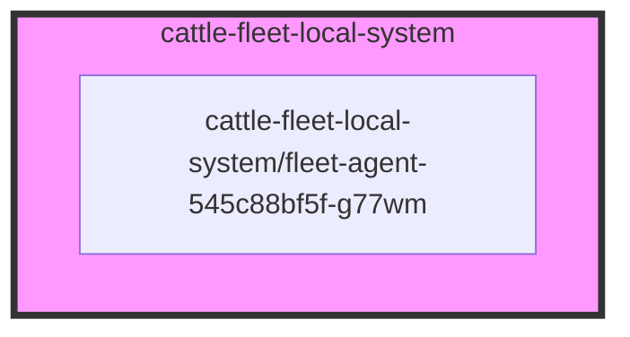
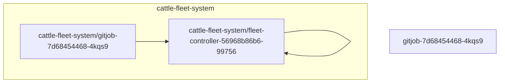
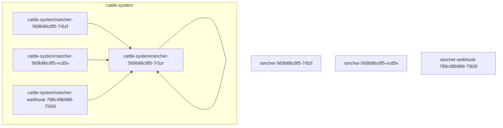
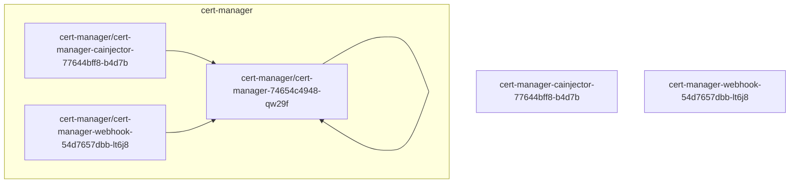
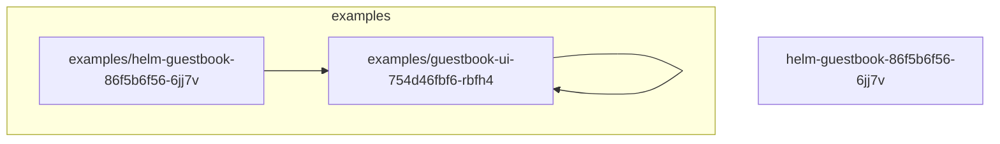
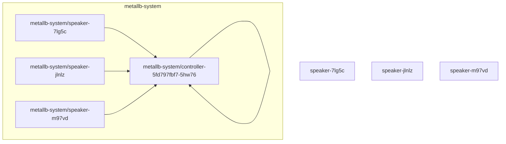

### Namespace: argocd

```mermaid
graph TD;
  subgraph argocd
    style argocd fill:#f9f,stroke:#333,stroke-width:4px;
    argocd/argocd-application-controller-0
  end
  argocd/argocd-application-controller-0 --> argocd/argocd-application-controller-0
argocd-applicationset-controller-5877955b59-g6skz
argocd-dex-server-6c87968c75-ndxdh
argocd-notifications-controller-64bb8dcf46-cjwrl
argocd-redis-7d8d46cc7f-6xf9w
argocd-repo-server-665d6b7b59-gxxzq
argocd-server-5986f74c99-sdn58
  subgraph argocd
    style argocd fill:#f9f,stroke:#333,stroke-width:4px;
    argocd/argocd-applicationset-controller-5877955b59-g6skz
  end
  argocd/argocd-applicationset-controller-5877955b59-g6skz --> argocd/argocd-application-controller-0
argocd-applicationset-controller-5877955b59-g6skz
argocd-dex-server-6c87968c75-ndxdh
argocd-notifications-controller-64bb8dcf46-cjwrl
argocd-redis-7d8d46cc7f-6xf9w
argocd-repo-server-665d6b7b59-gxxzq
argocd-server-5986f74c99-sdn58
  subgraph argocd
    style argocd fill:#f9f,stroke:#333,stroke-width:4px;
    argocd/argocd-dex-server-6c87968c75-ndxdh
  end
  argocd/argocd-dex-server-6c87968c75-ndxdh --> argocd/argocd-application-controller-0
argocd-applicationset-controller-5877955b59-g6skz
argocd-dex-server-6c87968c75-ndxdh
argocd-notifications-controller-64bb8dcf46-cjwrl
argocd-redis-7d8d46cc7f-6xf9w
argocd-repo-server-665d6b7b59-gxxzq
argocd-server-5986f74c99-sdn58
  subgraph argocd
    style argocd fill:#f9f,stroke:#333,stroke-width:4px;
    argocd/argocd-notifications-controller-64bb8dcf46-cjwrl
  end
  argocd/argocd-notifications-controller-64bb8dcf46-cjwrl --> argocd/argocd-application-controller-0
argocd-applicationset-controller-5877955b59-g6skz
argocd-dex-server-6c87968c75-ndxdh
argocd-notifications-controller-64bb8dcf46-cjwrl
argocd-redis-7d8d46cc7f-6xf9w
argocd-repo-server-665d6b7b59-gxxzq
argocd-server-5986f74c99-sdn58
  subgraph argocd
    style argocd fill:#f9f,stroke:#333,stroke-width:4px;
    argocd/argocd-redis-7d8d46cc7f-6xf9w
  end
  argocd/argocd-redis-7d8d46cc7f-6xf9w --> argocd/argocd-application-controller-0
argocd-applicationset-controller-5877955b59-g6skz
argocd-dex-server-6c87968c75-ndxdh
argocd-notifications-controller-64bb8dcf46-cjwrl
argocd-redis-7d8d46cc7f-6xf9w
argocd-repo-server-665d6b7b59-gxxzq
argocd-server-5986f74c99-sdn58
  subgraph argocd
    style argocd fill:#f9f,stroke:#333,stroke-width:4px;
    argocd/argocd-repo-server-665d6b7b59-gxxzq
  end
  argocd/argocd-repo-server-665d6b7b59-gxxzq --> argocd/argocd-application-controller-0
argocd-applicationset-controller-5877955b59-g6skz
argocd-dex-server-6c87968c75-ndxdh
argocd-notifications-controller-64bb8dcf46-cjwrl
argocd-redis-7d8d46cc7f-6xf9w
argocd-repo-server-665d6b7b59-gxxzq
argocd-server-5986f74c99-sdn58
  subgraph argocd
    style argocd fill:#f9f,stroke:#333,stroke-width:4px;
    argocd/argocd-server-5986f74c99-sdn58
  end
  argocd/argocd-server-5986f74c99-sdn58 --> argocd/argocd-application-controller-0
argocd-applicationset-controller-5877955b59-g6skz
argocd-dex-server-6c87968c75-ndxdh
argocd-notifications-controller-64bb8dcf46-cjwrl
argocd-redis-7d8d46cc7f-6xf9w
argocd-repo-server-665d6b7b59-gxxzq
argocd-server-5986f74c99-sdn58
```

### Namespace: cattle-fleet-clusters-system
```mermaid
graph TD;
```
### Namespace: cattle-fleet-local-system

### Namespace: cattle-fleet-system

### Namespace: cattle-global-data
```mermaid
graph TD;
```
### Namespace: cattle-global-nt
```mermaid
graph TD;
```
### Namespace: cattle-impersonation-system
```mermaid
graph TD;
```
### Namespace: cattle-system

### Namespace: cert-manager

### Namespace: cluster-fleet-local-local-1a3d67d0a899
```mermaid
graph TD;
```
### Namespace: default
```mermaid
graph TD;
  subgraph default
    style default fill:#f9f,stroke:#333,stroke-width:4px;
    default/kuard2
  end
```
### Namespace: examples

### Namespace: fleet-default
```mermaid
graph TD;
```
### Namespace: fleet-local
```mermaid
graph TD;
```
### Namespace: kube-node-lease
```mermaid
graph TD;
```
### Namespace: kube-prometheus

```mermaid
graph TD;
  subgraph kube-prometheus
    style kube-prometheus fill:#f9f,stroke:#333,stroke-width:4px;
    kube-prometheus/alertmanager-kube-prometheus-kube-prome-alertmanager-0
  end
  kube-prometheus/alertmanager-kube-prometheus-kube-prome-alertmanager-0 --> kube-prometheus/alertmanager-kube-prometheus-kube-prome-alertmanager-0
kube-prometheus-grafana-84c764c9cf-j2k94
kube-prometheus-kube-prome-operator-9dc6d459f-rtcds
kube-prometheus-kube-state-metrics-f946bb86b-g2s8n
kube-prometheus-prometheus-node-exporter-2qqmf
kube-prometheus-prometheus-node-exporter-cz44g
kube-prometheus-prometheus-node-exporter-wgwsg
prometheus-kube-prometheus-kube-prome-prometheus-0
  subgraph kube-prometheus
    style kube-prometheus fill:#f9f,stroke:#333,stroke-width:4px;
    kube-prometheus/kube-prometheus-grafana-84c764c9cf-j2k94
  end
  kube-prometheus/kube-prometheus-grafana-84c764c9cf-j2k94 --> kube-prometheus/alertmanager-kube-prometheus-kube-prome-alertmanager-0
kube-prometheus-grafana-84c764c9cf-j2k94
kube-prometheus-kube-prome-operator-9dc6d459f-rtcds
kube-prometheus-kube-state-metrics-f946bb86b-g2s8n
kube-prometheus-prometheus-node-exporter-2qqmf
kube-prometheus-prometheus-node-exporter-cz44g
kube-prometheus-prometheus-node-exporter-wgwsg
prometheus-kube-prometheus-kube-prome-prometheus-0
  subgraph kube-prometheus
    style kube-prometheus fill:#f9f,stroke:#333,stroke-width:4px;
    kube-prometheus/kube-prometheus-kube-prome-operator-9dc6d459f-rtcds
  end
  kube-prometheus/kube-prometheus-kube-prome-operator-9dc6d459f-rtcds --> kube-prometheus/alertmanager-kube-prometheus-kube-prome-alertmanager-0
kube-prometheus-grafana-84c764c9cf-j2k94
kube-prometheus-kube-prome-operator-9dc6d459f-rtcds
kube-prometheus-kube-state-metrics-f946bb86b-g2s8n
kube-prometheus-prometheus-node-exporter-2qqmf
kube-prometheus-prometheus-node-exporter-cz44g
kube-prometheus-prometheus-node-exporter-wgwsg
prometheus-kube-prometheus-kube-prome-prometheus-0
  subgraph kube-prometheus
    style kube-prometheus fill:#f9f,stroke:#333,stroke-width:4px;
    kube-prometheus/kube-prometheus-kube-state-metrics-f946bb86b-g2s8n
  end
  kube-prometheus/kube-prometheus-kube-state-metrics-f946bb86b-g2s8n --> kube-prometheus/alertmanager-kube-prometheus-kube-prome-alertmanager-0
kube-prometheus-grafana-84c764c9cf-j2k94
kube-prometheus-kube-prome-operator-9dc6d459f-rtcds
kube-prometheus-kube-state-metrics-f946bb86b-g2s8n
kube-prometheus-prometheus-node-exporter-2qqmf
kube-prometheus-prometheus-node-exporter-cz44g
kube-prometheus-prometheus-node-exporter-wgwsg
prometheus-kube-prometheus-kube-prome-prometheus-0
  subgraph kube-prometheus
    style kube-prometheus fill:#f9f,stroke:#333,stroke-width:4px;
    kube-prometheus/kube-prometheus-prometheus-node-exporter-2qqmf
  end
  kube-prometheus/kube-prometheus-prometheus-node-exporter-2qqmf --> kube-prometheus/alertmanager-kube-prometheus-kube-prome-alertmanager-0
kube-prometheus-grafana-84c764c9cf-j2k94
kube-prometheus-kube-prome-operator-9dc6d459f-rtcds
kube-prometheus-kube-state-metrics-f946bb86b-g2s8n
kube-prometheus-prometheus-node-exporter-2qqmf
kube-prometheus-prometheus-node-exporter-cz44g
kube-prometheus-prometheus-node-exporter-wgwsg
prometheus-kube-prometheus-kube-prome-prometheus-0
  subgraph kube-prometheus
    style kube-prometheus fill:#f9f,stroke:#333,stroke-width:4px;
    kube-prometheus/kube-prometheus-prometheus-node-exporter-cz44g
  end
  kube-prometheus/kube-prometheus-prometheus-node-exporter-cz44g --> kube-prometheus/alertmanager-kube-prometheus-kube-prome-alertmanager-0
kube-prometheus-grafana-84c764c9cf-j2k94
kube-prometheus-kube-prome-operator-9dc6d459f-rtcds
kube-prometheus-kube-state-metrics-f946bb86b-g2s8n
kube-prometheus-prometheus-node-exporter-2qqmf
kube-prometheus-prometheus-node-exporter-cz44g
kube-prometheus-prometheus-node-exporter-wgwsg
prometheus-kube-prometheus-kube-prome-prometheus-0
  subgraph kube-prometheus
    style kube-prometheus fill:#f9f,stroke:#333,stroke-width:4px;
    kube-prometheus/kube-prometheus-prometheus-node-exporter-wgwsg
  end
  kube-prometheus/kube-prometheus-prometheus-node-exporter-wgwsg --> kube-prometheus/alertmanager-kube-prometheus-kube-prome-alertmanager-0
kube-prometheus-grafana-84c764c9cf-j2k94
kube-prometheus-kube-prome-operator-9dc6d459f-rtcds
kube-prometheus-kube-state-metrics-f946bb86b-g2s8n
kube-prometheus-prometheus-node-exporter-2qqmf
kube-prometheus-prometheus-node-exporter-cz44g
kube-prometheus-prometheus-node-exporter-wgwsg
prometheus-kube-prometheus-kube-prome-prometheus-0
  subgraph kube-prometheus
    style kube-prometheus fill:#f9f,stroke:#333,stroke-width:4px;
    kube-prometheus/prometheus-kube-prometheus-kube-prome-prometheus-0
  end
  kube-prometheus/prometheus-kube-prometheus-kube-prome-prometheus-0 --> kube-prometheus/alertmanager-kube-prometheus-kube-prome-alertmanager-0
kube-prometheus-grafana-84c764c9cf-j2k94
kube-prometheus-kube-prome-operator-9dc6d459f-rtcds
kube-prometheus-kube-state-metrics-f946bb86b-g2s8n
kube-prometheus-prometheus-node-exporter-2qqmf
kube-prometheus-prometheus-node-exporter-cz44g
kube-prometheus-prometheus-node-exporter-wgwsg
prometheus-kube-prometheus-kube-prome-prometheus-0
```

### Namespace: kube-public
```mermaid
graph TD;
```
### Namespace: kube-system
```mermaid
graph TD;
  subgraph kube-system
    style kube-system fill:#f9f,stroke:#333,stroke-width:4px;
    kube-system/cloud-controller-manager-control-plane01
  end
  kube-system/cloud-controller-manager-control-plane01 --> kube-system/cloud-controller-manager-control-plane01
cloud-controller-manager-control-plane02
cloud-controller-manager-control-plane03
etcd-control-plane01
etcd-control-plane02
etcd-control-plane03
helm-install-rke2-canal-ct2wr
helm-install-rke2-coredns-vrc4s
helm-install-rke2-ingress-nginx-b79w7
helm-install-rke2-metrics-server-z4w6w
helm-install-rke2-snapshot-controller-9mdnr
helm-install-rke2-snapshot-controller-crd-lkgsg
helm-install-rke2-snapshot-validation-webhook-fnjgr
kube-apiserver-control-plane01
kube-apiserver-control-plane02
kube-apiserver-control-plane03
kube-controller-manager-control-plane01
kube-controller-manager-control-plane02
kube-controller-manager-control-plane03
kube-proxy-control-plane01
kube-proxy-control-plane02
kube-proxy-control-plane03
kube-proxy-worker01
kube-proxy-worker02
kube-proxy-worker03
kube-scheduler-control-plane01
kube-scheduler-control-plane02
kube-scheduler-control-plane03
rke2-canal-gtnvh
rke2-canal-kvd28
rke2-canal-m42jg
rke2-canal-plb4h
rke2-canal-rfmfr
rke2-canal-x45kd
rke2-coredns-rke2-coredns-7c98b7488c-chcxz
rke2-coredns-rke2-coredns-7c98b7488c-jwb2z
rke2-coredns-rke2-coredns-autoscaler-65b5bfc754-5n2pv
rke2-ingress-nginx-controller-2s9q9
rke2-ingress-nginx-controller-6ljbs
rke2-ingress-nginx-controller-t2dtt
rke2-metrics-server-5bf59cdccb-zzvws
rke2-snapshot-controller-6f7bbb497d-h7fn6
rke2-snapshot-validation-webhook-65b5675d5c-5fkl7
  subgraph kube-system
    style kube-system fill:#f9f,stroke:#333,stroke-width:4px;
    kube-system/cloud-controller-manager-control-plane02
  end
  kube-system/cloud-controller-manager-control-plane02 --> kube-system/cloud-controller-manager-control-plane01
cloud-controller-manager-control-plane02
cloud-controller-manager-control-plane03
etcd-control-plane01
etcd-control-plane02
etcd-control-plane03
helm-install-rke2-canal-ct2wr
helm-install-rke2-coredns-vrc4s
helm-install-rke2-ingress-nginx-b79w7
helm-install-rke2-metrics-server-z4w6w
helm-install-rke2-snapshot-controller-9mdnr
helm-install-rke2-snapshot-controller-crd-lkgsg
helm-install-rke2-snapshot-validation-webhook-fnjgr
kube-apiserver-control-plane01
kube-apiserver-control-plane02
kube-apiserver-control-plane03
kube-controller-manager-control-plane01
kube-controller-manager-control-plane02
kube-controller-manager-control-plane03
kube-proxy-control-plane01
kube-proxy-control-plane02
kube-proxy-control-plane03
kube-proxy-worker01
kube-proxy-worker02
kube-proxy-worker03
kube-scheduler-control-plane01
kube-scheduler-control-plane02
kube-scheduler-control-plane03
rke2-canal-gtnvh
rke2-canal-kvd28
rke2-canal-m42jg
rke2-canal-plb4h
rke2-canal-rfmfr
rke2-canal-x45kd
rke2-coredns-rke2-coredns-7c98b7488c-chcxz
rke2-coredns-rke2-coredns-7c98b7488c-jwb2z
rke2-coredns-rke2-coredns-autoscaler-65b5bfc754-5n2pv
rke2-ingress-nginx-controller-2s9q9
rke2-ingress-nginx-controller-6ljbs
rke2-ingress-nginx-controller-t2dtt
rke2-metrics-server-5bf59cdccb-zzvws
rke2-snapshot-controller-6f7bbb497d-h7fn6
rke2-snapshot-validation-webhook-65b5675d5c-5fkl7
  subgraph kube-system
    style kube-system fill:#f9f,stroke:#333,stroke-width:4px;
    kube-system/cloud-controller-manager-control-plane03
  end
  kube-system/cloud-controller-manager-control-plane03 --> kube-system/cloud-controller-manager-control-plane01
cloud-controller-manager-control-plane02
cloud-controller-manager-control-plane03
etcd-control-plane01
etcd-control-plane02
etcd-control-plane03
helm-install-rke2-canal-ct2wr
helm-install-rke2-coredns-vrc4s
helm-install-rke2-ingress-nginx-b79w7
helm-install-rke2-metrics-server-z4w6w
helm-install-rke2-snapshot-controller-9mdnr
helm-install-rke2-snapshot-controller-crd-lkgsg
helm-install-rke2-snapshot-validation-webhook-fnjgr
kube-apiserver-control-plane01
kube-apiserver-control-plane02
kube-apiserver-control-plane03
kube-controller-manager-control-plane01
kube-controller-manager-control-plane02
kube-controller-manager-control-plane03
kube-proxy-control-plane01
kube-proxy-control-plane02
kube-proxy-control-plane03
kube-proxy-worker01
kube-proxy-worker02
kube-proxy-worker03
kube-scheduler-control-plane01
kube-scheduler-control-plane02
kube-scheduler-control-plane03
rke2-canal-gtnvh
rke2-canal-kvd28
rke2-canal-m42jg
rke2-canal-plb4h
rke2-canal-rfmfr
rke2-canal-x45kd
rke2-coredns-rke2-coredns-7c98b7488c-chcxz
rke2-coredns-rke2-coredns-7c98b7488c-jwb2z
rke2-coredns-rke2-coredns-autoscaler-65b5bfc754-5n2pv
rke2-ingress-nginx-controller-2s9q9
rke2-ingress-nginx-controller-6ljbs
rke2-ingress-nginx-controller-t2dtt
rke2-metrics-server-5bf59cdccb-zzvws
rke2-snapshot-controller-6f7bbb497d-h7fn6
rke2-snapshot-validation-webhook-65b5675d5c-5fkl7
  subgraph kube-system
    style kube-system fill:#f9f,stroke:#333,stroke-width:4px;
    kube-system/etcd-control-plane01
  end
  kube-system/etcd-control-plane01 --> kube-system/cloud-controller-manager-control-plane01
cloud-controller-manager-control-plane02
cloud-controller-manager-control-plane03
etcd-control-plane01
etcd-control-plane02
etcd-control-plane03
helm-install-rke2-canal-ct2wr
helm-install-rke2-coredns-vrc4s
helm-install-rke2-ingress-nginx-b79w7
helm-install-rke2-metrics-server-z4w6w
helm-install-rke2-snapshot-controller-9mdnr
helm-install-rke2-snapshot-controller-crd-lkgsg
helm-install-rke2-snapshot-validation-webhook-fnjgr
kube-apiserver-control-plane01
kube-apiserver-control-plane02
kube-apiserver-control-plane03
kube-controller-manager-control-plane01
kube-controller-manager-control-plane02
kube-controller-manager-control-plane03
kube-proxy-control-plane01
kube-proxy-control-plane02
kube-proxy-control-plane03
kube-proxy-worker01
kube-proxy-worker02
kube-proxy-worker03
kube-scheduler-control-plane01
kube-scheduler-control-plane02
kube-scheduler-control-plane03
rke2-canal-gtnvh
rke2-canal-kvd28
rke2-canal-m42jg
rke2-canal-plb4h
rke2-canal-rfmfr
rke2-canal-x45kd
rke2-coredns-rke2-coredns-7c98b7488c-chcxz
rke2-coredns-rke2-coredns-7c98b7488c-jwb2z
rke2-coredns-rke2-coredns-autoscaler-65b5bfc754-5n2pv
rke2-ingress-nginx-controller-2s9q9
rke2-ingress-nginx-controller-6ljbs
rke2-ingress-nginx-controller-t2dtt
rke2-metrics-server-5bf59cdccb-zzvws
rke2-snapshot-controller-6f7bbb497d-h7fn6
rke2-snapshot-validation-webhook-65b5675d5c-5fkl7
  subgraph kube-system
    style kube-system fill:#f9f,stroke:#333,stroke-width:4px;
    kube-system/etcd-control-plane02
  end
  kube-system/etcd-control-plane02 --> kube-system/cloud-controller-manager-control-plane01
cloud-controller-manager-control-plane02
cloud-controller-manager-control-plane03
etcd-control-plane01
etcd-control-plane02
etcd-control-plane03
helm-install-rke2-canal-ct2wr
helm-install-rke2-coredns-vrc4s
helm-install-rke2-ingress-nginx-b79w7
helm-install-rke2-metrics-server-z4w6w
helm-install-rke2-snapshot-controller-9mdnr
helm-install-rke2-snapshot-controller-crd-lkgsg
helm-install-rke2-snapshot-validation-webhook-fnjgr
kube-apiserver-control-plane01
kube-apiserver-control-plane02
kube-apiserver-control-plane03
kube-controller-manager-control-plane01
kube-controller-manager-control-plane02
kube-controller-manager-control-plane03
kube-proxy-control-plane01
kube-proxy-control-plane02
kube-proxy-control-plane03
kube-proxy-worker01
kube-proxy-worker02
kube-proxy-worker03
kube-scheduler-control-plane01
kube-scheduler-control-plane02
kube-scheduler-control-plane03
rke2-canal-gtnvh
rke2-canal-kvd28
rke2-canal-m42jg
rke2-canal-plb4h
rke2-canal-rfmfr
rke2-canal-x45kd
rke2-coredns-rke2-coredns-7c98b7488c-chcxz
rke2-coredns-rke2-coredns-7c98b7488c-jwb2z
rke2-coredns-rke2-coredns-autoscaler-65b5bfc754-5n2pv
rke2-ingress-nginx-controller-2s9q9
rke2-ingress-nginx-controller-6ljbs
rke2-ingress-nginx-controller-t2dtt
rke2-metrics-server-5bf59cdccb-zzvws
rke2-snapshot-controller-6f7bbb497d-h7fn6
rke2-snapshot-validation-webhook-65b5675d5c-5fkl7
  subgraph kube-system
    style kube-system fill:#f9f,stroke:#333,stroke-width:4px;
    kube-system/etcd-control-plane03
  end
  kube-system/etcd-control-plane03 --> kube-system/cloud-controller-manager-control-plane01
cloud-controller-manager-control-plane02
cloud-controller-manager-control-plane03
etcd-control-plane01
etcd-control-plane02
etcd-control-plane03
helm-install-rke2-canal-ct2wr
helm-install-rke2-coredns-vrc4s
helm-install-rke2-ingress-nginx-b79w7
helm-install-rke2-metrics-server-z4w6w
helm-install-rke2-snapshot-controller-9mdnr
helm-install-rke2-snapshot-controller-crd-lkgsg
helm-install-rke2-snapshot-validation-webhook-fnjgr
kube-apiserver-control-plane01
kube-apiserver-control-plane02
kube-apiserver-control-plane03
kube-controller-manager-control-plane01
kube-controller-manager-control-plane02
kube-controller-manager-control-plane03
kube-proxy-control-plane01
kube-proxy-control-plane02
kube-proxy-control-plane03
kube-proxy-worker01
kube-proxy-worker02
kube-proxy-worker03
kube-scheduler-control-plane01
kube-scheduler-control-plane02
kube-scheduler-control-plane03
rke2-canal-gtnvh
rke2-canal-kvd28
rke2-canal-m42jg
rke2-canal-plb4h
rke2-canal-rfmfr
rke2-canal-x45kd
rke2-coredns-rke2-coredns-7c98b7488c-chcxz
rke2-coredns-rke2-coredns-7c98b7488c-jwb2z
rke2-coredns-rke2-coredns-autoscaler-65b5bfc754-5n2pv
rke2-ingress-nginx-controller-2s9q9
rke2-ingress-nginx-controller-6ljbs
rke2-ingress-nginx-controller-t2dtt
rke2-metrics-server-5bf59cdccb-zzvws
rke2-snapshot-controller-6f7bbb497d-h7fn6
rke2-snapshot-validation-webhook-65b5675d5c-5fkl7
  subgraph kube-system
    style kube-system fill:#f9f,stroke:#333,stroke-width:4px;
    kube-system/helm-install-rke2-canal-ct2wr
  end
  kube-system/helm-install-rke2-canal-ct2wr --> kube-system/cloud-controller-manager-control-plane01
cloud-controller-manager-control-plane02
cloud-controller-manager-control-plane03
etcd-control-plane01
etcd-control-plane02
etcd-control-plane03
helm-install-rke2-canal-ct2wr
helm-install-rke2-coredns-vrc4s
helm-install-rke2-ingress-nginx-b79w7
helm-install-rke2-metrics-server-z4w6w
helm-install-rke2-snapshot-controller-9mdnr
helm-install-rke2-snapshot-controller-crd-lkgsg
helm-install-rke2-snapshot-validation-webhook-fnjgr
kube-apiserver-control-plane01
kube-apiserver-control-plane02
kube-apiserver-control-plane03
kube-controller-manager-control-plane01
kube-controller-manager-control-plane02
kube-controller-manager-control-plane03
kube-proxy-control-plane01
kube-proxy-control-plane02
kube-proxy-control-plane03
kube-proxy-worker01
kube-proxy-worker02
kube-proxy-worker03
kube-scheduler-control-plane01
kube-scheduler-control-plane02
kube-scheduler-control-plane03
rke2-canal-gtnvh
rke2-canal-kvd28
rke2-canal-m42jg
rke2-canal-plb4h
rke2-canal-rfmfr
rke2-canal-x45kd
rke2-coredns-rke2-coredns-7c98b7488c-chcxz
rke2-coredns-rke2-coredns-7c98b7488c-jwb2z
rke2-coredns-rke2-coredns-autoscaler-65b5bfc754-5n2pv
rke2-ingress-nginx-controller-2s9q9
rke2-ingress-nginx-controller-6ljbs
rke2-ingress-nginx-controller-t2dtt
rke2-metrics-server-5bf59cdccb-zzvws
rke2-snapshot-controller-6f7bbb497d-h7fn6
rke2-snapshot-validation-webhook-65b5675d5c-5fkl7
  subgraph kube-system
    style kube-system fill:#f9f,stroke:#333,stroke-width:4px;
    kube-system/helm-install-rke2-coredns-vrc4s
  end
  kube-system/helm-install-rke2-coredns-vrc4s --> kube-system/cloud-controller-manager-control-plane01
cloud-controller-manager-control-plane02
cloud-controller-manager-control-plane03
etcd-control-plane01
etcd-control-plane02
etcd-control-plane03
helm-install-rke2-canal-ct2wr
helm-install-rke2-coredns-vrc4s
helm-install-rke2-ingress-nginx-b79w7
helm-install-rke2-metrics-server-z4w6w
helm-install-rke2-snapshot-controller-9mdnr
helm-install-rke2-snapshot-controller-crd-lkgsg
helm-install-rke2-snapshot-validation-webhook-fnjgr
kube-apiserver-control-plane01
kube-apiserver-control-plane02
kube-apiserver-control-plane03
kube-controller-manager-control-plane01
kube-controller-manager-control-plane02
kube-controller-manager-control-plane03
kube-proxy-control-plane01
kube-proxy-control-plane02
kube-proxy-control-plane03
kube-proxy-worker01
kube-proxy-worker02
kube-proxy-worker03
kube-scheduler-control-plane01
kube-scheduler-control-plane02
kube-scheduler-control-plane03
rke2-canal-gtnvh
rke2-canal-kvd28
rke2-canal-m42jg
rke2-canal-plb4h
rke2-canal-rfmfr
rke2-canal-x45kd
rke2-coredns-rke2-coredns-7c98b7488c-chcxz
rke2-coredns-rke2-coredns-7c98b7488c-jwb2z
rke2-coredns-rke2-coredns-autoscaler-65b5bfc754-5n2pv
rke2-ingress-nginx-controller-2s9q9
rke2-ingress-nginx-controller-6ljbs
rke2-ingress-nginx-controller-t2dtt
rke2-metrics-server-5bf59cdccb-zzvws
rke2-snapshot-controller-6f7bbb497d-h7fn6
rke2-snapshot-validation-webhook-65b5675d5c-5fkl7
  subgraph kube-system
    style kube-system fill:#f9f,stroke:#333,stroke-width:4px;
    kube-system/helm-install-rke2-ingress-nginx-b79w7
  end
  kube-system/helm-install-rke2-ingress-nginx-b79w7 --> kube-system/cloud-controller-manager-control-plane01
cloud-controller-manager-control-plane02
cloud-controller-manager-control-plane03
etcd-control-plane01
etcd-control-plane02
etcd-control-plane03
helm-install-rke2-canal-ct2wr
helm-install-rke2-coredns-vrc4s
helm-install-rke2-ingress-nginx-b79w7
helm-install-rke2-metrics-server-z4w6w
helm-install-rke2-snapshot-controller-9mdnr
helm-install-rke2-snapshot-controller-crd-lkgsg
helm-install-rke2-snapshot-validation-webhook-fnjgr
kube-apiserver-control-plane01
kube-apiserver-control-plane02
kube-apiserver-control-plane03
kube-controller-manager-control-plane01
kube-controller-manager-control-plane02
kube-controller-manager-control-plane03
kube-proxy-control-plane01
kube-proxy-control-plane02
kube-proxy-control-plane03
kube-proxy-worker01
kube-proxy-worker02
kube-proxy-worker03
kube-scheduler-control-plane01
kube-scheduler-control-plane02
kube-scheduler-control-plane03
rke2-canal-gtnvh
rke2-canal-kvd28
rke2-canal-m42jg
rke2-canal-plb4h
rke2-canal-rfmfr
rke2-canal-x45kd
rke2-coredns-rke2-coredns-7c98b7488c-chcxz
rke2-coredns-rke2-coredns-7c98b7488c-jwb2z
rke2-coredns-rke2-coredns-autoscaler-65b5bfc754-5n2pv
rke2-ingress-nginx-controller-2s9q9
rke2-ingress-nginx-controller-6ljbs
rke2-ingress-nginx-controller-t2dtt
rke2-metrics-server-5bf59cdccb-zzvws
rke2-snapshot-controller-6f7bbb497d-h7fn6
rke2-snapshot-validation-webhook-65b5675d5c-5fkl7
  subgraph kube-system
    style kube-system fill:#f9f,stroke:#333,stroke-width:4px;
    kube-system/helm-install-rke2-metrics-server-z4w6w
  end
  kube-system/helm-install-rke2-metrics-server-z4w6w --> kube-system/cloud-controller-manager-control-plane01
cloud-controller-manager-control-plane02
cloud-controller-manager-control-plane03
etcd-control-plane01
etcd-control-plane02
etcd-control-plane03
helm-install-rke2-canal-ct2wr
helm-install-rke2-coredns-vrc4s
helm-install-rke2-ingress-nginx-b79w7
helm-install-rke2-metrics-server-z4w6w
helm-install-rke2-snapshot-controller-9mdnr
helm-install-rke2-snapshot-controller-crd-lkgsg
helm-install-rke2-snapshot-validation-webhook-fnjgr
kube-apiserver-control-plane01
kube-apiserver-control-plane02
kube-apiserver-control-plane03
kube-controller-manager-control-plane01
kube-controller-manager-control-plane02
kube-controller-manager-control-plane03
kube-proxy-control-plane01
kube-proxy-control-plane02
kube-proxy-control-plane03
kube-proxy-worker01
kube-proxy-worker02
kube-proxy-worker03
kube-scheduler-control-plane01
kube-scheduler-control-plane02
kube-scheduler-control-plane03
rke2-canal-gtnvh
rke2-canal-kvd28
rke2-canal-m42jg
rke2-canal-plb4h
rke2-canal-rfmfr
rke2-canal-x45kd
rke2-coredns-rke2-coredns-7c98b7488c-chcxz
rke2-coredns-rke2-coredns-7c98b7488c-jwb2z
rke2-coredns-rke2-coredns-autoscaler-65b5bfc754-5n2pv
rke2-ingress-nginx-controller-2s9q9
rke2-ingress-nginx-controller-6ljbs
rke2-ingress-nginx-controller-t2dtt
rke2-metrics-server-5bf59cdccb-zzvws
rke2-snapshot-controller-6f7bbb497d-h7fn6
rke2-snapshot-validation-webhook-65b5675d5c-5fkl7
  subgraph kube-system
    style kube-system fill:#f9f,stroke:#333,stroke-width:4px;
    kube-system/helm-install-rke2-snapshot-controller-9mdnr
  end
  kube-system/helm-install-rke2-snapshot-controller-9mdnr --> kube-system/cloud-controller-manager-control-plane01
cloud-controller-manager-control-plane02
cloud-controller-manager-control-plane03
etcd-control-plane01
etcd-control-plane02
etcd-control-plane03
helm-install-rke2-canal-ct2wr
helm-install-rke2-coredns-vrc4s
helm-install-rke2-ingress-nginx-b79w7
helm-install-rke2-metrics-server-z4w6w
helm-install-rke2-snapshot-controller-9mdnr
helm-install-rke2-snapshot-controller-crd-lkgsg
helm-install-rke2-snapshot-validation-webhook-fnjgr
kube-apiserver-control-plane01
kube-apiserver-control-plane02
kube-apiserver-control-plane03
kube-controller-manager-control-plane01
kube-controller-manager-control-plane02
kube-controller-manager-control-plane03
kube-proxy-control-plane01
kube-proxy-control-plane02
kube-proxy-control-plane03
kube-proxy-worker01
kube-proxy-worker02
kube-proxy-worker03
kube-scheduler-control-plane01
kube-scheduler-control-plane02
kube-scheduler-control-plane03
rke2-canal-gtnvh
rke2-canal-kvd28
rke2-canal-m42jg
rke2-canal-plb4h
rke2-canal-rfmfr
rke2-canal-x45kd
rke2-coredns-rke2-coredns-7c98b7488c-chcxz
rke2-coredns-rke2-coredns-7c98b7488c-jwb2z
rke2-coredns-rke2-coredns-autoscaler-65b5bfc754-5n2pv
rke2-ingress-nginx-controller-2s9q9
rke2-ingress-nginx-controller-6ljbs
rke2-ingress-nginx-controller-t2dtt
rke2-metrics-server-5bf59cdccb-zzvws
rke2-snapshot-controller-6f7bbb497d-h7fn6
rke2-snapshot-validation-webhook-65b5675d5c-5fkl7
  subgraph kube-system
    style kube-system fill:#f9f,stroke:#333,stroke-width:4px;
    kube-system/helm-install-rke2-snapshot-controller-crd-lkgsg
  end
  kube-system/helm-install-rke2-snapshot-controller-crd-lkgsg --> kube-system/cloud-controller-manager-control-plane01
cloud-controller-manager-control-plane02
cloud-controller-manager-control-plane03
etcd-control-plane01
etcd-control-plane02
etcd-control-plane03
helm-install-rke2-canal-ct2wr
helm-install-rke2-coredns-vrc4s
helm-install-rke2-ingress-nginx-b79w7
helm-install-rke2-metrics-server-z4w6w
helm-install-rke2-snapshot-controller-9mdnr
helm-install-rke2-snapshot-controller-crd-lkgsg
helm-install-rke2-snapshot-validation-webhook-fnjgr
kube-apiserver-control-plane01
kube-apiserver-control-plane02
kube-apiserver-control-plane03
kube-controller-manager-control-plane01
kube-controller-manager-control-plane02
kube-controller-manager-control-plane03
kube-proxy-control-plane01
kube-proxy-control-plane02
kube-proxy-control-plane03
kube-proxy-worker01
kube-proxy-worker02
kube-proxy-worker03
kube-scheduler-control-plane01
kube-scheduler-control-plane02
kube-scheduler-control-plane03
rke2-canal-gtnvh
rke2-canal-kvd28
rke2-canal-m42jg
rke2-canal-plb4h
rke2-canal-rfmfr
rke2-canal-x45kd
rke2-coredns-rke2-coredns-7c98b7488c-chcxz
rke2-coredns-rke2-coredns-7c98b7488c-jwb2z
rke2-coredns-rke2-coredns-autoscaler-65b5bfc754-5n2pv
rke2-ingress-nginx-controller-2s9q9
rke2-ingress-nginx-controller-6ljbs
rke2-ingress-nginx-controller-t2dtt
rke2-metrics-server-5bf59cdccb-zzvws
rke2-snapshot-controller-6f7bbb497d-h7fn6
rke2-snapshot-validation-webhook-65b5675d5c-5fkl7
  subgraph kube-system
    style kube-system fill:#f9f,stroke:#333,stroke-width:4px;
    kube-system/helm-install-rke2-snapshot-validation-webhook-fnjgr
  end
  kube-system/helm-install-rke2-snapshot-validation-webhook-fnjgr --> kube-system/cloud-controller-manager-control-plane01
cloud-controller-manager-control-plane02
cloud-controller-manager-control-plane03
etcd-control-plane01
etcd-control-plane02
etcd-control-plane03
helm-install-rke2-canal-ct2wr
helm-install-rke2-coredns-vrc4s
helm-install-rke2-ingress-nginx-b79w7
helm-install-rke2-metrics-server-z4w6w
helm-install-rke2-snapshot-controller-9mdnr
helm-install-rke2-snapshot-controller-crd-lkgsg
helm-install-rke2-snapshot-validation-webhook-fnjgr
kube-apiserver-control-plane01
kube-apiserver-control-plane02
kube-apiserver-control-plane03
kube-controller-manager-control-plane01
kube-controller-manager-control-plane02
kube-controller-manager-control-plane03
kube-proxy-control-plane01
kube-proxy-control-plane02
kube-proxy-control-plane03
kube-proxy-worker01
kube-proxy-worker02
kube-proxy-worker03
kube-scheduler-control-plane01
kube-scheduler-control-plane02
kube-scheduler-control-plane03
rke2-canal-gtnvh
rke2-canal-kvd28
rke2-canal-m42jg
rke2-canal-plb4h
rke2-canal-rfmfr
rke2-canal-x45kd
rke2-coredns-rke2-coredns-7c98b7488c-chcxz
rke2-coredns-rke2-coredns-7c98b7488c-jwb2z
rke2-coredns-rke2-coredns-autoscaler-65b5bfc754-5n2pv
rke2-ingress-nginx-controller-2s9q9
rke2-ingress-nginx-controller-6ljbs
rke2-ingress-nginx-controller-t2dtt
rke2-metrics-server-5bf59cdccb-zzvws
rke2-snapshot-controller-6f7bbb497d-h7fn6
rke2-snapshot-validation-webhook-65b5675d5c-5fkl7
  subgraph kube-system
    style kube-system fill:#f9f,stroke:#333,stroke-width:4px;
    kube-system/kube-apiserver-control-plane01
  end
  kube-system/kube-apiserver-control-plane01 --> kube-system/cloud-controller-manager-control-plane01
cloud-controller-manager-control-plane02
cloud-controller-manager-control-plane03
etcd-control-plane01
etcd-control-plane02
etcd-control-plane03
helm-install-rke2-canal-ct2wr
helm-install-rke2-coredns-vrc4s
helm-install-rke2-ingress-nginx-b79w7
helm-install-rke2-metrics-server-z4w6w
helm-install-rke2-snapshot-controller-9mdnr
helm-install-rke2-snapshot-controller-crd-lkgsg
helm-install-rke2-snapshot-validation-webhook-fnjgr
kube-apiserver-control-plane01
kube-apiserver-control-plane02
kube-apiserver-control-plane03
kube-controller-manager-control-plane01
kube-controller-manager-control-plane02
kube-controller-manager-control-plane03
kube-proxy-control-plane01
kube-proxy-control-plane02
kube-proxy-control-plane03
kube-proxy-worker01
kube-proxy-worker02
kube-proxy-worker03
kube-scheduler-control-plane01
kube-scheduler-control-plane02
kube-scheduler-control-plane03
rke2-canal-gtnvh
rke2-canal-kvd28
rke2-canal-m42jg
rke2-canal-plb4h
rke2-canal-rfmfr
rke2-canal-x45kd
rke2-coredns-rke2-coredns-7c98b7488c-chcxz
rke2-coredns-rke2-coredns-7c98b7488c-jwb2z
rke2-coredns-rke2-coredns-autoscaler-65b5bfc754-5n2pv
rke2-ingress-nginx-controller-2s9q9
rke2-ingress-nginx-controller-6ljbs
rke2-ingress-nginx-controller-t2dtt
rke2-metrics-server-5bf59cdccb-zzvws
rke2-snapshot-controller-6f7bbb497d-h7fn6
rke2-snapshot-validation-webhook-65b5675d5c-5fkl7
  subgraph kube-system
    style kube-system fill:#f9f,stroke:#333,stroke-width:4px;
    kube-system/kube-apiserver-control-plane02
  end
  kube-system/kube-apiserver-control-plane02 --> kube-system/cloud-controller-manager-control-plane01
cloud-controller-manager-control-plane02
cloud-controller-manager-control-plane03
etcd-control-plane01
etcd-control-plane02
etcd-control-plane03
helm-install-rke2-canal-ct2wr
helm-install-rke2-coredns-vrc4s
helm-install-rke2-ingress-nginx-b79w7
helm-install-rke2-metrics-server-z4w6w
helm-install-rke2-snapshot-controller-9mdnr
helm-install-rke2-snapshot-controller-crd-lkgsg
helm-install-rke2-snapshot-validation-webhook-fnjgr
kube-apiserver-control-plane01
kube-apiserver-control-plane02
kube-apiserver-control-plane03
kube-controller-manager-control-plane01
kube-controller-manager-control-plane02
kube-controller-manager-control-plane03
kube-proxy-control-plane01
kube-proxy-control-plane02
kube-proxy-control-plane03
kube-proxy-worker01
kube-proxy-worker02
kube-proxy-worker03
kube-scheduler-control-plane01
kube-scheduler-control-plane02
kube-scheduler-control-plane03
rke2-canal-gtnvh
rke2-canal-kvd28
rke2-canal-m42jg
rke2-canal-plb4h
rke2-canal-rfmfr
rke2-canal-x45kd
rke2-coredns-rke2-coredns-7c98b7488c-chcxz
rke2-coredns-rke2-coredns-7c98b7488c-jwb2z
rke2-coredns-rke2-coredns-autoscaler-65b5bfc754-5n2pv
rke2-ingress-nginx-controller-2s9q9
rke2-ingress-nginx-controller-6ljbs
rke2-ingress-nginx-controller-t2dtt
rke2-metrics-server-5bf59cdccb-zzvws
rke2-snapshot-controller-6f7bbb497d-h7fn6
rke2-snapshot-validation-webhook-65b5675d5c-5fkl7
  subgraph kube-system
    style kube-system fill:#f9f,stroke:#333,stroke-width:4px;
    kube-system/kube-apiserver-control-plane03
  end
  kube-system/kube-apiserver-control-plane03 --> kube-system/cloud-controller-manager-control-plane01
cloud-controller-manager-control-plane02
cloud-controller-manager-control-plane03
etcd-control-plane01
etcd-control-plane02
etcd-control-plane03
helm-install-rke2-canal-ct2wr
helm-install-rke2-coredns-vrc4s
helm-install-rke2-ingress-nginx-b79w7
helm-install-rke2-metrics-server-z4w6w
helm-install-rke2-snapshot-controller-9mdnr
helm-install-rke2-snapshot-controller-crd-lkgsg
helm-install-rke2-snapshot-validation-webhook-fnjgr
kube-apiserver-control-plane01
kube-apiserver-control-plane02
kube-apiserver-control-plane03
kube-controller-manager-control-plane01
kube-controller-manager-control-plane02
kube-controller-manager-control-plane03
kube-proxy-control-plane01
kube-proxy-control-plane02
kube-proxy-control-plane03
kube-proxy-worker01
kube-proxy-worker02
kube-proxy-worker03
kube-scheduler-control-plane01
kube-scheduler-control-plane02
kube-scheduler-control-plane03
rke2-canal-gtnvh
rke2-canal-kvd28
rke2-canal-m42jg
rke2-canal-plb4h
rke2-canal-rfmfr
rke2-canal-x45kd
rke2-coredns-rke2-coredns-7c98b7488c-chcxz
rke2-coredns-rke2-coredns-7c98b7488c-jwb2z
rke2-coredns-rke2-coredns-autoscaler-65b5bfc754-5n2pv
rke2-ingress-nginx-controller-2s9q9
rke2-ingress-nginx-controller-6ljbs
rke2-ingress-nginx-controller-t2dtt
rke2-metrics-server-5bf59cdccb-zzvws
rke2-snapshot-controller-6f7bbb497d-h7fn6
rke2-snapshot-validation-webhook-65b5675d5c-5fkl7
  subgraph kube-system
    style kube-system fill:#f9f,stroke:#333,stroke-width:4px;
    kube-system/kube-controller-manager-control-plane01
  end
  kube-system/kube-controller-manager-control-plane01 --> kube-system/cloud-controller-manager-control-plane01
cloud-controller-manager-control-plane02
cloud-controller-manager-control-plane03
etcd-control-plane01
etcd-control-plane02
etcd-control-plane03
helm-install-rke2-canal-ct2wr
helm-install-rke2-coredns-vrc4s
helm-install-rke2-ingress-nginx-b79w7
helm-install-rke2-metrics-server-z4w6w
helm-install-rke2-snapshot-controller-9mdnr
helm-install-rke2-snapshot-controller-crd-lkgsg
helm-install-rke2-snapshot-validation-webhook-fnjgr
kube-apiserver-control-plane01
kube-apiserver-control-plane02
kube-apiserver-control-plane03
kube-controller-manager-control-plane01
kube-controller-manager-control-plane02
kube-controller-manager-control-plane03
kube-proxy-control-plane01
kube-proxy-control-plane02
kube-proxy-control-plane03
kube-proxy-worker01
kube-proxy-worker02
kube-proxy-worker03
kube-scheduler-control-plane01
kube-scheduler-control-plane02
kube-scheduler-control-plane03
rke2-canal-gtnvh
rke2-canal-kvd28
rke2-canal-m42jg
rke2-canal-plb4h
rke2-canal-rfmfr
rke2-canal-x45kd
rke2-coredns-rke2-coredns-7c98b7488c-chcxz
rke2-coredns-rke2-coredns-7c98b7488c-jwb2z
rke2-coredns-rke2-coredns-autoscaler-65b5bfc754-5n2pv
rke2-ingress-nginx-controller-2s9q9
rke2-ingress-nginx-controller-6ljbs
rke2-ingress-nginx-controller-t2dtt
rke2-metrics-server-5bf59cdccb-zzvws
rke2-snapshot-controller-6f7bbb497d-h7fn6
rke2-snapshot-validation-webhook-65b5675d5c-5fkl7
  subgraph kube-system
    style kube-system fill:#f9f,stroke:#333,stroke-width:4px;
    kube-system/kube-controller-manager-control-plane02
  end
  kube-system/kube-controller-manager-control-plane02 --> kube-system/cloud-controller-manager-control-plane01
cloud-controller-manager-control-plane02
cloud-controller-manager-control-plane03
etcd-control-plane01
etcd-control-plane02
etcd-control-plane03
helm-install-rke2-canal-ct2wr
helm-install-rke2-coredns-vrc4s
helm-install-rke2-ingress-nginx-b79w7
helm-install-rke2-metrics-server-z4w6w
helm-install-rke2-snapshot-controller-9mdnr
helm-install-rke2-snapshot-controller-crd-lkgsg
helm-install-rke2-snapshot-validation-webhook-fnjgr
kube-apiserver-control-plane01
kube-apiserver-control-plane02
kube-apiserver-control-plane03
kube-controller-manager-control-plane01
kube-controller-manager-control-plane02
kube-controller-manager-control-plane03
kube-proxy-control-plane01
kube-proxy-control-plane02
kube-proxy-control-plane03
kube-proxy-worker01
kube-proxy-worker02
kube-proxy-worker03
kube-scheduler-control-plane01
kube-scheduler-control-plane02
kube-scheduler-control-plane03
rke2-canal-gtnvh
rke2-canal-kvd28
rke2-canal-m42jg
rke2-canal-plb4h
rke2-canal-rfmfr
rke2-canal-x45kd
rke2-coredns-rke2-coredns-7c98b7488c-chcxz
rke2-coredns-rke2-coredns-7c98b7488c-jwb2z
rke2-coredns-rke2-coredns-autoscaler-65b5bfc754-5n2pv
rke2-ingress-nginx-controller-2s9q9
rke2-ingress-nginx-controller-6ljbs
rke2-ingress-nginx-controller-t2dtt
rke2-metrics-server-5bf59cdccb-zzvws
rke2-snapshot-controller-6f7bbb497d-h7fn6
rke2-snapshot-validation-webhook-65b5675d5c-5fkl7
  subgraph kube-system
    style kube-system fill:#f9f,stroke:#333,stroke-width:4px;
    kube-system/kube-controller-manager-control-plane03
  end
  kube-system/kube-controller-manager-control-plane03 --> kube-system/cloud-controller-manager-control-plane01
cloud-controller-manager-control-plane02
cloud-controller-manager-control-plane03
etcd-control-plane01
etcd-control-plane02
etcd-control-plane03
helm-install-rke2-canal-ct2wr
helm-install-rke2-coredns-vrc4s
helm-install-rke2-ingress-nginx-b79w7
helm-install-rke2-metrics-server-z4w6w
helm-install-rke2-snapshot-controller-9mdnr
helm-install-rke2-snapshot-controller-crd-lkgsg
helm-install-rke2-snapshot-validation-webhook-fnjgr
kube-apiserver-control-plane01
kube-apiserver-control-plane02
kube-apiserver-control-plane03
kube-controller-manager-control-plane01
kube-controller-manager-control-plane02
kube-controller-manager-control-plane03
kube-proxy-control-plane01
kube-proxy-control-plane02
kube-proxy-control-plane03
kube-proxy-worker01
kube-proxy-worker02
kube-proxy-worker03
kube-scheduler-control-plane01
kube-scheduler-control-plane02
kube-scheduler-control-plane03
rke2-canal-gtnvh
rke2-canal-kvd28
rke2-canal-m42jg
rke2-canal-plb4h
rke2-canal-rfmfr
rke2-canal-x45kd
rke2-coredns-rke2-coredns-7c98b7488c-chcxz
rke2-coredns-rke2-coredns-7c98b7488c-jwb2z
rke2-coredns-rke2-coredns-autoscaler-65b5bfc754-5n2pv
rke2-ingress-nginx-controller-2s9q9
rke2-ingress-nginx-controller-6ljbs
rke2-ingress-nginx-controller-t2dtt
rke2-metrics-server-5bf59cdccb-zzvws
rke2-snapshot-controller-6f7bbb497d-h7fn6
rke2-snapshot-validation-webhook-65b5675d5c-5fkl7
  subgraph kube-system
    style kube-system fill:#f9f,stroke:#333,stroke-width:4px;
    kube-system/kube-proxy-control-plane01
  end
  kube-system/kube-proxy-control-plane01 --> kube-system/cloud-controller-manager-control-plane01
cloud-controller-manager-control-plane02
cloud-controller-manager-control-plane03
etcd-control-plane01
etcd-control-plane02
etcd-control-plane03
helm-install-rke2-canal-ct2wr
helm-install-rke2-coredns-vrc4s
helm-install-rke2-ingress-nginx-b79w7
helm-install-rke2-metrics-server-z4w6w
helm-install-rke2-snapshot-controller-9mdnr
helm-install-rke2-snapshot-controller-crd-lkgsg
helm-install-rke2-snapshot-validation-webhook-fnjgr
kube-apiserver-control-plane01
kube-apiserver-control-plane02
kube-apiserver-control-plane03
kube-controller-manager-control-plane01
kube-controller-manager-control-plane02
kube-controller-manager-control-plane03
kube-proxy-control-plane01
kube-proxy-control-plane02
kube-proxy-control-plane03
kube-proxy-worker01
kube-proxy-worker02
kube-proxy-worker03
kube-scheduler-control-plane01
kube-scheduler-control-plane02
kube-scheduler-control-plane03
rke2-canal-gtnvh
rke2-canal-kvd28
rke2-canal-m42jg
rke2-canal-plb4h
rke2-canal-rfmfr
rke2-canal-x45kd
rke2-coredns-rke2-coredns-7c98b7488c-chcxz
rke2-coredns-rke2-coredns-7c98b7488c-jwb2z
rke2-coredns-rke2-coredns-autoscaler-65b5bfc754-5n2pv
rke2-ingress-nginx-controller-2s9q9
rke2-ingress-nginx-controller-6ljbs
rke2-ingress-nginx-controller-t2dtt
rke2-metrics-server-5bf59cdccb-zzvws
rke2-snapshot-controller-6f7bbb497d-h7fn6
rke2-snapshot-validation-webhook-65b5675d5c-5fkl7
  subgraph kube-system
    style kube-system fill:#f9f,stroke:#333,stroke-width:4px;
    kube-system/kube-proxy-control-plane02
  end
  kube-system/kube-proxy-control-plane02 --> kube-system/cloud-controller-manager-control-plane01
cloud-controller-manager-control-plane02
cloud-controller-manager-control-plane03
etcd-control-plane01
etcd-control-plane02
etcd-control-plane03
helm-install-rke2-canal-ct2wr
helm-install-rke2-coredns-vrc4s
helm-install-rke2-ingress-nginx-b79w7
helm-install-rke2-metrics-server-z4w6w
helm-install-rke2-snapshot-controller-9mdnr
helm-install-rke2-snapshot-controller-crd-lkgsg
helm-install-rke2-snapshot-validation-webhook-fnjgr
kube-apiserver-control-plane01
kube-apiserver-control-plane02
kube-apiserver-control-plane03
kube-controller-manager-control-plane01
kube-controller-manager-control-plane02
kube-controller-manager-control-plane03
kube-proxy-control-plane01
kube-proxy-control-plane02
kube-proxy-control-plane03
kube-proxy-worker01
kube-proxy-worker02
kube-proxy-worker03
kube-scheduler-control-plane01
kube-scheduler-control-plane02
kube-scheduler-control-plane03
rke2-canal-gtnvh
rke2-canal-kvd28
rke2-canal-m42jg
rke2-canal-plb4h
rke2-canal-rfmfr
rke2-canal-x45kd
rke2-coredns-rke2-coredns-7c98b7488c-chcxz
rke2-coredns-rke2-coredns-7c98b7488c-jwb2z
rke2-coredns-rke2-coredns-autoscaler-65b5bfc754-5n2pv
rke2-ingress-nginx-controller-2s9q9
rke2-ingress-nginx-controller-6ljbs
rke2-ingress-nginx-controller-t2dtt
rke2-metrics-server-5bf59cdccb-zzvws
rke2-snapshot-controller-6f7bbb497d-h7fn6
rke2-snapshot-validation-webhook-65b5675d5c-5fkl7
  subgraph kube-system
    style kube-system fill:#f9f,stroke:#333,stroke-width:4px;
    kube-system/kube-proxy-control-plane03
  end
  kube-system/kube-proxy-control-plane03 --> kube-system/cloud-controller-manager-control-plane01
cloud-controller-manager-control-plane02
cloud-controller-manager-control-plane03
etcd-control-plane01
etcd-control-plane02
etcd-control-plane03
helm-install-rke2-canal-ct2wr
helm-install-rke2-coredns-vrc4s
helm-install-rke2-ingress-nginx-b79w7
helm-install-rke2-metrics-server-z4w6w
helm-install-rke2-snapshot-controller-9mdnr
helm-install-rke2-snapshot-controller-crd-lkgsg
helm-install-rke2-snapshot-validation-webhook-fnjgr
kube-apiserver-control-plane01
kube-apiserver-control-plane02
kube-apiserver-control-plane03
kube-controller-manager-control-plane01
kube-controller-manager-control-plane02
kube-controller-manager-control-plane03
kube-proxy-control-plane01
kube-proxy-control-plane02
kube-proxy-control-plane03
kube-proxy-worker01
kube-proxy-worker02
kube-proxy-worker03
kube-scheduler-control-plane01
kube-scheduler-control-plane02
kube-scheduler-control-plane03
rke2-canal-gtnvh
rke2-canal-kvd28
rke2-canal-m42jg
rke2-canal-plb4h
rke2-canal-rfmfr
rke2-canal-x45kd
rke2-coredns-rke2-coredns-7c98b7488c-chcxz
rke2-coredns-rke2-coredns-7c98b7488c-jwb2z
rke2-coredns-rke2-coredns-autoscaler-65b5bfc754-5n2pv
rke2-ingress-nginx-controller-2s9q9
rke2-ingress-nginx-controller-6ljbs
rke2-ingress-nginx-controller-t2dtt
rke2-metrics-server-5bf59cdccb-zzvws
rke2-snapshot-controller-6f7bbb497d-h7fn6
rke2-snapshot-validation-webhook-65b5675d5c-5fkl7
  subgraph kube-system
    style kube-system fill:#f9f,stroke:#333,stroke-width:4px;
    kube-system/kube-proxy-worker01
  end
  kube-system/kube-proxy-worker01 --> kube-system/cloud-controller-manager-control-plane01
cloud-controller-manager-control-plane02
cloud-controller-manager-control-plane03
etcd-control-plane01
etcd-control-plane02
etcd-control-plane03
helm-install-rke2-canal-ct2wr
helm-install-rke2-coredns-vrc4s
helm-install-rke2-ingress-nginx-b79w7
helm-install-rke2-metrics-server-z4w6w
helm-install-rke2-snapshot-controller-9mdnr
helm-install-rke2-snapshot-controller-crd-lkgsg
helm-install-rke2-snapshot-validation-webhook-fnjgr
kube-apiserver-control-plane01
kube-apiserver-control-plane02
kube-apiserver-control-plane03
kube-controller-manager-control-plane01
kube-controller-manager-control-plane02
kube-controller-manager-control-plane03
kube-proxy-control-plane01
kube-proxy-control-plane02
kube-proxy-control-plane03
kube-proxy-worker01
kube-proxy-worker02
kube-proxy-worker03
kube-scheduler-control-plane01
kube-scheduler-control-plane02
kube-scheduler-control-plane03
rke2-canal-gtnvh
rke2-canal-kvd28
rke2-canal-m42jg
rke2-canal-plb4h
rke2-canal-rfmfr
rke2-canal-x45kd
rke2-coredns-rke2-coredns-7c98b7488c-chcxz
rke2-coredns-rke2-coredns-7c98b7488c-jwb2z
rke2-coredns-rke2-coredns-autoscaler-65b5bfc754-5n2pv
rke2-ingress-nginx-controller-2s9q9
rke2-ingress-nginx-controller-6ljbs
rke2-ingress-nginx-controller-t2dtt
rke2-metrics-server-5bf59cdccb-zzvws
rke2-snapshot-controller-6f7bbb497d-h7fn6
rke2-snapshot-validation-webhook-65b5675d5c-5fkl7
  subgraph kube-system
    style kube-system fill:#f9f,stroke:#333,stroke-width:4px;
    kube-system/kube-proxy-worker02
  end
  kube-system/kube-proxy-worker02 --> kube-system/cloud-controller-manager-control-plane01
cloud-controller-manager-control-plane02
cloud-controller-manager-control-plane03
etcd-control-plane01
etcd-control-plane02
etcd-control-plane03
helm-install-rke2-canal-ct2wr
helm-install-rke2-coredns-vrc4s
helm-install-rke2-ingress-nginx-b79w7
helm-install-rke2-metrics-server-z4w6w
helm-install-rke2-snapshot-controller-9mdnr
helm-install-rke2-snapshot-controller-crd-lkgsg
helm-install-rke2-snapshot-validation-webhook-fnjgr
kube-apiserver-control-plane01
kube-apiserver-control-plane02
kube-apiserver-control-plane03
kube-controller-manager-control-plane01
kube-controller-manager-control-plane02
kube-controller-manager-control-plane03
kube-proxy-control-plane01
kube-proxy-control-plane02
kube-proxy-control-plane03
kube-proxy-worker01
kube-proxy-worker02
kube-proxy-worker03
kube-scheduler-control-plane01
kube-scheduler-control-plane02
kube-scheduler-control-plane03
rke2-canal-gtnvh
rke2-canal-kvd28
rke2-canal-m42jg
rke2-canal-plb4h
rke2-canal-rfmfr
rke2-canal-x45kd
rke2-coredns-rke2-coredns-7c98b7488c-chcxz
rke2-coredns-rke2-coredns-7c98b7488c-jwb2z
rke2-coredns-rke2-coredns-autoscaler-65b5bfc754-5n2pv
rke2-ingress-nginx-controller-2s9q9
rke2-ingress-nginx-controller-6ljbs
rke2-ingress-nginx-controller-t2dtt
rke2-metrics-server-5bf59cdccb-zzvws
rke2-snapshot-controller-6f7bbb497d-h7fn6
rke2-snapshot-validation-webhook-65b5675d5c-5fkl7
  subgraph kube-system
    style kube-system fill:#f9f,stroke:#333,stroke-width:4px;
    kube-system/kube-proxy-worker03
  end
  kube-system/kube-proxy-worker03 --> kube-system/cloud-controller-manager-control-plane01
cloud-controller-manager-control-plane02
cloud-controller-manager-control-plane03
etcd-control-plane01
etcd-control-plane02
etcd-control-plane03
helm-install-rke2-canal-ct2wr
helm-install-rke2-coredns-vrc4s
helm-install-rke2-ingress-nginx-b79w7
helm-install-rke2-metrics-server-z4w6w
helm-install-rke2-snapshot-controller-9mdnr
helm-install-rke2-snapshot-controller-crd-lkgsg
helm-install-rke2-snapshot-validation-webhook-fnjgr
kube-apiserver-control-plane01
kube-apiserver-control-plane02
kube-apiserver-control-plane03
kube-controller-manager-control-plane01
kube-controller-manager-control-plane02
kube-controller-manager-control-plane03
kube-proxy-control-plane01
kube-proxy-control-plane02
kube-proxy-control-plane03
kube-proxy-worker01
kube-proxy-worker02
kube-proxy-worker03
kube-scheduler-control-plane01
kube-scheduler-control-plane02
kube-scheduler-control-plane03
rke2-canal-gtnvh
rke2-canal-kvd28
rke2-canal-m42jg
rke2-canal-plb4h
rke2-canal-rfmfr
rke2-canal-x45kd
rke2-coredns-rke2-coredns-7c98b7488c-chcxz
rke2-coredns-rke2-coredns-7c98b7488c-jwb2z
rke2-coredns-rke2-coredns-autoscaler-65b5bfc754-5n2pv
rke2-ingress-nginx-controller-2s9q9
rke2-ingress-nginx-controller-6ljbs
rke2-ingress-nginx-controller-t2dtt
rke2-metrics-server-5bf59cdccb-zzvws
rke2-snapshot-controller-6f7bbb497d-h7fn6
rke2-snapshot-validation-webhook-65b5675d5c-5fkl7
  subgraph kube-system
    style kube-system fill:#f9f,stroke:#333,stroke-width:4px;
    kube-system/kube-scheduler-control-plane01
  end
  kube-system/kube-scheduler-control-plane01 --> kube-system/cloud-controller-manager-control-plane01
cloud-controller-manager-control-plane02
cloud-controller-manager-control-plane03
etcd-control-plane01
etcd-control-plane02
etcd-control-plane03
helm-install-rke2-canal-ct2wr
helm-install-rke2-coredns-vrc4s
helm-install-rke2-ingress-nginx-b79w7
helm-install-rke2-metrics-server-z4w6w
helm-install-rke2-snapshot-controller-9mdnr
helm-install-rke2-snapshot-controller-crd-lkgsg
helm-install-rke2-snapshot-validation-webhook-fnjgr
kube-apiserver-control-plane01
kube-apiserver-control-plane02
kube-apiserver-control-plane03
kube-controller-manager-control-plane01
kube-controller-manager-control-plane02
kube-controller-manager-control-plane03
kube-proxy-control-plane01
kube-proxy-control-plane02
kube-proxy-control-plane03
kube-proxy-worker01
kube-proxy-worker02
kube-proxy-worker03
kube-scheduler-control-plane01
kube-scheduler-control-plane02
kube-scheduler-control-plane03
rke2-canal-gtnvh
rke2-canal-kvd28
rke2-canal-m42jg
rke2-canal-plb4h
rke2-canal-rfmfr
rke2-canal-x45kd
rke2-coredns-rke2-coredns-7c98b7488c-chcxz
rke2-coredns-rke2-coredns-7c98b7488c-jwb2z
rke2-coredns-rke2-coredns-autoscaler-65b5bfc754-5n2pv
rke2-ingress-nginx-controller-2s9q9
rke2-ingress-nginx-controller-6ljbs
rke2-ingress-nginx-controller-t2dtt
rke2-metrics-server-5bf59cdccb-zzvws
rke2-snapshot-controller-6f7bbb497d-h7fn6
rke2-snapshot-validation-webhook-65b5675d5c-5fkl7
  subgraph kube-system
    style kube-system fill:#f9f,stroke:#333,stroke-width:4px;
    kube-system/kube-scheduler-control-plane02
  end
  kube-system/kube-scheduler-control-plane02 --> kube-system/cloud-controller-manager-control-plane01
cloud-controller-manager-control-plane02
cloud-controller-manager-control-plane03
etcd-control-plane01
etcd-control-plane02
etcd-control-plane03
helm-install-rke2-canal-ct2wr
helm-install-rke2-coredns-vrc4s
helm-install-rke2-ingress-nginx-b79w7
helm-install-rke2-metrics-server-z4w6w
helm-install-rke2-snapshot-controller-9mdnr
helm-install-rke2-snapshot-controller-crd-lkgsg
helm-install-rke2-snapshot-validation-webhook-fnjgr
kube-apiserver-control-plane01
kube-apiserver-control-plane02
kube-apiserver-control-plane03
kube-controller-manager-control-plane01
kube-controller-manager-control-plane02
kube-controller-manager-control-plane03
kube-proxy-control-plane01
kube-proxy-control-plane02
kube-proxy-control-plane03
kube-proxy-worker01
kube-proxy-worker02
kube-proxy-worker03
kube-scheduler-control-plane01
kube-scheduler-control-plane02
kube-scheduler-control-plane03
rke2-canal-gtnvh
rke2-canal-kvd28
rke2-canal-m42jg
rke2-canal-plb4h
rke2-canal-rfmfr
rke2-canal-x45kd
rke2-coredns-rke2-coredns-7c98b7488c-chcxz
rke2-coredns-rke2-coredns-7c98b7488c-jwb2z
rke2-coredns-rke2-coredns-autoscaler-65b5bfc754-5n2pv
rke2-ingress-nginx-controller-2s9q9
rke2-ingress-nginx-controller-6ljbs
rke2-ingress-nginx-controller-t2dtt
rke2-metrics-server-5bf59cdccb-zzvws
rke2-snapshot-controller-6f7bbb497d-h7fn6
rke2-snapshot-validation-webhook-65b5675d5c-5fkl7
  subgraph kube-system
    style kube-system fill:#f9f,stroke:#333,stroke-width:4px;
    kube-system/kube-scheduler-control-plane03
  end
  kube-system/kube-scheduler-control-plane03 --> kube-system/cloud-controller-manager-control-plane01
cloud-controller-manager-control-plane02
cloud-controller-manager-control-plane03
etcd-control-plane01
etcd-control-plane02
etcd-control-plane03
helm-install-rke2-canal-ct2wr
helm-install-rke2-coredns-vrc4s
helm-install-rke2-ingress-nginx-b79w7
helm-install-rke2-metrics-server-z4w6w
helm-install-rke2-snapshot-controller-9mdnr
helm-install-rke2-snapshot-controller-crd-lkgsg
helm-install-rke2-snapshot-validation-webhook-fnjgr
kube-apiserver-control-plane01
kube-apiserver-control-plane02
kube-apiserver-control-plane03
kube-controller-manager-control-plane01
kube-controller-manager-control-plane02
kube-controller-manager-control-plane03
kube-proxy-control-plane01
kube-proxy-control-plane02
kube-proxy-control-plane03
kube-proxy-worker01
kube-proxy-worker02
kube-proxy-worker03
kube-scheduler-control-plane01
kube-scheduler-control-plane02
kube-scheduler-control-plane03
rke2-canal-gtnvh
rke2-canal-kvd28
rke2-canal-m42jg
rke2-canal-plb4h
rke2-canal-rfmfr
rke2-canal-x45kd
rke2-coredns-rke2-coredns-7c98b7488c-chcxz
rke2-coredns-rke2-coredns-7c98b7488c-jwb2z
rke2-coredns-rke2-coredns-autoscaler-65b5bfc754-5n2pv
rke2-ingress-nginx-controller-2s9q9
rke2-ingress-nginx-controller-6ljbs
rke2-ingress-nginx-controller-t2dtt
rke2-metrics-server-5bf59cdccb-zzvws
rke2-snapshot-controller-6f7bbb497d-h7fn6
rke2-snapshot-validation-webhook-65b5675d5c-5fkl7
  subgraph kube-system
    style kube-system fill:#f9f,stroke:#333,stroke-width:4px;
    kube-system/rke2-canal-gtnvh
  end
  kube-system/rke2-canal-gtnvh --> kube-system/cloud-controller-manager-control-plane01
cloud-controller-manager-control-plane02
cloud-controller-manager-control-plane03
etcd-control-plane01
etcd-control-plane02
etcd-control-plane03
helm-install-rke2-canal-ct2wr
helm-install-rke2-coredns-vrc4s
helm-install-rke2-ingress-nginx-b79w7
helm-install-rke2-metrics-server-z4w6w
helm-install-rke2-snapshot-controller-9mdnr
helm-install-rke2-snapshot-controller-crd-lkgsg
helm-install-rke2-snapshot-validation-webhook-fnjgr
kube-apiserver-control-plane01
kube-apiserver-control-plane02
kube-apiserver-control-plane03
kube-controller-manager-control-plane01
kube-controller-manager-control-plane02
kube-controller-manager-control-plane03
kube-proxy-control-plane01
kube-proxy-control-plane02
kube-proxy-control-plane03
kube-proxy-worker01
kube-proxy-worker02
kube-proxy-worker03
kube-scheduler-control-plane01
kube-scheduler-control-plane02
kube-scheduler-control-plane03
rke2-canal-gtnvh
rke2-canal-kvd28
rke2-canal-m42jg
rke2-canal-plb4h
rke2-canal-rfmfr
rke2-canal-x45kd
rke2-coredns-rke2-coredns-7c98b7488c-chcxz
rke2-coredns-rke2-coredns-7c98b7488c-jwb2z
rke2-coredns-rke2-coredns-autoscaler-65b5bfc754-5n2pv
rke2-ingress-nginx-controller-2s9q9
rke2-ingress-nginx-controller-6ljbs
rke2-ingress-nginx-controller-t2dtt
rke2-metrics-server-5bf59cdccb-zzvws
rke2-snapshot-controller-6f7bbb497d-h7fn6
rke2-snapshot-validation-webhook-65b5675d5c-5fkl7
  subgraph kube-system
    style kube-system fill:#f9f,stroke:#333,stroke-width:4px;
    kube-system/rke2-canal-kvd28
  end
  kube-system/rke2-canal-kvd28 --> kube-system/cloud-controller-manager-control-plane01
cloud-controller-manager-control-plane02
cloud-controller-manager-control-plane03
etcd-control-plane01
etcd-control-plane02
etcd-control-plane03
helm-install-rke2-canal-ct2wr
helm-install-rke2-coredns-vrc4s
helm-install-rke2-ingress-nginx-b79w7
helm-install-rke2-metrics-server-z4w6w
helm-install-rke2-snapshot-controller-9mdnr
helm-install-rke2-snapshot-controller-crd-lkgsg
helm-install-rke2-snapshot-validation-webhook-fnjgr
kube-apiserver-control-plane01
kube-apiserver-control-plane02
kube-apiserver-control-plane03
kube-controller-manager-control-plane01
kube-controller-manager-control-plane02
kube-controller-manager-control-plane03
kube-proxy-control-plane01
kube-proxy-control-plane02
kube-proxy-control-plane03
kube-proxy-worker01
kube-proxy-worker02
kube-proxy-worker03
kube-scheduler-control-plane01
kube-scheduler-control-plane02
kube-scheduler-control-plane03
rke2-canal-gtnvh
rke2-canal-kvd28
rke2-canal-m42jg
rke2-canal-plb4h
rke2-canal-rfmfr
rke2-canal-x45kd
rke2-coredns-rke2-coredns-7c98b7488c-chcxz
rke2-coredns-rke2-coredns-7c98b7488c-jwb2z
rke2-coredns-rke2-coredns-autoscaler-65b5bfc754-5n2pv
rke2-ingress-nginx-controller-2s9q9
rke2-ingress-nginx-controller-6ljbs
rke2-ingress-nginx-controller-t2dtt
rke2-metrics-server-5bf59cdccb-zzvws
rke2-snapshot-controller-6f7bbb497d-h7fn6
rke2-snapshot-validation-webhook-65b5675d5c-5fkl7
  subgraph kube-system
    style kube-system fill:#f9f,stroke:#333,stroke-width:4px;
    kube-system/rke2-canal-m42jg
  end
  kube-system/rke2-canal-m42jg --> kube-system/cloud-controller-manager-control-plane01
cloud-controller-manager-control-plane02
cloud-controller-manager-control-plane03
etcd-control-plane01
etcd-control-plane02
etcd-control-plane03
helm-install-rke2-canal-ct2wr
helm-install-rke2-coredns-vrc4s
helm-install-rke2-ingress-nginx-b79w7
helm-install-rke2-metrics-server-z4w6w
helm-install-rke2-snapshot-controller-9mdnr
helm-install-rke2-snapshot-controller-crd-lkgsg
helm-install-rke2-snapshot-validation-webhook-fnjgr
kube-apiserver-control-plane01
kube-apiserver-control-plane02
kube-apiserver-control-plane03
kube-controller-manager-control-plane01
kube-controller-manager-control-plane02
kube-controller-manager-control-plane03
kube-proxy-control-plane01
kube-proxy-control-plane02
kube-proxy-control-plane03
kube-proxy-worker01
kube-proxy-worker02
kube-proxy-worker03
kube-scheduler-control-plane01
kube-scheduler-control-plane02
kube-scheduler-control-plane03
rke2-canal-gtnvh
rke2-canal-kvd28
rke2-canal-m42jg
rke2-canal-plb4h
rke2-canal-rfmfr
rke2-canal-x45kd
rke2-coredns-rke2-coredns-7c98b7488c-chcxz
rke2-coredns-rke2-coredns-7c98b7488c-jwb2z
rke2-coredns-rke2-coredns-autoscaler-65b5bfc754-5n2pv
rke2-ingress-nginx-controller-2s9q9
rke2-ingress-nginx-controller-6ljbs
rke2-ingress-nginx-controller-t2dtt
rke2-metrics-server-5bf59cdccb-zzvws
rke2-snapshot-controller-6f7bbb497d-h7fn6
rke2-snapshot-validation-webhook-65b5675d5c-5fkl7
  subgraph kube-system
    style kube-system fill:#f9f,stroke:#333,stroke-width:4px;
    kube-system/rke2-canal-plb4h
  end
  kube-system/rke2-canal-plb4h --> kube-system/cloud-controller-manager-control-plane01
cloud-controller-manager-control-plane02
cloud-controller-manager-control-plane03
etcd-control-plane01
etcd-control-plane02
etcd-control-plane03
helm-install-rke2-canal-ct2wr
helm-install-rke2-coredns-vrc4s
helm-install-rke2-ingress-nginx-b79w7
helm-install-rke2-metrics-server-z4w6w
helm-install-rke2-snapshot-controller-9mdnr
helm-install-rke2-snapshot-controller-crd-lkgsg
helm-install-rke2-snapshot-validation-webhook-fnjgr
kube-apiserver-control-plane01
kube-apiserver-control-plane02
kube-apiserver-control-plane03
kube-controller-manager-control-plane01
kube-controller-manager-control-plane02
kube-controller-manager-control-plane03
kube-proxy-control-plane01
kube-proxy-control-plane02
kube-proxy-control-plane03
kube-proxy-worker01
kube-proxy-worker02
kube-proxy-worker03
kube-scheduler-control-plane01
kube-scheduler-control-plane02
kube-scheduler-control-plane03
rke2-canal-gtnvh
rke2-canal-kvd28
rke2-canal-m42jg
rke2-canal-plb4h
rke2-canal-rfmfr
rke2-canal-x45kd
rke2-coredns-rke2-coredns-7c98b7488c-chcxz
rke2-coredns-rke2-coredns-7c98b7488c-jwb2z
rke2-coredns-rke2-coredns-autoscaler-65b5bfc754-5n2pv
rke2-ingress-nginx-controller-2s9q9
rke2-ingress-nginx-controller-6ljbs
rke2-ingress-nginx-controller-t2dtt
rke2-metrics-server-5bf59cdccb-zzvws
rke2-snapshot-controller-6f7bbb497d-h7fn6
rke2-snapshot-validation-webhook-65b5675d5c-5fkl7
  subgraph kube-system
    style kube-system fill:#f9f,stroke:#333,stroke-width:4px;
    kube-system/rke2-canal-rfmfr
  end
  kube-system/rke2-canal-rfmfr --> kube-system/cloud-controller-manager-control-plane01
cloud-controller-manager-control-plane02
cloud-controller-manager-control-plane03
etcd-control-plane01
etcd-control-plane02
etcd-control-plane03
helm-install-rke2-canal-ct2wr
helm-install-rke2-coredns-vrc4s
helm-install-rke2-ingress-nginx-b79w7
helm-install-rke2-metrics-server-z4w6w
helm-install-rke2-snapshot-controller-9mdnr
helm-install-rke2-snapshot-controller-crd-lkgsg
helm-install-rke2-snapshot-validation-webhook-fnjgr
kube-apiserver-control-plane01
kube-apiserver-control-plane02
kube-apiserver-control-plane03
kube-controller-manager-control-plane01
kube-controller-manager-control-plane02
kube-controller-manager-control-plane03
kube-proxy-control-plane01
kube-proxy-control-plane02
kube-proxy-control-plane03
kube-proxy-worker01
kube-proxy-worker02
kube-proxy-worker03
kube-scheduler-control-plane01
kube-scheduler-control-plane02
kube-scheduler-control-plane03
rke2-canal-gtnvh
rke2-canal-kvd28
rke2-canal-m42jg
rke2-canal-plb4h
rke2-canal-rfmfr
rke2-canal-x45kd
rke2-coredns-rke2-coredns-7c98b7488c-chcxz
rke2-coredns-rke2-coredns-7c98b7488c-jwb2z
rke2-coredns-rke2-coredns-autoscaler-65b5bfc754-5n2pv
rke2-ingress-nginx-controller-2s9q9
rke2-ingress-nginx-controller-6ljbs
rke2-ingress-nginx-controller-t2dtt
rke2-metrics-server-5bf59cdccb-zzvws
rke2-snapshot-controller-6f7bbb497d-h7fn6
rke2-snapshot-validation-webhook-65b5675d5c-5fkl7
  subgraph kube-system
    style kube-system fill:#f9f,stroke:#333,stroke-width:4px;
    kube-system/rke2-canal-x45kd
  end
  kube-system/rke2-canal-x45kd --> kube-system/cloud-controller-manager-control-plane01
cloud-controller-manager-control-plane02
cloud-controller-manager-control-plane03
etcd-control-plane01
etcd-control-plane02
etcd-control-plane03
helm-install-rke2-canal-ct2wr
helm-install-rke2-coredns-vrc4s
helm-install-rke2-ingress-nginx-b79w7
helm-install-rke2-metrics-server-z4w6w
helm-install-rke2-snapshot-controller-9mdnr
helm-install-rke2-snapshot-controller-crd-lkgsg
helm-install-rke2-snapshot-validation-webhook-fnjgr
kube-apiserver-control-plane01
kube-apiserver-control-plane02
kube-apiserver-control-plane03
kube-controller-manager-control-plane01
kube-controller-manager-control-plane02
kube-controller-manager-control-plane03
kube-proxy-control-plane01
kube-proxy-control-plane02
kube-proxy-control-plane03
kube-proxy-worker01
kube-proxy-worker02
kube-proxy-worker03
kube-scheduler-control-plane01
kube-scheduler-control-plane02
kube-scheduler-control-plane03
rke2-canal-gtnvh
rke2-canal-kvd28
rke2-canal-m42jg
rke2-canal-plb4h
rke2-canal-rfmfr
rke2-canal-x45kd
rke2-coredns-rke2-coredns-7c98b7488c-chcxz
rke2-coredns-rke2-coredns-7c98b7488c-jwb2z
rke2-coredns-rke2-coredns-autoscaler-65b5bfc754-5n2pv
rke2-ingress-nginx-controller-2s9q9
rke2-ingress-nginx-controller-6ljbs
rke2-ingress-nginx-controller-t2dtt
rke2-metrics-server-5bf59cdccb-zzvws
rke2-snapshot-controller-6f7bbb497d-h7fn6
rke2-snapshot-validation-webhook-65b5675d5c-5fkl7
  subgraph kube-system
    style kube-system fill:#f9f,stroke:#333,stroke-width:4px;
    kube-system/rke2-coredns-rke2-coredns-7c98b7488c-chcxz
  end
  kube-system/rke2-coredns-rke2-coredns-7c98b7488c-chcxz --> kube-system/cloud-controller-manager-control-plane01
cloud-controller-manager-control-plane02
cloud-controller-manager-control-plane03
etcd-control-plane01
etcd-control-plane02
etcd-control-plane03
helm-install-rke2-canal-ct2wr
helm-install-rke2-coredns-vrc4s
helm-install-rke2-ingress-nginx-b79w7
helm-install-rke2-metrics-server-z4w6w
helm-install-rke2-snapshot-controller-9mdnr
helm-install-rke2-snapshot-controller-crd-lkgsg
helm-install-rke2-snapshot-validation-webhook-fnjgr
kube-apiserver-control-plane01
kube-apiserver-control-plane02
kube-apiserver-control-plane03
kube-controller-manager-control-plane01
kube-controller-manager-control-plane02
kube-controller-manager-control-plane03
kube-proxy-control-plane01
kube-proxy-control-plane02
kube-proxy-control-plane03
kube-proxy-worker01
kube-proxy-worker02
kube-proxy-worker03
kube-scheduler-control-plane01
kube-scheduler-control-plane02
kube-scheduler-control-plane03
rke2-canal-gtnvh
rke2-canal-kvd28
rke2-canal-m42jg
rke2-canal-plb4h
rke2-canal-rfmfr
rke2-canal-x45kd
rke2-coredns-rke2-coredns-7c98b7488c-chcxz
rke2-coredns-rke2-coredns-7c98b7488c-jwb2z
rke2-coredns-rke2-coredns-autoscaler-65b5bfc754-5n2pv
rke2-ingress-nginx-controller-2s9q9
rke2-ingress-nginx-controller-6ljbs
rke2-ingress-nginx-controller-t2dtt
rke2-metrics-server-5bf59cdccb-zzvws
rke2-snapshot-controller-6f7bbb497d-h7fn6
rke2-snapshot-validation-webhook-65b5675d5c-5fkl7
  subgraph kube-system
    style kube-system fill:#f9f,stroke:#333,stroke-width:4px;
    kube-system/rke2-coredns-rke2-coredns-7c98b7488c-jwb2z
  end
  kube-system/rke2-coredns-rke2-coredns-7c98b7488c-jwb2z --> kube-system/cloud-controller-manager-control-plane01
cloud-controller-manager-control-plane02
cloud-controller-manager-control-plane03
etcd-control-plane01
etcd-control-plane02
etcd-control-plane03
helm-install-rke2-canal-ct2wr
helm-install-rke2-coredns-vrc4s
helm-install-rke2-ingress-nginx-b79w7
helm-install-rke2-metrics-server-z4w6w
helm-install-rke2-snapshot-controller-9mdnr
helm-install-rke2-snapshot-controller-crd-lkgsg
helm-install-rke2-snapshot-validation-webhook-fnjgr
kube-apiserver-control-plane01
kube-apiserver-control-plane02
kube-apiserver-control-plane03
kube-controller-manager-control-plane01
kube-controller-manager-control-plane02
kube-controller-manager-control-plane03
kube-proxy-control-plane01
kube-proxy-control-plane02
kube-proxy-control-plane03
kube-proxy-worker01
kube-proxy-worker02
kube-proxy-worker03
kube-scheduler-control-plane01
kube-scheduler-control-plane02
kube-scheduler-control-plane03
rke2-canal-gtnvh
rke2-canal-kvd28
rke2-canal-m42jg
rke2-canal-plb4h
rke2-canal-rfmfr
rke2-canal-x45kd
rke2-coredns-rke2-coredns-7c98b7488c-chcxz
rke2-coredns-rke2-coredns-7c98b7488c-jwb2z
rke2-coredns-rke2-coredns-autoscaler-65b5bfc754-5n2pv
rke2-ingress-nginx-controller-2s9q9
rke2-ingress-nginx-controller-6ljbs
rke2-ingress-nginx-controller-t2dtt
rke2-metrics-server-5bf59cdccb-zzvws
rke2-snapshot-controller-6f7bbb497d-h7fn6
rke2-snapshot-validation-webhook-65b5675d5c-5fkl7
  subgraph kube-system
    style kube-system fill:#f9f,stroke:#333,stroke-width:4px;
    kube-system/rke2-coredns-rke2-coredns-autoscaler-65b5bfc754-5n2pv
  end
  kube-system/rke2-coredns-rke2-coredns-autoscaler-65b5bfc754-5n2pv --> kube-system/cloud-controller-manager-control-plane01
cloud-controller-manager-control-plane02
cloud-controller-manager-control-plane03
etcd-control-plane01
etcd-control-plane02
etcd-control-plane03
helm-install-rke2-canal-ct2wr
helm-install-rke2-coredns-vrc4s
helm-install-rke2-ingress-nginx-b79w7
helm-install-rke2-metrics-server-z4w6w
helm-install-rke2-snapshot-controller-9mdnr
helm-install-rke2-snapshot-controller-crd-lkgsg
helm-install-rke2-snapshot-validation-webhook-fnjgr
kube-apiserver-control-plane01
kube-apiserver-control-plane02
kube-apiserver-control-plane03
kube-controller-manager-control-plane01
kube-controller-manager-control-plane02
kube-controller-manager-control-plane03
kube-proxy-control-plane01
kube-proxy-control-plane02
kube-proxy-control-plane03
kube-proxy-worker01
kube-proxy-worker02
kube-proxy-worker03
kube-scheduler-control-plane01
kube-scheduler-control-plane02
kube-scheduler-control-plane03
rke2-canal-gtnvh
rke2-canal-kvd28
rke2-canal-m42jg
rke2-canal-plb4h
rke2-canal-rfmfr
rke2-canal-x45kd
rke2-coredns-rke2-coredns-7c98b7488c-chcxz
rke2-coredns-rke2-coredns-7c98b7488c-jwb2z
rke2-coredns-rke2-coredns-autoscaler-65b5bfc754-5n2pv
rke2-ingress-nginx-controller-2s9q9
rke2-ingress-nginx-controller-6ljbs
rke2-ingress-nginx-controller-t2dtt
rke2-metrics-server-5bf59cdccb-zzvws
rke2-snapshot-controller-6f7bbb497d-h7fn6
rke2-snapshot-validation-webhook-65b5675d5c-5fkl7
  subgraph kube-system
    style kube-system fill:#f9f,stroke:#333,stroke-width:4px;
    kube-system/rke2-ingress-nginx-controller-2s9q9
  end
  kube-system/rke2-ingress-nginx-controller-2s9q9 --> kube-system/cloud-controller-manager-control-plane01
cloud-controller-manager-control-plane02
cloud-controller-manager-control-plane03
etcd-control-plane01
etcd-control-plane02
etcd-control-plane03
helm-install-rke2-canal-ct2wr
helm-install-rke2-coredns-vrc4s
helm-install-rke2-ingress-nginx-b79w7
helm-install-rke2-metrics-server-z4w6w
helm-install-rke2-snapshot-controller-9mdnr
helm-install-rke2-snapshot-controller-crd-lkgsg
helm-install-rke2-snapshot-validation-webhook-fnjgr
kube-apiserver-control-plane01
kube-apiserver-control-plane02
kube-apiserver-control-plane03
kube-controller-manager-control-plane01
kube-controller-manager-control-plane02
kube-controller-manager-control-plane03
kube-proxy-control-plane01
kube-proxy-control-plane02
kube-proxy-control-plane03
kube-proxy-worker01
kube-proxy-worker02
kube-proxy-worker03
kube-scheduler-control-plane01
kube-scheduler-control-plane02
kube-scheduler-control-plane03
rke2-canal-gtnvh
rke2-canal-kvd28
rke2-canal-m42jg
rke2-canal-plb4h
rke2-canal-rfmfr
rke2-canal-x45kd
rke2-coredns-rke2-coredns-7c98b7488c-chcxz
rke2-coredns-rke2-coredns-7c98b7488c-jwb2z
rke2-coredns-rke2-coredns-autoscaler-65b5bfc754-5n2pv
rke2-ingress-nginx-controller-2s9q9
rke2-ingress-nginx-controller-6ljbs
rke2-ingress-nginx-controller-t2dtt
rke2-metrics-server-5bf59cdccb-zzvws
rke2-snapshot-controller-6f7bbb497d-h7fn6
rke2-snapshot-validation-webhook-65b5675d5c-5fkl7
  subgraph kube-system
    style kube-system fill:#f9f,stroke:#333,stroke-width:4px;
    kube-system/rke2-ingress-nginx-controller-6ljbs
  end
  kube-system/rke2-ingress-nginx-controller-6ljbs --> kube-system/cloud-controller-manager-control-plane01
cloud-controller-manager-control-plane02
cloud-controller-manager-control-plane03
etcd-control-plane01
etcd-control-plane02
etcd-control-plane03
helm-install-rke2-canal-ct2wr
helm-install-rke2-coredns-vrc4s
helm-install-rke2-ingress-nginx-b79w7
helm-install-rke2-metrics-server-z4w6w
helm-install-rke2-snapshot-controller-9mdnr
helm-install-rke2-snapshot-controller-crd-lkgsg
helm-install-rke2-snapshot-validation-webhook-fnjgr
kube-apiserver-control-plane01
kube-apiserver-control-plane02
kube-apiserver-control-plane03
kube-controller-manager-control-plane01
kube-controller-manager-control-plane02
kube-controller-manager-control-plane03
kube-proxy-control-plane01
kube-proxy-control-plane02
kube-proxy-control-plane03
kube-proxy-worker01
kube-proxy-worker02
kube-proxy-worker03
kube-scheduler-control-plane01
kube-scheduler-control-plane02
kube-scheduler-control-plane03
rke2-canal-gtnvh
rke2-canal-kvd28
rke2-canal-m42jg
rke2-canal-plb4h
rke2-canal-rfmfr
rke2-canal-x45kd
rke2-coredns-rke2-coredns-7c98b7488c-chcxz
rke2-coredns-rke2-coredns-7c98b7488c-jwb2z
rke2-coredns-rke2-coredns-autoscaler-65b5bfc754-5n2pv
rke2-ingress-nginx-controller-2s9q9
rke2-ingress-nginx-controller-6ljbs
rke2-ingress-nginx-controller-t2dtt
rke2-metrics-server-5bf59cdccb-zzvws
rke2-snapshot-controller-6f7bbb497d-h7fn6
rke2-snapshot-validation-webhook-65b5675d5c-5fkl7
  subgraph kube-system
    style kube-system fill:#f9f,stroke:#333,stroke-width:4px;
    kube-system/rke2-ingress-nginx-controller-t2dtt
  end
  kube-system/rke2-ingress-nginx-controller-t2dtt --> kube-system/cloud-controller-manager-control-plane01
cloud-controller-manager-control-plane02
cloud-controller-manager-control-plane03
etcd-control-plane01
etcd-control-plane02
etcd-control-plane03
helm-install-rke2-canal-ct2wr
helm-install-rke2-coredns-vrc4s
helm-install-rke2-ingress-nginx-b79w7
helm-install-rke2-metrics-server-z4w6w
helm-install-rke2-snapshot-controller-9mdnr
helm-install-rke2-snapshot-controller-crd-lkgsg
helm-install-rke2-snapshot-validation-webhook-fnjgr
kube-apiserver-control-plane01
kube-apiserver-control-plane02
kube-apiserver-control-plane03
kube-controller-manager-control-plane01
kube-controller-manager-control-plane02
kube-controller-manager-control-plane03
kube-proxy-control-plane01
kube-proxy-control-plane02
kube-proxy-control-plane03
kube-proxy-worker01
kube-proxy-worker02
kube-proxy-worker03
kube-scheduler-control-plane01
kube-scheduler-control-plane02
kube-scheduler-control-plane03
rke2-canal-gtnvh
rke2-canal-kvd28
rke2-canal-m42jg
rke2-canal-plb4h
rke2-canal-rfmfr
rke2-canal-x45kd
rke2-coredns-rke2-coredns-7c98b7488c-chcxz
rke2-coredns-rke2-coredns-7c98b7488c-jwb2z
rke2-coredns-rke2-coredns-autoscaler-65b5bfc754-5n2pv
rke2-ingress-nginx-controller-2s9q9
rke2-ingress-nginx-controller-6ljbs
rke2-ingress-nginx-controller-t2dtt
rke2-metrics-server-5bf59cdccb-zzvws
rke2-snapshot-controller-6f7bbb497d-h7fn6
rke2-snapshot-validation-webhook-65b5675d5c-5fkl7
  subgraph kube-system
    style kube-system fill:#f9f,stroke:#333,stroke-width:4px;
    kube-system/rke2-metrics-server-5bf59cdccb-zzvws
  end
  kube-system/rke2-metrics-server-5bf59cdccb-zzvws --> kube-system/cloud-controller-manager-control-plane01
cloud-controller-manager-control-plane02
cloud-controller-manager-control-plane03
etcd-control-plane01
etcd-control-plane02
etcd-control-plane03
helm-install-rke2-canal-ct2wr
helm-install-rke2-coredns-vrc4s
helm-install-rke2-ingress-nginx-b79w7
helm-install-rke2-metrics-server-z4w6w
helm-install-rke2-snapshot-controller-9mdnr
helm-install-rke2-snapshot-controller-crd-lkgsg
helm-install-rke2-snapshot-validation-webhook-fnjgr
kube-apiserver-control-plane01
kube-apiserver-control-plane02
kube-apiserver-control-plane03
kube-controller-manager-control-plane01
kube-controller-manager-control-plane02
kube-controller-manager-control-plane03
kube-proxy-control-plane01
kube-proxy-control-plane02
kube-proxy-control-plane03
kube-proxy-worker01
kube-proxy-worker02
kube-proxy-worker03
kube-scheduler-control-plane01
kube-scheduler-control-plane02
kube-scheduler-control-plane03
rke2-canal-gtnvh
rke2-canal-kvd28
rke2-canal-m42jg
rke2-canal-plb4h
rke2-canal-rfmfr
rke2-canal-x45kd
rke2-coredns-rke2-coredns-7c98b7488c-chcxz
rke2-coredns-rke2-coredns-7c98b7488c-jwb2z
rke2-coredns-rke2-coredns-autoscaler-65b5bfc754-5n2pv
rke2-ingress-nginx-controller-2s9q9
rke2-ingress-nginx-controller-6ljbs
rke2-ingress-nginx-controller-t2dtt
rke2-metrics-server-5bf59cdccb-zzvws
rke2-snapshot-controller-6f7bbb497d-h7fn6
rke2-snapshot-validation-webhook-65b5675d5c-5fkl7
  subgraph kube-system
    style kube-system fill:#f9f,stroke:#333,stroke-width:4px;
    kube-system/rke2-snapshot-controller-6f7bbb497d-h7fn6
  end
  kube-system/rke2-snapshot-controller-6f7bbb497d-h7fn6 --> kube-system/cloud-controller-manager-control-plane01
cloud-controller-manager-control-plane02
cloud-controller-manager-control-plane03
etcd-control-plane01
etcd-control-plane02
etcd-control-plane03
helm-install-rke2-canal-ct2wr
helm-install-rke2-coredns-vrc4s
helm-install-rke2-ingress-nginx-b79w7
helm-install-rke2-metrics-server-z4w6w
helm-install-rke2-snapshot-controller-9mdnr
helm-install-rke2-snapshot-controller-crd-lkgsg
helm-install-rke2-snapshot-validation-webhook-fnjgr
kube-apiserver-control-plane01
kube-apiserver-control-plane02
kube-apiserver-control-plane03
kube-controller-manager-control-plane01
kube-controller-manager-control-plane02
kube-controller-manager-control-plane03
kube-proxy-control-plane01
kube-proxy-control-plane02
kube-proxy-control-plane03
kube-proxy-worker01
kube-proxy-worker02
kube-proxy-worker03
kube-scheduler-control-plane01
kube-scheduler-control-plane02
kube-scheduler-control-plane03
rke2-canal-gtnvh
rke2-canal-kvd28
rke2-canal-m42jg
rke2-canal-plb4h
rke2-canal-rfmfr
rke2-canal-x45kd
rke2-coredns-rke2-coredns-7c98b7488c-chcxz
rke2-coredns-rke2-coredns-7c98b7488c-jwb2z
rke2-coredns-rke2-coredns-autoscaler-65b5bfc754-5n2pv
rke2-ingress-nginx-controller-2s9q9
rke2-ingress-nginx-controller-6ljbs
rke2-ingress-nginx-controller-t2dtt
rke2-metrics-server-5bf59cdccb-zzvws
rke2-snapshot-controller-6f7bbb497d-h7fn6
rke2-snapshot-validation-webhook-65b5675d5c-5fkl7
  subgraph kube-system
    style kube-system fill:#f9f,stroke:#333,stroke-width:4px;
    kube-system/rke2-snapshot-validation-webhook-65b5675d5c-5fkl7
  end
  kube-system/rke2-snapshot-validation-webhook-65b5675d5c-5fkl7 --> kube-system/cloud-controller-manager-control-plane01
cloud-controller-manager-control-plane02
cloud-controller-manager-control-plane03
etcd-control-plane01
etcd-control-plane02
etcd-control-plane03
helm-install-rke2-canal-ct2wr
helm-install-rke2-coredns-vrc4s
helm-install-rke2-ingress-nginx-b79w7
helm-install-rke2-metrics-server-z4w6w
helm-install-rke2-snapshot-controller-9mdnr
helm-install-rke2-snapshot-controller-crd-lkgsg
helm-install-rke2-snapshot-validation-webhook-fnjgr
kube-apiserver-control-plane01
kube-apiserver-control-plane02
kube-apiserver-control-plane03
kube-controller-manager-control-plane01
kube-controller-manager-control-plane02
kube-controller-manager-control-plane03
kube-proxy-control-plane01
kube-proxy-control-plane02
kube-proxy-control-plane03
kube-proxy-worker01
kube-proxy-worker02
kube-proxy-worker03
kube-scheduler-control-plane01
kube-scheduler-control-plane02
kube-scheduler-control-plane03
rke2-canal-gtnvh
rke2-canal-kvd28
rke2-canal-m42jg
rke2-canal-plb4h
rke2-canal-rfmfr
rke2-canal-x45kd
rke2-coredns-rke2-coredns-7c98b7488c-chcxz
rke2-coredns-rke2-coredns-7c98b7488c-jwb2z
rke2-coredns-rke2-coredns-autoscaler-65b5bfc754-5n2pv
rke2-ingress-nginx-controller-2s9q9
rke2-ingress-nginx-controller-6ljbs
rke2-ingress-nginx-controller-t2dtt
rke2-metrics-server-5bf59cdccb-zzvws
rke2-snapshot-controller-6f7bbb497d-h7fn6
rke2-snapshot-validation-webhook-65b5675d5c-5fkl7
```
### Namespace: local
```mermaid
graph TD;
```
### Namespace: longhorn-system
```mermaid
graph TD;
  subgraph longhorn-system
    style longhorn-system fill:#f9f,stroke:#333,stroke-width:4px;
    longhorn-system/csi-attacher-785fd6545b-hnxxg
  end
  longhorn-system/csi-attacher-785fd6545b-hnxxg --> longhorn-system/csi-attacher-785fd6545b-hnxxg
csi-attacher-785fd6545b-q2z7r
csi-attacher-785fd6545b-tc5sr
csi-provisioner-8658f9bd9c-hgc44
csi-provisioner-8658f9bd9c-rb8l7
csi-provisioner-8658f9bd9c-rqj9r
csi-resizer-68c4c75bf5-585hb
csi-resizer-68c4c75bf5-6647f
csi-resizer-68c4c75bf5-m2vqj
csi-snapshotter-7c466dd68f-4lzzq
csi-snapshotter-7c466dd68f-mk278
csi-snapshotter-7c466dd68f-tlc4w
engine-image-ei-74783864-2ljvc
engine-image-ei-74783864-blxq7
engine-image-ei-74783864-xjkbp
instance-manager-53258310551ec57c0391d8e8dc4fbbd4
instance-manager-6f9e4d8e218ec7e212763bf0c55ace01
instance-manager-ef5001acf28658c046e462e770ee0c8f
longhorn-csi-plugin-798l4
longhorn-csi-plugin-j7htm
longhorn-csi-plugin-jpnk5
longhorn-driver-deployer-8657b87cf9-vdjk6
longhorn-manager-f9zt5
longhorn-manager-gfdvl
longhorn-manager-t2gp7
longhorn-ui-74966dd455-8q2f7
longhorn-ui-74966dd455-qjqwt
  subgraph longhorn-system
    style longhorn-system fill:#f9f,stroke:#333,stroke-width:4px;
    longhorn-system/csi-attacher-785fd6545b-q2z7r
  end
  longhorn-system/csi-attacher-785fd6545b-q2z7r --> longhorn-system/csi-attacher-785fd6545b-hnxxg
csi-attacher-785fd6545b-q2z7r
csi-attacher-785fd6545b-tc5sr
csi-provisioner-8658f9bd9c-hgc44
csi-provisioner-8658f9bd9c-rb8l7
csi-provisioner-8658f9bd9c-rqj9r
csi-resizer-68c4c75bf5-585hb
csi-resizer-68c4c75bf5-6647f
csi-resizer-68c4c75bf5-m2vqj
csi-snapshotter-7c466dd68f-4lzzq
csi-snapshotter-7c466dd68f-mk278
csi-snapshotter-7c466dd68f-tlc4w
engine-image-ei-74783864-2ljvc
engine-image-ei-74783864-blxq7
engine-image-ei-74783864-xjkbp
instance-manager-53258310551ec57c0391d8e8dc4fbbd4
instance-manager-6f9e4d8e218ec7e212763bf0c55ace01
instance-manager-ef5001acf28658c046e462e770ee0c8f
longhorn-csi-plugin-798l4
longhorn-csi-plugin-j7htm
longhorn-csi-plugin-jpnk5
longhorn-driver-deployer-8657b87cf9-vdjk6
longhorn-manager-f9zt5
longhorn-manager-gfdvl
longhorn-manager-t2gp7
longhorn-ui-74966dd455-8q2f7
longhorn-ui-74966dd455-qjqwt
  subgraph longhorn-system
    style longhorn-system fill:#f9f,stroke:#333,stroke-width:4px;
    longhorn-system/csi-attacher-785fd6545b-tc5sr
  end
  longhorn-system/csi-attacher-785fd6545b-tc5sr --> longhorn-system/csi-attacher-785fd6545b-hnxxg
csi-attacher-785fd6545b-q2z7r
csi-attacher-785fd6545b-tc5sr
csi-provisioner-8658f9bd9c-hgc44
csi-provisioner-8658f9bd9c-rb8l7
csi-provisioner-8658f9bd9c-rqj9r
csi-resizer-68c4c75bf5-585hb
csi-resizer-68c4c75bf5-6647f
csi-resizer-68c4c75bf5-m2vqj
csi-snapshotter-7c466dd68f-4lzzq
csi-snapshotter-7c466dd68f-mk278
csi-snapshotter-7c466dd68f-tlc4w
engine-image-ei-74783864-2ljvc
engine-image-ei-74783864-blxq7
engine-image-ei-74783864-xjkbp
instance-manager-53258310551ec57c0391d8e8dc4fbbd4
instance-manager-6f9e4d8e218ec7e212763bf0c55ace01
instance-manager-ef5001acf28658c046e462e770ee0c8f
longhorn-csi-plugin-798l4
longhorn-csi-plugin-j7htm
longhorn-csi-plugin-jpnk5
longhorn-driver-deployer-8657b87cf9-vdjk6
longhorn-manager-f9zt5
longhorn-manager-gfdvl
longhorn-manager-t2gp7
longhorn-ui-74966dd455-8q2f7
longhorn-ui-74966dd455-qjqwt
  subgraph longhorn-system
    style longhorn-system fill:#f9f,stroke:#333,stroke-width:4px;
    longhorn-system/csi-provisioner-8658f9bd9c-hgc44
  end
  longhorn-system/csi-provisioner-8658f9bd9c-hgc44 --> longhorn-system/csi-attacher-785fd6545b-hnxxg
csi-attacher-785fd6545b-q2z7r
csi-attacher-785fd6545b-tc5sr
csi-provisioner-8658f9bd9c-hgc44
csi-provisioner-8658f9bd9c-rb8l7
csi-provisioner-8658f9bd9c-rqj9r
csi-resizer-68c4c75bf5-585hb
csi-resizer-68c4c75bf5-6647f
csi-resizer-68c4c75bf5-m2vqj
csi-snapshotter-7c466dd68f-4lzzq
csi-snapshotter-7c466dd68f-mk278
csi-snapshotter-7c466dd68f-tlc4w
engine-image-ei-74783864-2ljvc
engine-image-ei-74783864-blxq7
engine-image-ei-74783864-xjkbp
instance-manager-53258310551ec57c0391d8e8dc4fbbd4
instance-manager-6f9e4d8e218ec7e212763bf0c55ace01
instance-manager-ef5001acf28658c046e462e770ee0c8f
longhorn-csi-plugin-798l4
longhorn-csi-plugin-j7htm
longhorn-csi-plugin-jpnk5
longhorn-driver-deployer-8657b87cf9-vdjk6
longhorn-manager-f9zt5
longhorn-manager-gfdvl
longhorn-manager-t2gp7
longhorn-ui-74966dd455-8q2f7
longhorn-ui-74966dd455-qjqwt
  subgraph longhorn-system
    style longhorn-system fill:#f9f,stroke:#333,stroke-width:4px;
    longhorn-system/csi-provisioner-8658f9bd9c-rb8l7
  end
  longhorn-system/csi-provisioner-8658f9bd9c-rb8l7 --> longhorn-system/csi-attacher-785fd6545b-hnxxg
csi-attacher-785fd6545b-q2z7r
csi-attacher-785fd6545b-tc5sr
csi-provisioner-8658f9bd9c-hgc44
csi-provisioner-8658f9bd9c-rb8l7
csi-provisioner-8658f9bd9c-rqj9r
csi-resizer-68c4c75bf5-585hb
csi-resizer-68c4c75bf5-6647f
csi-resizer-68c4c75bf5-m2vqj
csi-snapshotter-7c466dd68f-4lzzq
csi-snapshotter-7c466dd68f-mk278
csi-snapshotter-7c466dd68f-tlc4w
engine-image-ei-74783864-2ljvc
engine-image-ei-74783864-blxq7
engine-image-ei-74783864-xjkbp
instance-manager-53258310551ec57c0391d8e8dc4fbbd4
instance-manager-6f9e4d8e218ec7e212763bf0c55ace01
instance-manager-ef5001acf28658c046e462e770ee0c8f
longhorn-csi-plugin-798l4
longhorn-csi-plugin-j7htm
longhorn-csi-plugin-jpnk5
longhorn-driver-deployer-8657b87cf9-vdjk6
longhorn-manager-f9zt5
longhorn-manager-gfdvl
longhorn-manager-t2gp7
longhorn-ui-74966dd455-8q2f7
longhorn-ui-74966dd455-qjqwt
  subgraph longhorn-system
    style longhorn-system fill:#f9f,stroke:#333,stroke-width:4px;
    longhorn-system/csi-provisioner-8658f9bd9c-rqj9r
  end
  longhorn-system/csi-provisioner-8658f9bd9c-rqj9r --> longhorn-system/csi-attacher-785fd6545b-hnxxg
csi-attacher-785fd6545b-q2z7r
csi-attacher-785fd6545b-tc5sr
csi-provisioner-8658f9bd9c-hgc44
csi-provisioner-8658f9bd9c-rb8l7
csi-provisioner-8658f9bd9c-rqj9r
csi-resizer-68c4c75bf5-585hb
csi-resizer-68c4c75bf5-6647f
csi-resizer-68c4c75bf5-m2vqj
csi-snapshotter-7c466dd68f-4lzzq
csi-snapshotter-7c466dd68f-mk278
csi-snapshotter-7c466dd68f-tlc4w
engine-image-ei-74783864-2ljvc
engine-image-ei-74783864-blxq7
engine-image-ei-74783864-xjkbp
instance-manager-53258310551ec57c0391d8e8dc4fbbd4
instance-manager-6f9e4d8e218ec7e212763bf0c55ace01
instance-manager-ef5001acf28658c046e462e770ee0c8f
longhorn-csi-plugin-798l4
longhorn-csi-plugin-j7htm
longhorn-csi-plugin-jpnk5
longhorn-driver-deployer-8657b87cf9-vdjk6
longhorn-manager-f9zt5
longhorn-manager-gfdvl
longhorn-manager-t2gp7
longhorn-ui-74966dd455-8q2f7
longhorn-ui-74966dd455-qjqwt
  subgraph longhorn-system
    style longhorn-system fill:#f9f,stroke:#333,stroke-width:4px;
    longhorn-system/csi-resizer-68c4c75bf5-585hb
  end
  longhorn-system/csi-resizer-68c4c75bf5-585hb --> longhorn-system/csi-attacher-785fd6545b-hnxxg
csi-attacher-785fd6545b-q2z7r
csi-attacher-785fd6545b-tc5sr
csi-provisioner-8658f9bd9c-hgc44
csi-provisioner-8658f9bd9c-rb8l7
csi-provisioner-8658f9bd9c-rqj9r
csi-resizer-68c4c75bf5-585hb
csi-resizer-68c4c75bf5-6647f
csi-resizer-68c4c75bf5-m2vqj
csi-snapshotter-7c466dd68f-4lzzq
csi-snapshotter-7c466dd68f-mk278
csi-snapshotter-7c466dd68f-tlc4w
engine-image-ei-74783864-2ljvc
engine-image-ei-74783864-blxq7
engine-image-ei-74783864-xjkbp
instance-manager-53258310551ec57c0391d8e8dc4fbbd4
instance-manager-6f9e4d8e218ec7e212763bf0c55ace01
instance-manager-ef5001acf28658c046e462e770ee0c8f
longhorn-csi-plugin-798l4
longhorn-csi-plugin-j7htm
longhorn-csi-plugin-jpnk5
longhorn-driver-deployer-8657b87cf9-vdjk6
longhorn-manager-f9zt5
longhorn-manager-gfdvl
longhorn-manager-t2gp7
longhorn-ui-74966dd455-8q2f7
longhorn-ui-74966dd455-qjqwt
  subgraph longhorn-system
    style longhorn-system fill:#f9f,stroke:#333,stroke-width:4px;
    longhorn-system/csi-resizer-68c4c75bf5-6647f
  end
  longhorn-system/csi-resizer-68c4c75bf5-6647f --> longhorn-system/csi-attacher-785fd6545b-hnxxg
csi-attacher-785fd6545b-q2z7r
csi-attacher-785fd6545b-tc5sr
csi-provisioner-8658f9bd9c-hgc44
csi-provisioner-8658f9bd9c-rb8l7
csi-provisioner-8658f9bd9c-rqj9r
csi-resizer-68c4c75bf5-585hb
csi-resizer-68c4c75bf5-6647f
csi-resizer-68c4c75bf5-m2vqj
csi-snapshotter-7c466dd68f-4lzzq
csi-snapshotter-7c466dd68f-mk278
csi-snapshotter-7c466dd68f-tlc4w
engine-image-ei-74783864-2ljvc
engine-image-ei-74783864-blxq7
engine-image-ei-74783864-xjkbp
instance-manager-53258310551ec57c0391d8e8dc4fbbd4
instance-manager-6f9e4d8e218ec7e212763bf0c55ace01
instance-manager-ef5001acf28658c046e462e770ee0c8f
longhorn-csi-plugin-798l4
longhorn-csi-plugin-j7htm
longhorn-csi-plugin-jpnk5
longhorn-driver-deployer-8657b87cf9-vdjk6
longhorn-manager-f9zt5
longhorn-manager-gfdvl
longhorn-manager-t2gp7
longhorn-ui-74966dd455-8q2f7
longhorn-ui-74966dd455-qjqwt
  subgraph longhorn-system
    style longhorn-system fill:#f9f,stroke:#333,stroke-width:4px;
    longhorn-system/csi-resizer-68c4c75bf5-m2vqj
  end
  longhorn-system/csi-resizer-68c4c75bf5-m2vqj --> longhorn-system/csi-attacher-785fd6545b-hnxxg
csi-attacher-785fd6545b-q2z7r
csi-attacher-785fd6545b-tc5sr
csi-provisioner-8658f9bd9c-hgc44
csi-provisioner-8658f9bd9c-rb8l7
csi-provisioner-8658f9bd9c-rqj9r
csi-resizer-68c4c75bf5-585hb
csi-resizer-68c4c75bf5-6647f
csi-resizer-68c4c75bf5-m2vqj
csi-snapshotter-7c466dd68f-4lzzq
csi-snapshotter-7c466dd68f-mk278
csi-snapshotter-7c466dd68f-tlc4w
engine-image-ei-74783864-2ljvc
engine-image-ei-74783864-blxq7
engine-image-ei-74783864-xjkbp
instance-manager-53258310551ec57c0391d8e8dc4fbbd4
instance-manager-6f9e4d8e218ec7e212763bf0c55ace01
instance-manager-ef5001acf28658c046e462e770ee0c8f
longhorn-csi-plugin-798l4
longhorn-csi-plugin-j7htm
longhorn-csi-plugin-jpnk5
longhorn-driver-deployer-8657b87cf9-vdjk6
longhorn-manager-f9zt5
longhorn-manager-gfdvl
longhorn-manager-t2gp7
longhorn-ui-74966dd455-8q2f7
longhorn-ui-74966dd455-qjqwt
  subgraph longhorn-system
    style longhorn-system fill:#f9f,stroke:#333,stroke-width:4px;
    longhorn-system/csi-snapshotter-7c466dd68f-4lzzq
  end
  longhorn-system/csi-snapshotter-7c466dd68f-4lzzq --> longhorn-system/csi-attacher-785fd6545b-hnxxg
csi-attacher-785fd6545b-q2z7r
csi-attacher-785fd6545b-tc5sr
csi-provisioner-8658f9bd9c-hgc44
csi-provisioner-8658f9bd9c-rb8l7
csi-provisioner-8658f9bd9c-rqj9r
csi-resizer-68c4c75bf5-585hb
csi-resizer-68c4c75bf5-6647f
csi-resizer-68c4c75bf5-m2vqj
csi-snapshotter-7c466dd68f-4lzzq
csi-snapshotter-7c466dd68f-mk278
csi-snapshotter-7c466dd68f-tlc4w
engine-image-ei-74783864-2ljvc
engine-image-ei-74783864-blxq7
engine-image-ei-74783864-xjkbp
instance-manager-53258310551ec57c0391d8e8dc4fbbd4
instance-manager-6f9e4d8e218ec7e212763bf0c55ace01
instance-manager-ef5001acf28658c046e462e770ee0c8f
longhorn-csi-plugin-798l4
longhorn-csi-plugin-j7htm
longhorn-csi-plugin-jpnk5
longhorn-driver-deployer-8657b87cf9-vdjk6
longhorn-manager-f9zt5
longhorn-manager-gfdvl
longhorn-manager-t2gp7
longhorn-ui-74966dd455-8q2f7
longhorn-ui-74966dd455-qjqwt
  subgraph longhorn-system
    style longhorn-system fill:#f9f,stroke:#333,stroke-width:4px;
    longhorn-system/csi-snapshotter-7c466dd68f-mk278
  end
  longhorn-system/csi-snapshotter-7c466dd68f-mk278 --> longhorn-system/csi-attacher-785fd6545b-hnxxg
csi-attacher-785fd6545b-q2z7r
csi-attacher-785fd6545b-tc5sr
csi-provisioner-8658f9bd9c-hgc44
csi-provisioner-8658f9bd9c-rb8l7
csi-provisioner-8658f9bd9c-rqj9r
csi-resizer-68c4c75bf5-585hb
csi-resizer-68c4c75bf5-6647f
csi-resizer-68c4c75bf5-m2vqj
csi-snapshotter-7c466dd68f-4lzzq
csi-snapshotter-7c466dd68f-mk278
csi-snapshotter-7c466dd68f-tlc4w
engine-image-ei-74783864-2ljvc
engine-image-ei-74783864-blxq7
engine-image-ei-74783864-xjkbp
instance-manager-53258310551ec57c0391d8e8dc4fbbd4
instance-manager-6f9e4d8e218ec7e212763bf0c55ace01
instance-manager-ef5001acf28658c046e462e770ee0c8f
longhorn-csi-plugin-798l4
longhorn-csi-plugin-j7htm
longhorn-csi-plugin-jpnk5
longhorn-driver-deployer-8657b87cf9-vdjk6
longhorn-manager-f9zt5
longhorn-manager-gfdvl
longhorn-manager-t2gp7
longhorn-ui-74966dd455-8q2f7
longhorn-ui-74966dd455-qjqwt
  subgraph longhorn-system
    style longhorn-system fill:#f9f,stroke:#333,stroke-width:4px;
    longhorn-system/csi-snapshotter-7c466dd68f-tlc4w
  end
  longhorn-system/csi-snapshotter-7c466dd68f-tlc4w --> longhorn-system/csi-attacher-785fd6545b-hnxxg
csi-attacher-785fd6545b-q2z7r
csi-attacher-785fd6545b-tc5sr
csi-provisioner-8658f9bd9c-hgc44
csi-provisioner-8658f9bd9c-rb8l7
csi-provisioner-8658f9bd9c-rqj9r
csi-resizer-68c4c75bf5-585hb
csi-resizer-68c4c75bf5-6647f
csi-resizer-68c4c75bf5-m2vqj
csi-snapshotter-7c466dd68f-4lzzq
csi-snapshotter-7c466dd68f-mk278
csi-snapshotter-7c466dd68f-tlc4w
engine-image-ei-74783864-2ljvc
engine-image-ei-74783864-blxq7
engine-image-ei-74783864-xjkbp
instance-manager-53258310551ec57c0391d8e8dc4fbbd4
instance-manager-6f9e4d8e218ec7e212763bf0c55ace01
instance-manager-ef5001acf28658c046e462e770ee0c8f
longhorn-csi-plugin-798l4
longhorn-csi-plugin-j7htm
longhorn-csi-plugin-jpnk5
longhorn-driver-deployer-8657b87cf9-vdjk6
longhorn-manager-f9zt5
longhorn-manager-gfdvl
longhorn-manager-t2gp7
longhorn-ui-74966dd455-8q2f7
longhorn-ui-74966dd455-qjqwt
  subgraph longhorn-system
    style longhorn-system fill:#f9f,stroke:#333,stroke-width:4px;
    longhorn-system/engine-image-ei-74783864-2ljvc
  end
  longhorn-system/engine-image-ei-74783864-2ljvc --> longhorn-system/csi-attacher-785fd6545b-hnxxg
csi-attacher-785fd6545b-q2z7r
csi-attacher-785fd6545b-tc5sr
csi-provisioner-8658f9bd9c-hgc44
csi-provisioner-8658f9bd9c-rb8l7
csi-provisioner-8658f9bd9c-rqj9r
csi-resizer-68c4c75bf5-585hb
csi-resizer-68c4c75bf5-6647f
csi-resizer-68c4c75bf5-m2vqj
csi-snapshotter-7c466dd68f-4lzzq
csi-snapshotter-7c466dd68f-mk278
csi-snapshotter-7c466dd68f-tlc4w
engine-image-ei-74783864-2ljvc
engine-image-ei-74783864-blxq7
engine-image-ei-74783864-xjkbp
instance-manager-53258310551ec57c0391d8e8dc4fbbd4
instance-manager-6f9e4d8e218ec7e212763bf0c55ace01
instance-manager-ef5001acf28658c046e462e770ee0c8f
longhorn-csi-plugin-798l4
longhorn-csi-plugin-j7htm
longhorn-csi-plugin-jpnk5
longhorn-driver-deployer-8657b87cf9-vdjk6
longhorn-manager-f9zt5
longhorn-manager-gfdvl
longhorn-manager-t2gp7
longhorn-ui-74966dd455-8q2f7
longhorn-ui-74966dd455-qjqwt
  subgraph longhorn-system
    style longhorn-system fill:#f9f,stroke:#333,stroke-width:4px;
    longhorn-system/engine-image-ei-74783864-blxq7
  end
  longhorn-system/engine-image-ei-74783864-blxq7 --> longhorn-system/csi-attacher-785fd6545b-hnxxg
csi-attacher-785fd6545b-q2z7r
csi-attacher-785fd6545b-tc5sr
csi-provisioner-8658f9bd9c-hgc44
csi-provisioner-8658f9bd9c-rb8l7
csi-provisioner-8658f9bd9c-rqj9r
csi-resizer-68c4c75bf5-585hb
csi-resizer-68c4c75bf5-6647f
csi-resizer-68c4c75bf5-m2vqj
csi-snapshotter-7c466dd68f-4lzzq
csi-snapshotter-7c466dd68f-mk278
csi-snapshotter-7c466dd68f-tlc4w
engine-image-ei-74783864-2ljvc
engine-image-ei-74783864-blxq7
engine-image-ei-74783864-xjkbp
instance-manager-53258310551ec57c0391d8e8dc4fbbd4
instance-manager-6f9e4d8e218ec7e212763bf0c55ace01
instance-manager-ef5001acf28658c046e462e770ee0c8f
longhorn-csi-plugin-798l4
longhorn-csi-plugin-j7htm
longhorn-csi-plugin-jpnk5
longhorn-driver-deployer-8657b87cf9-vdjk6
longhorn-manager-f9zt5
longhorn-manager-gfdvl
longhorn-manager-t2gp7
longhorn-ui-74966dd455-8q2f7
longhorn-ui-74966dd455-qjqwt
  subgraph longhorn-system
    style longhorn-system fill:#f9f,stroke:#333,stroke-width:4px;
    longhorn-system/engine-image-ei-74783864-xjkbp
  end
  longhorn-system/engine-image-ei-74783864-xjkbp --> longhorn-system/csi-attacher-785fd6545b-hnxxg
csi-attacher-785fd6545b-q2z7r
csi-attacher-785fd6545b-tc5sr
csi-provisioner-8658f9bd9c-hgc44
csi-provisioner-8658f9bd9c-rb8l7
csi-provisioner-8658f9bd9c-rqj9r
csi-resizer-68c4c75bf5-585hb
csi-resizer-68c4c75bf5-6647f
csi-resizer-68c4c75bf5-m2vqj
csi-snapshotter-7c466dd68f-4lzzq
csi-snapshotter-7c466dd68f-mk278
csi-snapshotter-7c466dd68f-tlc4w
engine-image-ei-74783864-2ljvc
engine-image-ei-74783864-blxq7
engine-image-ei-74783864-xjkbp
instance-manager-53258310551ec57c0391d8e8dc4fbbd4
instance-manager-6f9e4d8e218ec7e212763bf0c55ace01
instance-manager-ef5001acf28658c046e462e770ee0c8f
longhorn-csi-plugin-798l4
longhorn-csi-plugin-j7htm
longhorn-csi-plugin-jpnk5
longhorn-driver-deployer-8657b87cf9-vdjk6
longhorn-manager-f9zt5
longhorn-manager-gfdvl
longhorn-manager-t2gp7
longhorn-ui-74966dd455-8q2f7
longhorn-ui-74966dd455-qjqwt
  subgraph longhorn-system
    style longhorn-system fill:#f9f,stroke:#333,stroke-width:4px;
    longhorn-system/instance-manager-53258310551ec57c0391d8e8dc4fbbd4
  end
  longhorn-system/instance-manager-53258310551ec57c0391d8e8dc4fbbd4 --> longhorn-system/csi-attacher-785fd6545b-hnxxg
csi-attacher-785fd6545b-q2z7r
csi-attacher-785fd6545b-tc5sr
csi-provisioner-8658f9bd9c-hgc44
csi-provisioner-8658f9bd9c-rb8l7
csi-provisioner-8658f9bd9c-rqj9r
csi-resizer-68c4c75bf5-585hb
csi-resizer-68c4c75bf5-6647f
csi-resizer-68c4c75bf5-m2vqj
csi-snapshotter-7c466dd68f-4lzzq
csi-snapshotter-7c466dd68f-mk278
csi-snapshotter-7c466dd68f-tlc4w
engine-image-ei-74783864-2ljvc
engine-image-ei-74783864-blxq7
engine-image-ei-74783864-xjkbp
instance-manager-53258310551ec57c0391d8e8dc4fbbd4
instance-manager-6f9e4d8e218ec7e212763bf0c55ace01
instance-manager-ef5001acf28658c046e462e770ee0c8f
longhorn-csi-plugin-798l4
longhorn-csi-plugin-j7htm
longhorn-csi-plugin-jpnk5
longhorn-driver-deployer-8657b87cf9-vdjk6
longhorn-manager-f9zt5
longhorn-manager-gfdvl
longhorn-manager-t2gp7
longhorn-ui-74966dd455-8q2f7
longhorn-ui-74966dd455-qjqwt
  subgraph longhorn-system
    style longhorn-system fill:#f9f,stroke:#333,stroke-width:4px;
    longhorn-system/instance-manager-6f9e4d8e218ec7e212763bf0c55ace01
  end
  longhorn-system/instance-manager-6f9e4d8e218ec7e212763bf0c55ace01 --> longhorn-system/csi-attacher-785fd6545b-hnxxg
csi-attacher-785fd6545b-q2z7r
csi-attacher-785fd6545b-tc5sr
csi-provisioner-8658f9bd9c-hgc44
csi-provisioner-8658f9bd9c-rb8l7
csi-provisioner-8658f9bd9c-rqj9r
csi-resizer-68c4c75bf5-585hb
csi-resizer-68c4c75bf5-6647f
csi-resizer-68c4c75bf5-m2vqj
csi-snapshotter-7c466dd68f-4lzzq
csi-snapshotter-7c466dd68f-mk278
csi-snapshotter-7c466dd68f-tlc4w
engine-image-ei-74783864-2ljvc
engine-image-ei-74783864-blxq7
engine-image-ei-74783864-xjkbp
instance-manager-53258310551ec57c0391d8e8dc4fbbd4
instance-manager-6f9e4d8e218ec7e212763bf0c55ace01
instance-manager-ef5001acf28658c046e462e770ee0c8f
longhorn-csi-plugin-798l4
longhorn-csi-plugin-j7htm
longhorn-csi-plugin-jpnk5
longhorn-driver-deployer-8657b87cf9-vdjk6
longhorn-manager-f9zt5
longhorn-manager-gfdvl
longhorn-manager-t2gp7
longhorn-ui-74966dd455-8q2f7
longhorn-ui-74966dd455-qjqwt
  subgraph longhorn-system
    style longhorn-system fill:#f9f,stroke:#333,stroke-width:4px;
    longhorn-system/instance-manager-ef5001acf28658c046e462e770ee0c8f
  end
  longhorn-system/instance-manager-ef5001acf28658c046e462e770ee0c8f --> longhorn-system/csi-attacher-785fd6545b-hnxxg
csi-attacher-785fd6545b-q2z7r
csi-attacher-785fd6545b-tc5sr
csi-provisioner-8658f9bd9c-hgc44
csi-provisioner-8658f9bd9c-rb8l7
csi-provisioner-8658f9bd9c-rqj9r
csi-resizer-68c4c75bf5-585hb
csi-resizer-68c4c75bf5-6647f
csi-resizer-68c4c75bf5-m2vqj
csi-snapshotter-7c466dd68f-4lzzq
csi-snapshotter-7c466dd68f-mk278
csi-snapshotter-7c466dd68f-tlc4w
engine-image-ei-74783864-2ljvc
engine-image-ei-74783864-blxq7
engine-image-ei-74783864-xjkbp
instance-manager-53258310551ec57c0391d8e8dc4fbbd4
instance-manager-6f9e4d8e218ec7e212763bf0c55ace01
instance-manager-ef5001acf28658c046e462e770ee0c8f
longhorn-csi-plugin-798l4
longhorn-csi-plugin-j7htm
longhorn-csi-plugin-jpnk5
longhorn-driver-deployer-8657b87cf9-vdjk6
longhorn-manager-f9zt5
longhorn-manager-gfdvl
longhorn-manager-t2gp7
longhorn-ui-74966dd455-8q2f7
longhorn-ui-74966dd455-qjqwt
  subgraph longhorn-system
    style longhorn-system fill:#f9f,stroke:#333,stroke-width:4px;
    longhorn-system/longhorn-csi-plugin-798l4
  end
  longhorn-system/longhorn-csi-plugin-798l4 --> longhorn-system/csi-attacher-785fd6545b-hnxxg
csi-attacher-785fd6545b-q2z7r
csi-attacher-785fd6545b-tc5sr
csi-provisioner-8658f9bd9c-hgc44
csi-provisioner-8658f9bd9c-rb8l7
csi-provisioner-8658f9bd9c-rqj9r
csi-resizer-68c4c75bf5-585hb
csi-resizer-68c4c75bf5-6647f
csi-resizer-68c4c75bf5-m2vqj
csi-snapshotter-7c466dd68f-4lzzq
csi-snapshotter-7c466dd68f-mk278
csi-snapshotter-7c466dd68f-tlc4w
engine-image-ei-74783864-2ljvc
engine-image-ei-74783864-blxq7
engine-image-ei-74783864-xjkbp
instance-manager-53258310551ec57c0391d8e8dc4fbbd4
instance-manager-6f9e4d8e218ec7e212763bf0c55ace01
instance-manager-ef5001acf28658c046e462e770ee0c8f
longhorn-csi-plugin-798l4
longhorn-csi-plugin-j7htm
longhorn-csi-plugin-jpnk5
longhorn-driver-deployer-8657b87cf9-vdjk6
longhorn-manager-f9zt5
longhorn-manager-gfdvl
longhorn-manager-t2gp7
longhorn-ui-74966dd455-8q2f7
longhorn-ui-74966dd455-qjqwt
  subgraph longhorn-system
    style longhorn-system fill:#f9f,stroke:#333,stroke-width:4px;
    longhorn-system/longhorn-csi-plugin-j7htm
  end
  longhorn-system/longhorn-csi-plugin-j7htm --> longhorn-system/csi-attacher-785fd6545b-hnxxg
csi-attacher-785fd6545b-q2z7r
csi-attacher-785fd6545b-tc5sr
csi-provisioner-8658f9bd9c-hgc44
csi-provisioner-8658f9bd9c-rb8l7
csi-provisioner-8658f9bd9c-rqj9r
csi-resizer-68c4c75bf5-585hb
csi-resizer-68c4c75bf5-6647f
csi-resizer-68c4c75bf5-m2vqj
csi-snapshotter-7c466dd68f-4lzzq
csi-snapshotter-7c466dd68f-mk278
csi-snapshotter-7c466dd68f-tlc4w
engine-image-ei-74783864-2ljvc
engine-image-ei-74783864-blxq7
engine-image-ei-74783864-xjkbp
instance-manager-53258310551ec57c0391d8e8dc4fbbd4
instance-manager-6f9e4d8e218ec7e212763bf0c55ace01
instance-manager-ef5001acf28658c046e462e770ee0c8f
longhorn-csi-plugin-798l4
longhorn-csi-plugin-j7htm
longhorn-csi-plugin-jpnk5
longhorn-driver-deployer-8657b87cf9-vdjk6
longhorn-manager-f9zt5
longhorn-manager-gfdvl
longhorn-manager-t2gp7
longhorn-ui-74966dd455-8q2f7
longhorn-ui-74966dd455-qjqwt
  subgraph longhorn-system
    style longhorn-system fill:#f9f,stroke:#333,stroke-width:4px;
    longhorn-system/longhorn-csi-plugin-jpnk5
  end
  longhorn-system/longhorn-csi-plugin-jpnk5 --> longhorn-system/csi-attacher-785fd6545b-hnxxg
csi-attacher-785fd6545b-q2z7r
csi-attacher-785fd6545b-tc5sr
csi-provisioner-8658f9bd9c-hgc44
csi-provisioner-8658f9bd9c-rb8l7
csi-provisioner-8658f9bd9c-rqj9r
csi-resizer-68c4c75bf5-585hb
csi-resizer-68c4c75bf5-6647f
csi-resizer-68c4c75bf5-m2vqj
csi-snapshotter-7c466dd68f-4lzzq
csi-snapshotter-7c466dd68f-mk278
csi-snapshotter-7c466dd68f-tlc4w
engine-image-ei-74783864-2ljvc
engine-image-ei-74783864-blxq7
engine-image-ei-74783864-xjkbp
instance-manager-53258310551ec57c0391d8e8dc4fbbd4
instance-manager-6f9e4d8e218ec7e212763bf0c55ace01
instance-manager-ef5001acf28658c046e462e770ee0c8f
longhorn-csi-plugin-798l4
longhorn-csi-plugin-j7htm
longhorn-csi-plugin-jpnk5
longhorn-driver-deployer-8657b87cf9-vdjk6
longhorn-manager-f9zt5
longhorn-manager-gfdvl
longhorn-manager-t2gp7
longhorn-ui-74966dd455-8q2f7
longhorn-ui-74966dd455-qjqwt
  subgraph longhorn-system
    style longhorn-system fill:#f9f,stroke:#333,stroke-width:4px;
    longhorn-system/longhorn-driver-deployer-8657b87cf9-vdjk6
  end
  longhorn-system/longhorn-driver-deployer-8657b87cf9-vdjk6 --> longhorn-system/csi-attacher-785fd6545b-hnxxg
csi-attacher-785fd6545b-q2z7r
csi-attacher-785fd6545b-tc5sr
csi-provisioner-8658f9bd9c-hgc44
csi-provisioner-8658f9bd9c-rb8l7
csi-provisioner-8658f9bd9c-rqj9r
csi-resizer-68c4c75bf5-585hb
csi-resizer-68c4c75bf5-6647f
csi-resizer-68c4c75bf5-m2vqj
csi-snapshotter-7c466dd68f-4lzzq
csi-snapshotter-7c466dd68f-mk278
csi-snapshotter-7c466dd68f-tlc4w
engine-image-ei-74783864-2ljvc
engine-image-ei-74783864-blxq7
engine-image-ei-74783864-xjkbp
instance-manager-53258310551ec57c0391d8e8dc4fbbd4
instance-manager-6f9e4d8e218ec7e212763bf0c55ace01
instance-manager-ef5001acf28658c046e462e770ee0c8f
longhorn-csi-plugin-798l4
longhorn-csi-plugin-j7htm
longhorn-csi-plugin-jpnk5
longhorn-driver-deployer-8657b87cf9-vdjk6
longhorn-manager-f9zt5
longhorn-manager-gfdvl
longhorn-manager-t2gp7
longhorn-ui-74966dd455-8q2f7
longhorn-ui-74966dd455-qjqwt
  subgraph longhorn-system
    style longhorn-system fill:#f9f,stroke:#333,stroke-width:4px;
    longhorn-system/longhorn-manager-f9zt5
  end
  longhorn-system/longhorn-manager-f9zt5 --> longhorn-system/csi-attacher-785fd6545b-hnxxg
csi-attacher-785fd6545b-q2z7r
csi-attacher-785fd6545b-tc5sr
csi-provisioner-8658f9bd9c-hgc44
csi-provisioner-8658f9bd9c-rb8l7
csi-provisioner-8658f9bd9c-rqj9r
csi-resizer-68c4c75bf5-585hb
csi-resizer-68c4c75bf5-6647f
csi-resizer-68c4c75bf5-m2vqj
csi-snapshotter-7c466dd68f-4lzzq
csi-snapshotter-7c466dd68f-mk278
csi-snapshotter-7c466dd68f-tlc4w
engine-image-ei-74783864-2ljvc
engine-image-ei-74783864-blxq7
engine-image-ei-74783864-xjkbp
instance-manager-53258310551ec57c0391d8e8dc4fbbd4
instance-manager-6f9e4d8e218ec7e212763bf0c55ace01
instance-manager-ef5001acf28658c046e462e770ee0c8f
longhorn-csi-plugin-798l4
longhorn-csi-plugin-j7htm
longhorn-csi-plugin-jpnk5
longhorn-driver-deployer-8657b87cf9-vdjk6
longhorn-manager-f9zt5
longhorn-manager-gfdvl
longhorn-manager-t2gp7
longhorn-ui-74966dd455-8q2f7
longhorn-ui-74966dd455-qjqwt
  subgraph longhorn-system
    style longhorn-system fill:#f9f,stroke:#333,stroke-width:4px;
    longhorn-system/longhorn-manager-gfdvl
  end
  longhorn-system/longhorn-manager-gfdvl --> longhorn-system/csi-attacher-785fd6545b-hnxxg
csi-attacher-785fd6545b-q2z7r
csi-attacher-785fd6545b-tc5sr
csi-provisioner-8658f9bd9c-hgc44
csi-provisioner-8658f9bd9c-rb8l7
csi-provisioner-8658f9bd9c-rqj9r
csi-resizer-68c4c75bf5-585hb
csi-resizer-68c4c75bf5-6647f
csi-resizer-68c4c75bf5-m2vqj
csi-snapshotter-7c466dd68f-4lzzq
csi-snapshotter-7c466dd68f-mk278
csi-snapshotter-7c466dd68f-tlc4w
engine-image-ei-74783864-2ljvc
engine-image-ei-74783864-blxq7
engine-image-ei-74783864-xjkbp
instance-manager-53258310551ec57c0391d8e8dc4fbbd4
instance-manager-6f9e4d8e218ec7e212763bf0c55ace01
instance-manager-ef5001acf28658c046e462e770ee0c8f
longhorn-csi-plugin-798l4
longhorn-csi-plugin-j7htm
longhorn-csi-plugin-jpnk5
longhorn-driver-deployer-8657b87cf9-vdjk6
longhorn-manager-f9zt5
longhorn-manager-gfdvl
longhorn-manager-t2gp7
longhorn-ui-74966dd455-8q2f7
longhorn-ui-74966dd455-qjqwt
  subgraph longhorn-system
    style longhorn-system fill:#f9f,stroke:#333,stroke-width:4px;
    longhorn-system/longhorn-manager-t2gp7
  end
  longhorn-system/longhorn-manager-t2gp7 --> longhorn-system/csi-attacher-785fd6545b-hnxxg
csi-attacher-785fd6545b-q2z7r
csi-attacher-785fd6545b-tc5sr
csi-provisioner-8658f9bd9c-hgc44
csi-provisioner-8658f9bd9c-rb8l7
csi-provisioner-8658f9bd9c-rqj9r
csi-resizer-68c4c75bf5-585hb
csi-resizer-68c4c75bf5-6647f
csi-resizer-68c4c75bf5-m2vqj
csi-snapshotter-7c466dd68f-4lzzq
csi-snapshotter-7c466dd68f-mk278
csi-snapshotter-7c466dd68f-tlc4w
engine-image-ei-74783864-2ljvc
engine-image-ei-74783864-blxq7
engine-image-ei-74783864-xjkbp
instance-manager-53258310551ec57c0391d8e8dc4fbbd4
instance-manager-6f9e4d8e218ec7e212763bf0c55ace01
instance-manager-ef5001acf28658c046e462e770ee0c8f
longhorn-csi-plugin-798l4
longhorn-csi-plugin-j7htm
longhorn-csi-plugin-jpnk5
longhorn-driver-deployer-8657b87cf9-vdjk6
longhorn-manager-f9zt5
longhorn-manager-gfdvl
longhorn-manager-t2gp7
longhorn-ui-74966dd455-8q2f7
longhorn-ui-74966dd455-qjqwt
  subgraph longhorn-system
    style longhorn-system fill:#f9f,stroke:#333,stroke-width:4px;
    longhorn-system/longhorn-ui-74966dd455-8q2f7
  end
  longhorn-system/longhorn-ui-74966dd455-8q2f7 --> longhorn-system/csi-attacher-785fd6545b-hnxxg
csi-attacher-785fd6545b-q2z7r
csi-attacher-785fd6545b-tc5sr
csi-provisioner-8658f9bd9c-hgc44
csi-provisioner-8658f9bd9c-rb8l7
csi-provisioner-8658f9bd9c-rqj9r
csi-resizer-68c4c75bf5-585hb
csi-resizer-68c4c75bf5-6647f
csi-resizer-68c4c75bf5-m2vqj
csi-snapshotter-7c466dd68f-4lzzq
csi-snapshotter-7c466dd68f-mk278
csi-snapshotter-7c466dd68f-tlc4w
engine-image-ei-74783864-2ljvc
engine-image-ei-74783864-blxq7
engine-image-ei-74783864-xjkbp
instance-manager-53258310551ec57c0391d8e8dc4fbbd4
instance-manager-6f9e4d8e218ec7e212763bf0c55ace01
instance-manager-ef5001acf28658c046e462e770ee0c8f
longhorn-csi-plugin-798l4
longhorn-csi-plugin-j7htm
longhorn-csi-plugin-jpnk5
longhorn-driver-deployer-8657b87cf9-vdjk6
longhorn-manager-f9zt5
longhorn-manager-gfdvl
longhorn-manager-t2gp7
longhorn-ui-74966dd455-8q2f7
longhorn-ui-74966dd455-qjqwt
  subgraph longhorn-system
    style longhorn-system fill:#f9f,stroke:#333,stroke-width:4px;
    longhorn-system/longhorn-ui-74966dd455-qjqwt
  end
  longhorn-system/longhorn-ui-74966dd455-qjqwt --> longhorn-system/csi-attacher-785fd6545b-hnxxg
csi-attacher-785fd6545b-q2z7r
csi-attacher-785fd6545b-tc5sr
csi-provisioner-8658f9bd9c-hgc44
csi-provisioner-8658f9bd9c-rb8l7
csi-provisioner-8658f9bd9c-rqj9r
csi-resizer-68c4c75bf5-585hb
csi-resizer-68c4c75bf5-6647f
csi-resizer-68c4c75bf5-m2vqj
csi-snapshotter-7c466dd68f-4lzzq
csi-snapshotter-7c466dd68f-mk278
csi-snapshotter-7c466dd68f-tlc4w
engine-image-ei-74783864-2ljvc
engine-image-ei-74783864-blxq7
engine-image-ei-74783864-xjkbp
instance-manager-53258310551ec57c0391d8e8dc4fbbd4
instance-manager-6f9e4d8e218ec7e212763bf0c55ace01
instance-manager-ef5001acf28658c046e462e770ee0c8f
longhorn-csi-plugin-798l4
longhorn-csi-plugin-j7htm
longhorn-csi-plugin-jpnk5
longhorn-driver-deployer-8657b87cf9-vdjk6
longhorn-manager-f9zt5
longhorn-manager-gfdvl
longhorn-manager-t2gp7
longhorn-ui-74966dd455-8q2f7
longhorn-ui-74966dd455-qjqwt
```
### Namespace: metallb-system

### Namespace: p-8tsnj
```mermaid
graph TD;
```
### Namespace: p-d99hr
```mermaid
graph TD;
```
### Namespace: silvestrini
```mermaid
graph TD;
  subgraph silvestrini
    style silvestrini fill:#f9f,stroke:#333,stroke-width:4px;
    silvestrini/app-silvestrini-75d4956ddb-bv6gn
  end
  silvestrini/app-silvestrini-75d4956ddb-bv6gn --> silvestrini/app-silvestrini-75d4956ddb-bv6gn
app-silvestrini-75d4956ddb-pndrn
app-silvestrini-75d4956ddb-sw4b5
  subgraph silvestrini
    style silvestrini fill:#f9f,stroke:#333,stroke-width:4px;
    silvestrini/app-silvestrini-75d4956ddb-pndrn
  end
  silvestrini/app-silvestrini-75d4956ddb-pndrn --> silvestrini/app-silvestrini-75d4956ddb-bv6gn
app-silvestrini-75d4956ddb-pndrn
app-silvestrini-75d4956ddb-sw4b5
  subgraph silvestrini
    style silvestrini fill:#f9f,stroke:#333,stroke-width:4px;
    silvestrini/app-silvestrini-75d4956ddb-sw4b5
  end
  silvestrini/app-silvestrini-75d4956ddb-sw4b5 --> silvestrini/app-silvestrini-75d4956ddb-bv6gn
app-silvestrini-75d4956ddb-pndrn
app-silvestrini-75d4956ddb-sw4b5
```
### Namespace: user-j72fs
```mermaid
graph TD;
```
